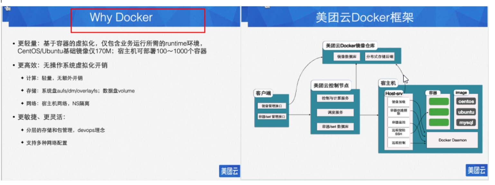
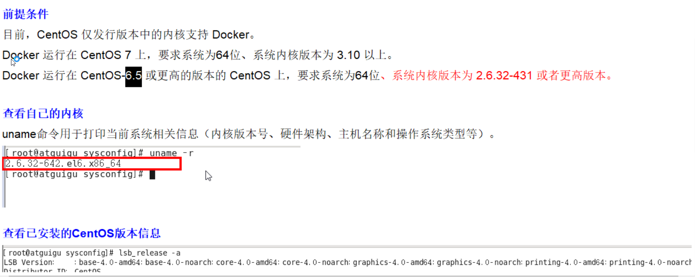

# Docker 笔记
## 1.概述

### 1）简介

Docker 可以理解为把程序需要运行的所有的**环境，配置，程序，数据**等一起**打包为一个镜像文件**作为一个整体来运行，避免传统的 不同主机上都需要去安装运行环境，重新配置，复制程序等动作，而且，还不一定能保证运行环境都一样。

达到的效果，一次封装，处处运行！

Docker 是由Go语言开发的云开源项目。官方网站：http://docker-cn.com

### 2）容器与虚拟机的区别

虚拟机是虚拟出所有的硬件和操作系统，在该系统上运行所需的程序进程。

容器内的应用进程是**直接运行于宿主的内核**，容器内**没有**自己的**内核**，也**没有硬件**的**模拟**，所以比传统的虚拟机更轻便。

**虚拟机的缺点**

资源占用多，冗余步骤多，启动慢。

### 3）DevOps

DevOps：开发（Development）和运维（Operations）这两个领域的合并。

## 2.Docker 三要素（容器、仓库、镜像）

容器和镜像的关系，就像对象和类的关系，1个容器就是1个镜像的实例。

仓库：是用于保存镜像的地方。

Docker也是采用的git来管理仓库的。 

Docker是用容器（Container）来运行1个或一组应用，**容器是用镜像创建的运行实例。**

它可以被启动、开始、停止、删除。每个容器都是相互隔离的，保证安全的平台。

可以把容器看做是一个简易版的Linux环境（包括root用户权限、进程空间、用户空间和网络空间等）和运行在其中的应用程序。

## 3.Docker安装

安装前提：CenterOS 6.5 版本及以上才行，最好是7。

第7节了。

