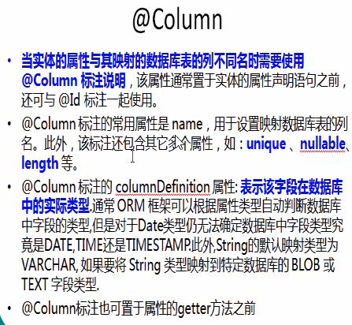
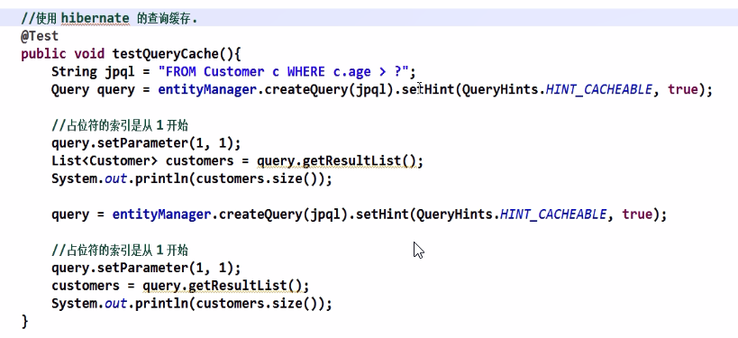
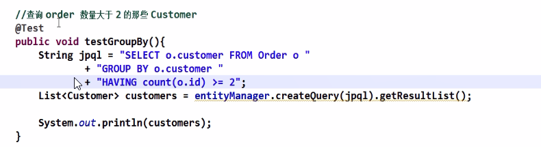

# JPA & Spring Data 学习笔记

## 1. JDBC 规范 & JPA规范

### 1）概述


JDBC是数据库底层驱动、操作的规范，提供一组api的接口，没有实现，由各个数据库厂家来实现各个接口


JPA是什么？


**JPA是ORM规范**


Jpa的主要技术


### 2）主要操作步骤


## 2.用Idea创建JPA项目

### 1).创建一个maven工程

不用选择任何架构的maven的项目即可，就是一个空的maven工程

### 2).修改pom.xml 引入jpa需要的包

```xml
<?xml version="1.0" encoding="UTF-8"?>
<project xmlns="http://maven.apache.org/POM/4.0.0"
         xmlns:xsi="http://www.w3.org/2001/XMLSchema-instance"
         xsi:schemaLocation="http://maven.apache.org/POM/4.0.0 http://maven.apache.org/xsd/maven-4.0.0.xsd">
    <modelVersion>4.0.0</modelVersion>

    <groupId>com.hx</groupId>
    <artifactId>jpa</artifactId>
    <version>1.0-SNAPSHOT</version>

    <dependencies>
        <!--mysql 的驱动-->
        <dependency>
            <groupId>mysql</groupId>
            <artifactId>mysql-connector-java</artifactId>
            <version>5.1.47</version>
        </dependency>

        <!--hibernate的JPA的实现-->
        <dependency>
            <groupId>org.hibernate</groupId>
            <artifactId>hibernate-entitymanager</artifactId>
            <version>4.2.14.Final</version>
        </dependency>

    </dependencies>


</project>
```

### 3).手工添加persistence.xml文件

在src\main\resources\META-INF\persistence.xml

注意，**在idea中是在resources下建立的**，用eclipse是在src根目录下建立的，否则在启动的时候，找不到这个persistence配置文件。

**文件名和路径都是固定的**

```xml
<?xml version="1.0" encoding="UTF-8"?>
<persistence xmlns="http://java.sun.com/xml/ns/persistence" version="2.0">

    <persistence-unit name="jpa-1" transaction-type="RESOURCE_LOCAL">
        <!--配置使用什么产品作为JPA的实现
          1. HibernatePersistence 是 javax.persistence.spi.PersistenceProvider 接口的实现
          2. 若JPA项目中只有一个JPA的实现产品，则该节点也可以不配置
        -->
        <provider>org.hibernate.ejb.HibernatePersistence</provider>

        <!--添加持久化类-->
        <class>com.hx.jpa.helloworld.Customer</class>
        <properties>
            <!--配置 jpa的 数据库驱动-->
            <property name="javax.persistence.jdbc.driver" value="com.mysql.jdbc.Driver" />
            <property name="javax.persistence.jdbc.url" value="jdbc:mysql://localhost:3306/jpadb"/>
            <property name="javax.persistence.jdbc.user" value="root"/>
            <property name="javax.persistence.jdbc.password" value="root"/>

            <!--配置 JPA 实现产品的基本属性，这里是配置hibernate的基本属性-->

            <!--格式化sql-->
            <property name="hibernate.format_sql" value="true"/>
            <property name="hibernate.show_sql" value="true"/>
            <!--生成数据库的策略-->
            <property name="hibernate.hbm2ddl.auto" value="update"/>

        </properties>


    </persistence-unit>
</persistence>
```

### 4).建立一个Customer实体类

```java
package com.hx.jpa.helloworld;

import javax.persistence.*;

/**
 * @author yxqiang
 * @create 2018-10-06 13:44
 *
 * 持久化类
 */


@Entity
@Table(name = "JPA_CUSTOMERS")

public class Customer {
    private Integer id;
    private String lastName;
    private String email;
    private int age;

    @Id
    @GeneratedValue(strategy = GenerationType.AUTO) //设置主键自增长的类型
    public Integer getId() {
        return id;
    }

    public void setId(Integer id) {
        this.id = id;
    }

    @Column(name="LAST_NAME")
    public String getLastName() {
        return lastName;
    }

    public void setLastName(String lastName) {
        this.lastName = lastName;
    }

    public String getEmail() {
        return email;
    }

    public void setEmail(String email) {
        this.email = email;
    }

    public int getAge() {
        return age;
    }

    public void setAge(int age) {
        this.age = age;
    }
}
```

### 5).测试JPA操作

```java
package com.hx.jpa.helloworld;

import javax.persistence.EntityManager;
import javax.persistence.EntityManagerFactory;
import javax.persistence.EntityTransaction;
import javax.persistence.Persistence;

/**
 * @author yxqiang
 * @create 2018-10-06 13:52
 */
public class Main {

    public static void main(String[] args) {
        //1. 创建EntityManagerFactory
        String prisistenceUnitName = "jpa-1";
        EntityManagerFactory entityManagerFactory = Persistence.createEntityManagerFactory(prisistenceUnitName);


        //2. 创建EntityManager
        EntityManager entityManager = entityManagerFactory.createEntityManager();


        //3. 开启事务
        EntityTransaction transaction = entityManager.getTransaction();
        transaction.begin();

        //4. 进行持久化操作
        Customer customer = new Customer();
        customer.setAge(12);
        customer.setEmail("yangxq5858@qq.com");
        customer.setLastName("Yansen");
        entityManager.persist(customer); //保存，持久化

        //5. 提交事务
        transaction.commit();

        //6. 关闭EntityManager
        entityManager.close();

        //7. 关闭EntityManagerFactory
        entityManagerFactory.close();

    }
}

```

## 3.JPA的六个基本注解

### 1）@Entity 实体类

### 2）@Table 指明表的名字

```java
@Entity
@Table(name = "JPA_CUSTOMERS")
public class Customer {
}
```


### 3）@Id 指明主键列

标注在属性的getter方法上

```java
    @Id
    @GeneratedValue(strategy = GenerationType.AUTO) //设置主键自增长的类型
    public Integer getId() {
        return id;
    }

```

### 4）@GeneratedValue 用于标注主键的生成策略

--IDENTITY: 采用数据库ID自增长的方式，Oracle不支持。

--AUTO:JPA自动选择合适的策略，是**默认值**

--SEQUENCE:通过序列产生，通过@SequenceGenerator注解指定序列名,MySQL不支持

--TABLE:通过表产生主键，框架借表模拟序列产生主键，使用该策略可以更方便数据库的移植。

### 5）@Basic 对没有任何标注的getXxxx()方法

默认即为@Basic，**可以不标注**

fetch：表示该属性的读取策略，有EAGER 和 LAZY 两种，分别表示主支抓取和延迟加载，**默认为EAGER.**

optional:表示该属性时候允许为null，默认为true

### 6）@Column 可以对列精确注解




### 7）@Transient 忽略映射

```java
    @Transient  //表示不需要映射的字段
    public String getInfo() {
        return "Customer{" +
                "id=" + id +
                ", lastName='" + lastName + '\'' +
                ", email='" + email + '\'' +
                ", age=" + age +
                '}';
    }

```


### 8）@Temporal 标注日期类型

```java
// 如果不加，默认生成为DateTime类型，数据是带日期和时分秒的

    @Temporal(TemporalType.DATE)  //生日，不需要时分秒
    public Date getBirth() {
        return birth;
    }


    @Temporal(TemporalType.TIMESTAMP) //标注为时间戳
    public Date getCreatedTime() {
        return createdTime;
    }


```


## 4.JPA相关接口/类

### 1）Persisence


### 2）EntityManagerFactory


### 3）EntityManager

#### find() & getReference()方法

```java
public class JPATest {

    private EntityManagerFactory entityManagerFactory;
    private EntityManager entityManager;
    private EntityTransaction transaction;

    @Before
    public void init(){
        entityManagerFactory = Persistence.createEntityManagerFactory("jpa-1");
        entityManager = entityManagerFactory.createEntityManager();
        transaction = entityManager.getTransaction();
        transaction.begin();
    }

    @After
    public void destroy(){
        transaction.commit();
        entityManager.close();
        entityManagerFactory.close();

    }

    @Test
    public void testFind() {
        //entityManger.getReference 相当于Hibernate的load 方法，延迟加载
        Customer customer = entityManager.find(Customer.class, 5);
        System.out.println("------------------");
        System.out.println(customer);
    }

  
    //注意，这里用到了@Before 和 @After，表示在测试方法执行之前和之后，执行。用于公共的操作动作
    @Test
    public void testgetReference() {
        //entityManager.find 相当于 Hibernate的get方法，
        //先返回的是一个代理，真正使用的时候，才向数据库发sql
        //如果在返回代理对象后，把EntityManager关闭了，就会报错，说no session 去执行代理操作
        Customer customer = entityManager.getReference(Customer.class, 5);
        System.out.println("------------------");
        System.out.println(customer);
    }


}
```

#### Persist方法，持久化

```java
@Test
public void testPersist() {
    /**
     *
     *entityManager.Persistence 相当于 Hibernate的save方法,使对象由临时状态变为持久化状态
     *和Hibernate的save方法有点区别：
     *   如果有id值，则不能执行Insert，抛出异常
     */

    Customer customer = new Customer();
    customer.setAge(20);
    customer.setBirth(new Date());
    customer.setCreatedTime(new Date());
    customer.setEmail("yangxq@qq.com");
    customer.setLastName("YANSEN");
    entityManager.persist(customer);
    System.out.println(customer.getId());
}
```

#### remove() 删除持久化对象（必须为持久化的，非游离对象)

```java
    /**
     * entityManager.remove 相当于Hibernate 的delete，删除持久化对象，但Hibernate还可以移除游离对象
     *
     */
    @Test
    public void testRemove(){

        //下面这段代码，在hibernate中可以执行，在JPA中不行，因为JPA不能移除游离对象
        Customer customer1 = new Customer();
        customer1.setId(7);
        entityManager.remove(customer1);
        
        Customer customer = entityManager.find(Customer.class, 7);
        entityManager.remove(customer);
    }
```

#### JPA规范中的实体的四种状态


#### merge


类似于Hibernate的saveOrupdate(）方法。

```java
   /**
     * 类似于Hibernate session的 saveOrUpdate()
     * 1. 若传入是一个临时对象，则merge后，产生一个新对象，并对新对象进行持久化操作，临时对象不处理。
     * 2. 若传入的是一个游离对象（即有OID），如果在entityManager的缓存中没有该对象，并且数据库中也没有该对象，
     *    就对产生一个新对象，并对新对象赋值，并持久化，游离对象不处理。
     * 3. 若传入的对象在缓存和数据库中都有，则会先查询出原有的对象，并把游离对象的属性赋值给查询到的对象，将查询到的对象进行update操作
     */
    @Test
    public void testMerge(){
        Customer customer = new Customer();
        customer.setAge(20);
        customer.setBirth(new Date());
        customer.setCreatedTime(new Date());
        customer.setEmail("yangxq@qq.com");
        customer.setLastName("YANSEN");
        Customer customer1 = entityManager.merge(customer);

        System.out.println(customer.getId());  //返回null
        System.out.println(customer1.getId()); //有值

    }
```

注意：

在hibernate中的session.saveOrupdate()方法，是不能对相同id的多个entity进行merge，要报错，但在JPA中是可以的，因为它做了一个复制的动作。

#### flush()方法

强制执行sql，如果没有这个方法时，只有在commit时，才会执行。


其他方法


## 5.映射关系

### 1) @ManyToOne

单向多对一的关系（比如：订单属于一个客户，一个客户有多个订单）

删除N的一端，可以直接删除。如果删除1的一端，如果有外键约束的数据，则不能删除

可以通过N的一端，get出1的一端，对其修改操作。

```java
@Entity
@Table(name = "JPA_ORDERS")
public class Order {

    private int id;
    private String orderName;
    private Customer customer;

    @GeneratedValue(strategy = GenerationType.AUTO)
    @Id
    public int getId() {
        return id;
    }

    public void setId(int id) {
        this.id = id;
    }

    @Column(name = "ORDER_NAME")
    public String getOrderName() {
        return orderName;
    }

    public void setOrderName(String orderName) {
        this.orderName = orderName;
    }

    //多对一的映射
    //使用JoinColumn设置外键
    @ManyToOne(fetch = FetchType.LAZY) //使用懒加载,修改关联或叫引用的加载策略
    @JoinColumn(name = "CUSTOMER_ID")
    public Customer getCustomer() {
        return customer;
    }

    public void setCustomer(Customer customer) {
        this.customer = customer;
    }
}


    /**
     * 单向多对一
     *
     *先保存 1的一端，再保存 n的一端，避免产生不必要的update语句
     *
     */
    @Test
    public void testManyToOne(){
        Customer customer = new Customer();
        customer.setAge(20);
        customer.setBirth(new Date());
        customer.setCreatedTime(new Date());
        customer.setEmail("yangxq@qq.com");
        customer.setLastName("FF-1");
        Order order = new Order();
        order.setOrderName("FF-1-1");

        Order order1 = new Order();
        order1.setOrderName("FF-1-2");

        order.setCustomer(customer);
        order1.setCustomer(customer);
        entityManager.persist(customer);
        entityManager.persist(order);
        entityManager.persist(order1);
    }
```


映射关系，没有学习完


## 6.JPQL语言

Java Persistence Query Language 的简称。它是中间查询语言，最终被编译成根据不同的数据库生成SQL语句，从而屏蔽不同数据的差异。

根据EntityManager的Query接口（createQuery、createNamedQuery及createNativeQuery)方法获取查询对象，进而可调用Query接口的相关方法来执行查询操作。


使用查询的二级缓存：1.要先配置启用二级缓存，再到查询Query时，设置启用




Group by




子查询


使用JPQL函数


## 7.整合Spring


示例：

配置db.properties

```java
jdbc.user=root
jdbc.password=1230
jdbc.driverClass=com.mysql.jdbc.Driver
jdbc.jdbcUrl=jdbc:mysql:///jpa        # /// 表示mysql的默认连接，数据库是jpa
```


配置applicationContext.xml

```xml
<?xml version="1.0" encoding="UTF-8"?>
<beans xmlns="http://www.springframework.org/schema/beans"
	xmlns:xsi="http://www.w3.org/2001/XMLSchema-instance"
	xmlns:context="http://www.springframework.org/schema/context"
	xmlns:tx="http://www.springframework.org/schema/tx"
	xsi:schemaLocation="http://www.springframework.org/schema/beans http://www.springframework.org/schema/beans/spring-beans.xsd
		http://www.springframework.org/schema/context http://www.springframework.org/schema/context/spring-context-4.0.xsd
		http://www.springframework.org/schema/tx http://www.springframework.org/schema/tx/spring-tx-4.0.xsd">

	<!-- 配置自动扫描的包 -->
	<context:component-scan base-package="com.atguigu.jpa"></context:component-scan>

	<!-- 配置 C3P0 数据源 -->
	<context:property-placeholder location="classpath:db.properties"/>

	<bean id="dataSource"
		class="com.mchange.v2.c3p0.ComboPooledDataSource">
		<property name="user" value="${jdbc.user}"></property>
		<property name="password" value="${jdbc.password}"></property>
		<property name="driverClass" value="${jdbc.driverClass}"></property>
		<property name="jdbcUrl" value="${jdbc.jdbcUrl}"></property>	
		
		<!-- 配置其他属性 -->
	</bean>
	
	<!-- 配置 EntityManagerFactory -->
	<bean id="entityManagerFactory"
		class="org.springframework.orm.jpa.LocalContainerEntityManagerFactoryBean">
		<property name="dataSource" ref="dataSource"></property>
		<!-- 配置 JPA 提供商的适配器. 可以通过内部 bean 的方式来配置 -->
		<property name="jpaVendorAdapter">
			<bean class="org.springframework.orm.jpa.vendor.HibernateJpaVendorAdapter"></bean>
		</property>	
		<!-- 配置实体类所在的包 -->
		<property name="packagesToScan" value="com.atguigu.jpa.spring.entities"></property>
		<!-- 配置 JPA 的基本属性. 例如 JPA 实现产品的属性 -->
		<property name="jpaProperties">
			<props>
				<prop key="hibernate.show_sql">true</prop>
				<prop key="hibernate.format_sql">true</prop>
				<prop key="hibernate.hbm2ddl.auto">update</prop>
			</props>
		</property>
	</bean>
	
	<!-- 配置 JPA 使用的事务管理器 -->
	<bean id="transactionManager"
		class="org.springframework.orm.jpa.JpaTransactionManager">
		<property name="entityManagerFactory" ref="entityManagerFactory"></property>	
	</bean>
	
	<!-- 配置支持基于注解是事务配置 -->
	<tx:annotation-driven transaction-manager="transactionManager"/>

</beans>
```


建立entiry 实体

```java
@Table(name="JPA_PERSONS")
@Entity
public class Person {

	private Integer id;
	private String lastName;

	private String email;
	private int age;

	@GeneratedValue
	@Id
	public Integer getId() {
		return id;
	}

	public void setId(Integer id) {
		this.id = id;
	}

	@Column(name="LAST_NAME")
	public String getLastName() {
		return lastName;
	}

	public void setLastName(String lastName) {
		this.lastName = lastName;
	}

	public String getEmail() {
		return email;
	}

	public void setEmail(String email) {
		this.email = email;
	}

	public int getAge() {
		return age;
	}

	public void setAge(int age) {
		this.age = age;
	}
}

```


建立数据的Dao

```java
@Repository
public class PersonDao {

	//如何获取到和当前事务关联的 EntityManager 对象呢 ?
	//通过 @PersistenceContext 注解来标记成员变量!
	@PersistenceContext
	private EntityManager entityManager;
	
	public void save(Person person){
		entityManager.persist(person);
	}
	
}
```

建立Service

```java
@Service
public class PersonService {
	
	@Autowired
	private PersonDao personDao;
	
	@Transactional
	public void savePersons(Person p1, Person p2){
		personDao.save(p1);
		
		int i = 10 / 0;
		
		personDao.save(p2);
	}
	
}
```

测试

```java
package com.atguigu.jpa.spring;

import java.sql.SQLException;

import javax.sql.DataSource;

import org.junit.Test;
import org.springframework.context.ApplicationContext;
import org.springframework.context.support.ClassPathXmlApplicationContext;

import com.atguigu.jpa.service.PersonService;
import com.atguigu.jpa.spring.entities.Person;

public class JPATest {
	
	private ApplicationContext ctx = null;
	private PersonService personService = null;
	
	{
		ctx = new ClassPathXmlApplicationContext("applicationContext.xml");
		personService = ctx.getBean(PersonService.class);
	}
	
	@Test
	public void testPersonService(){
		Person p1 = new Person();
		p1.setAge(11);
		p1.setEmail("aa@163.com");
		p1.setLastName("AA");
		
		Person p2 = new Person();
		p2.setAge(12);
		p2.setEmail("bb@163.com");
		p2.setLastName("BB");
		
		System.out.println(personService.getClass().getName());
		personService.savePersons(p1, p2);
	}
	
	@Test
	public void testDataSource() throws SQLException {
		DataSource dataSource = ctx.getBean(DataSource.class);
		System.out.println(dataSource.getConnection());
	}
}
```


