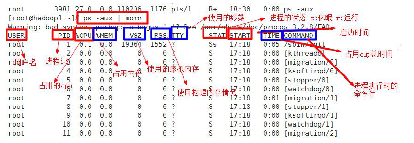
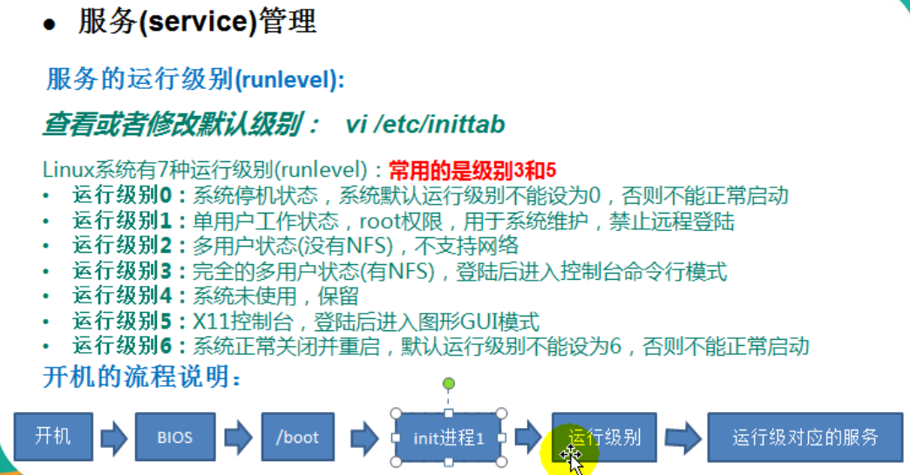
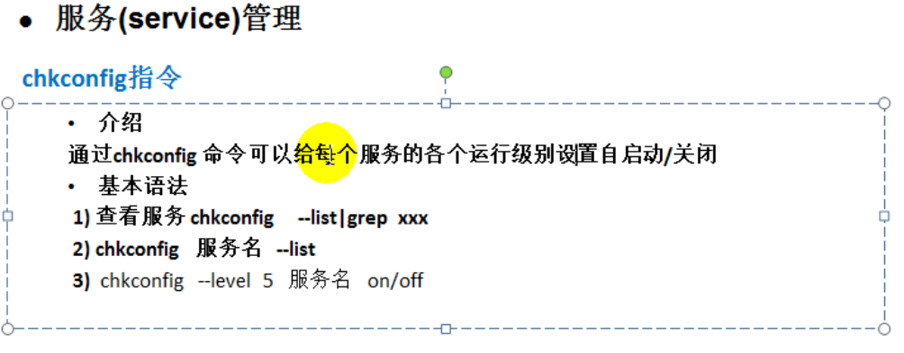

# Linux 笔记

CentOs的安装，需要按照《尚硅谷大数据技术之Linux下安装 CentOS和网络配置.doc》文档中，自定义磁盘分区的方式来安装


## 分区

至少**3个基本分区**：

1. root 分区，用于启动，200MB，选择挂载点
2. swap分区，虚拟内存使用，一般配置为物理内存大小一样，注意，要**选择swap类型**
3. / 分区，根分区

## 目录介绍

Linux下没有多个磁盘（ c:  d: 等概念），只有1个根目录。

各个目录是Linux提前规划好了的，不能随便存放文件。

**Linux中一切皆为文件。**


**/ ：表示根目录**

根目录下的目录为：

**bin**: 存放 经常使用的命令

**boot**: 存放 启动Linux时使用的一些核心文件，包括一些连接文件以及镜像文件

**dev**: 类似于windows的设备管理器，把所有的硬件用文件的形式存储。

**etc**:所有的系统管理所需要的**配置文件**和子目录

**home**: 存放普通用户的主目录，在linux中每个用户都有一个自己的目录，目录名是以用户的账号命名的。

lib:系统开机所需最基本的动态库，**几乎所有**的应用程序都需要用到这些共享库

lib64:

lost+found:一般为空，非法关机后，这里会存放一些文件

**media**: 系统识别一些设备，如U盘，光驱等，当识别后，linux会把识别的设备挂载到这个目录下。

**mnt**: 让用户临时挂载别的文件系统的，可以将外部的存储挂载在此，进行查看

**opt**: 存放安装文件的地方，如一些应用的安装盘，都放到这里。

proc: 这个是一个虚拟目录，它是系统内存的映射，访问这个目录来获取系统信息。

**root**: 超级权限者的用户主目录

sbin: Supper User，系统管理员使用的管理程序

selinux: 一种安全子系统，它能控制程序只能访问特定文件。

srv: **service缩写**，该目录存放一些服务启动滞后需要提取的数据

sys:  linux2.6内核的一个很大的变化，该目录下安装了2.6内核中新出现的一个文件系统

tmp: 存放临时文件

**usr**: **非常重要的目录**，用户的很多应用程序和文件都放在这个目录下，类似于windows的program file目录。

**usr/local:**  这个是主机额外安装软件所**安装的目录**，一般是通过编译源代码方式安装的程序

**var:** 这个目录存放不断扩充的东西，比如：各种日志文件。


## JavaEE 安装

xftp软件上传linux下的java安装文件，使用sftp协议，端口是22，linux必须开启sshd服务。

### 1）解压：

gz后缀的：tar -zxvf  xxx.gz

-z: 表示压缩

-x: 表示解包

-c：表示打包

-v：表示显示详细信息

-f：表示文件名

一般压缩的命令参数为：-zcvf

解压的命令参数为：-zxvf

### 2）配置环境变量（/etc/profile)

进入/etc 目录，

vim profile

按G 滚动到文件末尾

输入i ：进入到编辑模式

JAVA_HOME=/opt/jdk1.7.0_79

PATH=/opt/jdk1.7.0_79/bin:$PATH

export JAVA_HOME PATH

按esc 退出编辑

输入：

输入wq（保存并退出）


**保存后，要注销，重新登录，才生效**

也可以，采用下面的指令来即刻让环境生效

source /etc/profile.


### 3）安装tomcat

#### **解压：**

tar -zxvf apache-tomcat-7.0.70.tar.gz

进入 tomcat目录

cd /opt/apache-tomcat-7.0.70/bin

#### **启动**

**输入   ./startup.sh  启动，注意，一定要有 ./ 才行。**

linux 中就可以访问了。windows环境还没法访问，需要设置防火墙

#### **防火墙设置:**

输入：service iptables status ，查看放行列表

输入：vim  /etc/sysconfig/iptables

```console
# Firewall configuration written by system-config-firewall
# Manual customization of this file is not recommended.
*filter
:INPUT ACCEPT [0:0]
:FORWARD ACCEPT [0:0]
:OUTPUT ACCEPT [0:0]
-A INPUT -m state --state ESTABLISHED,RELATED -j ACCEPT
-A INPUT -p icmp -j ACCEPT
-A INPUT -i lo -j ACCEPT
-A INPUT -m state --state NEW -m tcp -p tcp --dport 22 -j ACCEPT
-A INPUT -m state --state NEW -m tcp -p tcp --dport 8080 -j  ACCEPT
-A FORWARD -j REJECT --reject-with icmp-host-prohibited
COMMIT

```

按下i 进入编辑模式

找到22端口，按下 yy  键复制，按下 p 键粘贴，修改22 为8080

按下esc 退出编辑模式，进入普通模式

输入  ：（冒号）

输入 wq ，回车，保存退出。

**重启防火墙：**

​     service iptables restart

```console
[root@centos bin]# service iptables restart
iptables：将链设置为政策 ACCEPT：filter                    [确定]
iptables：清除防火墙规则：                                 [确定]
iptables：正在卸载模块：                                   [确定]
iptables：应用防火墙规则：                                 [确定]

```

这时，windows就可以访问了。


##常用指令

###halt： 关机

### **clear**：清屏幕

### **pwd**: 表示显示当前路径

### **ps -aux**：查看进程




### **ps -aux | grep sshd**

|表示管道， grep是查找字符串，这里表示 查询有没有 sshd的进程

### **ps -ef | grep xxx**命令

表示查看进程的父进程信息

### **netstat -anp | more** 

 查看有哪些端口，输入q退出more的分页显示

more 表示分页查看

### **kill -9 103**

-9：表示强制停止并杀掉，103：表示进程id

**killall  xx进程名**

按名称杀掉所有打开的进程。

### **service 服务名 start(stop、restart)**

服务的启动，停止，重启

如：service iptables start（防火墙服务打开）

但，这种方式，只是**临时生效**，重启服务器系统后，又回归原始状态了。


### **查看服务名**

  方法一：在服务器上，使用setup命令-->系统服务 就可以看到，打了 * 号的表示已经启动了。

  方法二：ls  /etc/init.d/ ，可以看到结果中，就是系统服务。

### **服务运行级别**







### **解压**

tar -zxvf  xxx.tar.gz -C  指定目录

### 重命名

mv 原始文件名 新文件名

①将一个名为abc.txt的文件重命名为1234.txt

mv abc.txt 1234.txt

②将目录A 重命名 为B

mv A B

③将a.txt移动到/b下，并重命名为c.txt

mv a.txt /b/c.txt

### JPS

查看有java进程的


### chkconfig 

chkconfig iptables off 关闭防火墙

chkconfig xxx服务名 on/off/reset

chkconfig --add xxx服务名 ：添加服务

chkconfig --del xxx服务名  ：删除服务

chkconfig --list xxx服务名：表示显示服务在不同的级别启动状态

chkconfig --level 2345 httpd on：表示对httpd服务在级别为 2345时为打开状态。


### 更改主机名

**Step1：查看当前的主机名**

```
[root@sxl133 Desktop]# hostname
sxl133
```

这里的主机名是sxl133，如果没有设置，则是localhost.localdomain，这是linux默认的主机名。

 

**Step2：更新network文件**

```
[root@sxl133 Desktop]# vi /etc/sysconfig/network
[root@sxl133 Desktop]# 
```


将HOSTNAME=localhost.localdomain改成sxl133（我们想要设置的主机名）

退出编辑。

 

**Step3：更新hosts文件**

**输入：vi /etc/hosts**

```
127.0.0.1   localhost localhost.localdomain localhost4 localhost4.localdomain4
::1         localhost localhost.localdomain localhost6 localhost6.localdomain6
```

改成

```
127.0.0.1   localhost sxl133 localhost4 localhost4.localdomain4
::1         localhost sxl133 localhost6 localhost6.localdomain6
```

退出编辑。

 

**Step4：reboot重启服务器，同时查询主机名**

```
1 [root@sxl133 Desktop]#  reboot
2 [root@sxl133 Desktop]#  hostname
```

### scp命令（跨机器复制）

scp -r local_file remote_username@remote_ip:remote_folder

-r：表示递归复制


