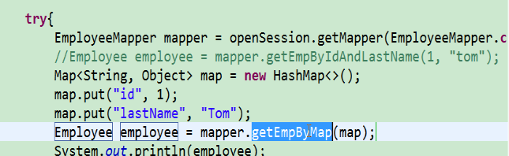

# MyBatis3 学习笔记

这是官方的，中文的哦

http://www.mybatis.org/mybatis-3/zh/configuration.html


## 1.环境搭建

### 1) 用maven建立工程，配置pom.xml

```xml
<?xml version="1.0" encoding="UTF-8"?>
<project xmlns="http://maven.apache.org/POM/4.0.0"
         xmlns:xsi="http://www.w3.org/2001/XMLSchema-instance"
         xsi:schemaLocation="http://maven.apache.org/POM/4.0.0 http://maven.apache.org/xsd/maven-4.0.0.xsd">
    <modelVersion>4.0.0</modelVersion>

    <groupId>com.hx.mybatis</groupId>
    <artifactId>MybatisTraning</artifactId>
    <version>1.0-SNAPSHOT</version>


    <dependencies>
        <!--mybatis 就一个包 -->
        <dependency>
            <groupId>org.mybatis</groupId>
            <artifactId>mybatis</artifactId>
            <version>3.4.6</version>
        </dependency>

        <!--mysql 的驱动-->
        <dependency>
            <groupId>mysql</groupId>
            <artifactId>mysql-connector-java</artifactId>
            <version>5.1.37</version>
        </dependency>

        <!--为了输出日志，引入的，注意配合log4.properties文件-->
        <dependency>
            <groupId>log4j</groupId>
            <artifactId>log4j</artifactId>
            <version>1.2.17</version>
        </dependency>
        
        <!--数据源的驱动-->
        <dependency>
            <groupId>com.mchange</groupId>
            <artifactId>c3p0</artifactId>
            <version>0.9.5.2</version>
        </dependency>

        <!--测试包-->
        <dependency>
            <groupId>junit</groupId>
            <artifactId>junit</artifactId>
            <version>4.12</version>
            <scope>test</scope>
        </dependency>

    </dependencies>
</project>
```

### 2)log4j.properties

```properties
### set log levels ###
log4j.rootLogger = DEBUG,Console,File

###  输出到控制台  ###
log4j.appender.Console=org.apache.log4j.ConsoleAppender
log4j.appender.Console.Target=System.out
log4j.appender.Console.layout=org.apache.log4j.PatternLayout
log4j.appender.Console.layout.ConversionPattern= %d{ABSOLUTE} %5p %c{1}:%L - %m%n


### 输出到日志文件 ###
log4j.appender.File=org.apache.log4j.RollingFileAppender 
log4j.appender.File.File=${project}/WEB-INF/logs/app.log
log4j.appender.File.DatePattern=_yyyyMMdd'.log'
log4j.appender.File.MaxFileSize=10MB
log4j.appender.File.Threshold=ALL
log4j.appender.File.layout=org.apache.log4j.PatternLayout
log4j.appender.File.layout.ConversionPattern=[%p][%d{yyyy-MM-dd HH\:mm\:ss,SSS}][%c]%m%n

```

### 3)mybatis-config.xml

```xml
<?xml version="1.0" encoding="UTF-8" ?>
<!DOCTYPE configuration
        PUBLIC "-//mybatis.org//DTD Config 3.0//EN"
        "http://mybatis.org/dtd/mybatis-3-config.dtd">
<configuration>
    <environments default="development">
        <environment id="development">
            <transactionManager type="JDBC"/>
            <dataSource type="POOLED">
                <property name="driver" value="com.mysql.jdbc.Driver"/>
                <property name="url" value="jdbc:mysql://localhost:3306/mybatis"/>
                <property name="username" value="root"/>
                <property name="password" value="root"/>
            </dataSource>
        </environment>
    </environments>
    <!--将写好的sql映射文件，注册到全局配置中-->
    <mappers>
        <mapper resource="EmployeeMapper.xml"/>
    </mappers>
</configuration>
```

### 4)定义sql的Mapper

```xml
<?xml version="1.0" encoding="UTF-8" ?>
<!DOCTYPE mapper
        PUBLIC "-//mybatis.org//DTD Mapper 3.0//EN"
        "http://mybatis.org/dtd/mybatis-3-mapper.dtd">

<!--

  namespace：名称空间,随便写
  id：唯一标识
  resultType:返回值类型
  #{id}:从传递过来的参数中，取出id值

  唯一标识：建议用命名空间+id 组合成为唯一标识

-->
<mapper namespace="com.hx.mybatis.bean.EmployeeMapper">
    <select id="selectEmployee" resultType="com.hx.mybatis.bean.Employee">
       select id,last_name lastName,email,gender from tbl_Employee where id = #{id}
    </select>
</mapper>
```

### 5)定义实体类（pojo）

```java
public class Employee {
    private Integer id;
    private String lastName;
    private String gender;
    private String email;


    @Override
    public String toString() {
        return "Employee{" +
                "id=" + id +
                ", lastName='" + lastName + '\'' +
                ", gender='" + gender + '\'' +
                ", email='" + email + '\'' +
                '}';
    }

    public Integer getId() {
        return id;
    }

    public void setId(Integer id) {
        this.id = id;
    }

    public String getLastName() {
        return lastName;
    }

    public void setLastName(String lastName) {
        this.lastName = lastName;
    }

    public String getGender() {
        return gender;
    }

    public void setGender(String gender) {
        this.gender = gender;
    }

    public String getEmail() {
        return email;
    }

    public void setEmail(String email) {
        this.email = email;
    }
}
```

### 6)测试

1. 得到SessionFactory

2. 得到SqlSession

3. openSession

4. sqlSession.selectOne 利用sqlSession来对数据库的crud

5. sqlSession 关闭

  **sqlSession代表和数据库的一次会话**

```java
public class MybatisTest {

    private SqlSessionFactory sqlSessionFactory = null;
    private SqlSession sqlSession = null;


    @Before
    public void before() throws IOException {
        String resource = "mybatis-config.xml";
        InputStream inputStream = Resources.getResourceAsStream(resource);
        sqlSessionFactory = new SqlSessionFactoryBuilder().build(inputStream);
        sqlSession = sqlSessionFactory.openSession();
    }

    @After
    public void after(){
        sqlSession.close();
    }


    @Test
    public void test1(){
        //参数：sql的唯一标识，参数
        Employee employee = sqlSession.selectOne("com.hx.mybatis.bean.EmployeeMapper.selectEmployee", 1);
        System.out.println(employee);

    }
```

## 2.使用接口编程

以前的Mapper文件的nameSpace名字可以随便写，现在要求是接口的全路径名字。

id为接口中的方法名。

**注意：我们没有写实现类，只用了接口，mybatis会自动生成一个代理对象，由代理对象来执行数据的CRUD**


### 1）新建EmployeeMapper接口

```java
public interface EmployeeMapper {

    Employee getEmployeeById(Integer id);
}
```


### 2）修改mapper.xml文件

```xml
<!--这里的命名空间和id 与接口定义中的名字保持一致-->
<mapper namespace="com.hx.mybatis.dao.EmployeeMapper">
    <select id="getEmployeeById" resultType="com.hx.mybatis.bean.Employee">
       select id,last_name as lastName,gender,email from tbl_Employee where id = #{id}
    </select>
</mapper>
```

### 3）测试

```java
public SqlSessionFactory getSqlSessionFactory() throws IOException {
		String resource = "mybatis-config.xml";
		InputStream inputStream = Resources.getResourceAsStream(resource);
		return new SqlSessionFactoryBuilder().build(inputStream);
}


@Test
	public void test01() throws IOException {
		// 1、获取sqlSessionFactory对象
		SqlSessionFactory sqlSessionFactory = getSqlSessionFactory();
		// 2、获取sqlSession对象
		SqlSession openSession = sqlSessionFactory.openSession();
		try {
			// 3、获取接口的实现类对象
			//会为接口自动的创建一个代理对象，代理对象去执行增删改查方法
			EmployeeMapper empMapper =              openSession.getMapper(EmployeeMapper.class);
			Employee employee = empMapper.getEmpById(1);
			System.out.println(empMapper.getClass());
			System.out.println(employee);
		} finally {
			openSession.close();
		}

	}

```

以后，就用接口式编程了。便于orm层的更换

### 4）总结

SqlSession（非线程安全）

sqlSession 和 session 一样，都是非线程安全的。每次使用，都应该获取一个新对象。

sqlSession.getMapper() 返回的是一个代理对象（代理我们自定义的接口）

两个重要的配置文件：

-    mybatis的全局配置文件（这个全局配置文件，也可以通过代码来实现）
-    SQL映射文件


## 3.全局配置文件

MyBatis 的配置文件包含了会深深影响 MyBatis 行为的设置（settings）和属性（properties）信息。文档的顶层结构如下：

- configuration 配置
  - [properties 属性](http://www.mybatis.org/mybatis-3/zh/configuration.html#properties)
  - [settings 设置](http://www.mybatis.org/mybatis-3/zh/configuration.html#settings)
  - [typeAliases 类型别名](http://www.mybatis.org/mybatis-3/zh/configuration.html#typeAliases)
  - [typeHandlers 类型处理器](http://www.mybatis.org/mybatis-3/zh/configuration.html#typeHandlers)
  - [objectFactory 对象工厂](http://www.mybatis.org/mybatis-3/zh/configuration.html#objectFactory)
  - [plugins 插件](http://www.mybatis.org/mybatis-3/zh/configuration.html#plugins)
  - environments 环境
    - environment 环境变量
      - transactionManager 事务管理器
      - dataSource 数据源
  - [databaseIdProvider 数据库厂商标识](http://www.mybatis.org/mybatis-3/zh/configuration.html#databaseIdProvider)
  - [mappers 映射器](http://www.mybatis.org/mybatis-3/zh/configuration.html#mappers)

### 1)properties属性，引入外部配置文件

```xml
<?xml version="1.0" encoding="UTF-8" ?>
<!DOCTYPE configuration 
        PUBLIC "-//mybatis.org//DTD Config 3.0//EN"
        "http://mybatis.org/dtd/mybatis-3-config.dtd">
<configuration>
    <!--
    properties 节点 引入外部配置文件
        resource:表示引入类路径下的文件
        url：    表示引入网络资源或磁盘资源
    -->
    <properties resource="./config/db.properties">

    </properties>
    <environments default="development">
        <environment id="development">
            <transactionManager type="JDBC"/>
            <dataSource type="POOLED">
                <property name="driver" value="${jdbc.driver}"/>
                <property name="url" value="${jdbc.url}"/>
                <property name="username" value="${jdbc.username}"/>
                <property name="password" value="${jdbc.password}"/>
            </dataSource>
        </environment>
    </environments>
    <mappers>
        <mapper resource="./mapper/EmployeeMapper.xml"/>
    </mappers>
</configuration>
```

加入properties节点，设置resource属性值，即可引入外部配置文件。

同时，在dataSource中使用 类似于el表达式，来获取外部配置文件的值

spring整合后，这个也不会使用的。

### 2）settings 设置

```xml
<!--settings配置很重要-->
<settings>
    <!--开启驼峰命名-->
    <setting name="mapUnderscoreToCamelCase" value="true"/>
</settings>
```


### 3）typeAliases

设置类型别名

```xml
    <typeAliases>
        <!--不写alias时，默认值为 employee（类名小写），有alias时，取emp
            别名，不区分大小写
        -->
        <!--<typeAlias type="com.hx.mybatis.bean.Employee" alias="emp"/>-->

        <!--批量对包下的所有类，包括子包，设置别名-->
        <package name="com.hx.mybatis.bean"/>

        <!--使用@Alias注解    -->

    </typeAliases>
```

还可以在类上，设置别名的注解@Alias("emp")

建议：还是使用全类名，我们可以用鼠标+点击 快速定位到定义处。

### 4）environments 环境配置

可以设置多个运行环境，如：开发环境、测试环境等。

**事务管理器（transactionManager）**，以后，还是会用Spring代替

**数据源（dataSource）**，有三种内建的数据源类型（也就是 type=”[UNPOOLED|POOLED|JNDI]”）

这里的连接池，是mybatis自己的连接池，我们也可以自定义连接池。

#### 实现c3p0连接池

你可以通过实现接口 `org.apache.ibatis.datasource.DataSourceFactory` 来使用第三方数据源：

```java
public interface DataSourceFactory {
  void setProperties(Properties props);
  DataSource getDataSource();
}
```

`org.apache.ibatis.datasource.unpooled.UnpooledDataSourceFactory` 可被用作父类来构建新的数据源适配器，比如下面这段插入 C3P0 数据源所必需的代码：

```java
import org.apache.ibatis.datasource.unpooled.UnpooledDataSourceFactory;
import com.mchange.v2.c3p0.ComboPooledDataSource;
        
public class C3P0DataSourceFactory extends UnpooledDataSourceFactory {

  public C3P0DataSourceFactory() {
    this.dataSource = new ComboPooledDataSource();
  }
}
```

为了令其工作，记得为每个希望 MyBatis 调用的 setter 方法在配置文件中增加对应的属性。下面是一个可以连接至 PostgreSQL 数据库的例子：

```xml
<dataSource type="org.myproject.C3P0DataSourceFactory">
  <property name="driver" value="org.postgresql.Driver"/>
  <property name="url" value="jdbc:postgresql:mydb"/>
  <property name="username" value="postgres"/>
  <property name="password" value="root"/>
</dataSource>
```

注意，导入c3p0包，是 **com.mchange** 的哪个版本。

```xml
        <!--数据源的驱动-->
        <dependency>
            <groupId>com.mchange</groupId>
            <artifactId>c3p0</artifactId>
            <version>0.9.5.2</version>
        </dependency>

```


**同时，c3p0对应的配置的名字 和 Mybatis的默认名字不一样**

```java
<property name="driverClass" value="${jdbc.driver}"/>
<property name="jdbcUrl" value="${jdbc.url}"/>
<property name="user" value="${jdbc.username}"/>
<property name="password" value="${jdbc.password}"/>
```

### 5）映射器（mappers）

```xml
<!-- 使用相对于类路径的资源引用 -->
<mappers>
  <mapper resource="org/mybatis/builder/AuthorMapper.xml"/>
  <mapper resource="org/mybatis/builder/BlogMapper.xml"/>
  <mapper resource="org/mybatis/builder/PostMapper.xml"/>
</mappers>
<!-- 使用完全限定资源定位符（URL） -->
<mappers>
  <mapper url="file:///var/mappers/AuthorMapper.xml"/>
  <mapper url="file:///var/mappers/BlogMapper.xml"/>
  <mapper url="file:///var/mappers/PostMapper.xml"/>
</mappers>
<!-- 使用映射器接口实现类的完全限定类名 -->
<mappers>
  <mapper class="org.mybatis.builder.AuthorMapper"/>
  <mapper class="org.mybatis.builder.BlogMapper"/>
  <mapper class="org.mybatis.builder.PostMapper"/>
</mappers>
<!-- 将包内的映射器接口实现全部注册为映射器 -->
<mappers>
  <package name="org.mybatis.builder"/>
</mappers>
```


可以，使用注解，在接口的方法上定义，来取消sql映射文件。

**推荐做法：只有简单的，不怎么修改的sql，可以采用注解；其他复杂的，重要的，还是在xml配置文件中声明。**


**注意，标签的顺序，是不能打乱的，否则也会报错的**

## 4.映射文件

### 1）新增、删除、修改

```java
public interface EmployeeMapper {

    Employee getEmployeeById(Integer id);
    //Mybatis 会自动从数据库的结果返回int、Integer、Boolean、void
    Integer insertEmp(Employee employee);

    Boolean updateEmp(Employee employee);

    Boolean delEmp(Integer id);

}


```

```xml
    <!--插入可以不指定参数类型-->
    <insert id="insertEmp" parameterType="com.hx.mybatis.bean.Employee">
        insert into tbl_employee(last_name,gender,email) values (#{lastName},#{gender},#{email})
    </insert>
    <update id="updateEmp">
        update tbl_employee
          set last_name = #{lastName},
              gender = #{gender},
              email = #{email}
          where id = #{id}
    </update>
    <delete id="delEmp" >
        delete from tbl_employee where id = #{id}
    </delete>
```

```java
 //测试插入
    @Test
    public void testInsert() throws IOException {
        SqlSessionFactory sqlSessionFactory = getSqlSessionFactory();
        //这里没有开启自动提交
        SqlSession sqlSession = sqlSessionFactory.openSession();
        try {
            EmployeeMapper empMapper = sqlSession.getMapper(EmployeeMapper.class);
            Employee employee = new Employee(null, "Tom", "0", "Tom@qq.com");
            Integer count = empMapper.insertEmp(employee);
            System.out.println(count);
            //手工提交
            sqlSession.commit();
        }finally {
            sqlSession.close();
        }
    }
    //测试修改
    @Test
    public void testUpdate() throws IOException {
        SqlSessionFactory sqlSessionFactory = getSqlSessionFactory();
        //这里没有开启自动提交
        SqlSession sqlSession = sqlSessionFactory.openSession();
        try {
            EmployeeMapper empMapper = sqlSession.getMapper(EmployeeMapper.class);
            Employee employee = new Employee(1, "Tom", "0", "Tom@qq.com");
            Boolean flag = empMapper.updateEmp(employee);
            System.out.println(flag);
            //手工提交
            sqlSession.commit();
        }finally {
            sqlSession.close();
        }
    }
   //测试删除
    @Test
    public void testDelete() throws IOException {
        SqlSessionFactory sqlSessionFactory = getSqlSessionFactory();
        //这里开启了自动提交
        SqlSession sqlSession = sqlSessionFactory.openSession(true);
        try {
            EmployeeMapper empMapper = sqlSession.getMapper(EmployeeMapper.class);
            Boolean flag = empMapper.delEmp(3);
            System.out.println(flag);
            //手工提交
//            sqlSession.commit();
        }finally {
            sqlSession.close();
        }
    }
```

### 2）获取自增长id的返回值：

   mybatis也是和jdbc一样，采用的是stament.getGenreatedKeys() 来获取的。需要打开useGeneratedKeys="true"，并设置返回的主键，赋值给bean的哪个属性。

下面这个是mysql的方式

```xml
 <insert id="insertEmp" parameterType="com.hx.mybatis.bean.Employee" useGeneratedKeys="true" keyProperty="id">
        insert into tbl_employee(last_name,gender,email) values (#{lastName},#{gender},#{email})
    </insert>
```

oracle的方式

```xml
<!-- 
	获取非自增主键的值：
		Oracle不支持自增；Oracle使用序列来模拟自增；
		每次插入的数据的主键是从序列中拿到的值；如何获取到这个值；
	 -->
	<insert id="addEmp" databaseId="oracle">
		<!-- 
		keyProperty:查出的主键值封装给javaBean的哪个属性
		order="BEFORE":当前sql在插入sql之前运行
			   AFTER：当前sql在插入sql之后运行
		resultType:查出的数据的返回值类型
		
		BEFORE运行顺序：
			先运行selectKey查询id的sql；查出id值封装给javaBean的id属性
			在运行插入的sql；就可以取出id属性对应的值
		AFTER运行顺序：
			先运行插入的sql（从序列中取出新值作为id）；
			再运行selectKey查询id的sql；
		 -->
		<selectKey keyProperty="id" order="BEFORE" resultType="Integer">
			<!-- 编写查询主键的sql语句 -->
			<!-- BEFORE-->
			select EMPLOYEES_SEQ.nextval from dual 
			<!-- AFTER：
			 select EMPLOYEES_SEQ.currval from dual -->
		</selectKey>
		
		<!-- 插入时的主键是从序列中拿到的 -->
		<!-- BEFORE:-->
		insert into employees(EMPLOYEE_ID,LAST_NAME,EMAIL) 
		values(#{id},#{lastName},#{email<!-- ,jdbcType=NULL -->}) 
		<!-- AFTER：
		insert into employees(EMPLOYEE_ID,LAST_NAME,EMAIL) 
		values(employees_seq.nextval,#{lastName},#{email}) -->
	</insert>
```

推荐使用before的方式，先把nextval 取出来，再插入。

### 3）参数的传递方式

#### **单个参数**：

mybatis不会做特殊处理，

	#{参数名/任意名}：取出参数值。
​	

#### **多个参数**：

##### 1.@Param

mybatis会做特殊处理。

	多个参数会被封装成 一个map，
		key：param1...paramN,或者参数的索引也可以
		value：传入的参数值
	#{}就是从map中获取指定的key的值；
	
	异常：
	org.apache.ibatis.binding.BindingException: 
	Parameter 'id' not found. 
	Available parameters are [1, 0, param1, param2]
	操作：
		方法：public Employee getEmpByIdAndLastName(Integer id,String lastName);
		取值：#{id},#{lastName}

**【命名参数】：接口的方法中明确指定封装参数时map的key；@Param("id")**

```java
//多参数
Employee getEmployeeByIdAndLastName(@Param("id") Integer id,@Param("lastName") String lastName);

```

```xml
    <select id="getEmployeeByIdAndLastName" resultType="com.hx.mybatis.bean.Employee">
       select * from tbl_Employee where id = #{id} and last_name = #{lastName}
    </select>
```

##### 2.POJO

如果多个参数正好是我们业务逻辑的数据模型，我们就可以直接传入pojo；

	#{属性名}：取出传入的pojo的属性值	
```java
    //使用pojo的参数方式
    Employee getEmployeeByPOJO(Employee employee);

```

```xml
    <select id="getEmployeeByPOJO" resultType="com.hx.mybatis.bean.Employee">
       select * from tbl_Employee where id = #{id} and last_name = #{lastName}
    </select>
```

```java
    @Test
    public void testPojoParamQuery() throws IOException {
        SqlSessionFactory sqlSessionFactory = getSqlSessionFactory();
        SqlSession sqlSession = sqlSessionFactory.openSession();
        try {
            EmployeeMapper mapper = sqlSession.getMapper(EmployeeMapper.class);
            Employee employee = new Employee();
            employee.setId(4);
            employee.setLastName("Tom");
            Employee employee2 = mapper.getEmployeeByPOJO(employee);
            System.out.println(employee2);
        }finally {
            sqlSession.close();

        }
    }
```


##### 3.Map：

如果多个参数不是业务模型中的数据，没有对应的pojo，不经常使用，为了方便，我们也可以传入map

	#{key}：取出map中对应的值



##### 4.DTO：

如果多个参数不是业务模型中的数据，但是经常要使用，**推荐**来编写一个**DTO**（Transfer Object）数据传输对象
Page{

	int index;
	int size;
}

##### 5.总结

========================思考================================	
public Employee getEmp(@Param("id")Integer id,String lastName);
	sqlmapper.xml配置文件中的参数取值：id==>#{id 或者 param1}   lastName==>#{param2}

public Employee getEmp(Integer id,@Param("e")Employee emp);
取值：id==>#{param1}    lastName===>#{param2.lastName 或者e.lastName}


**特别注意**：如果是Collection（List、Set）类型或者是数组，也会特殊处理。也是把传入的list或者数组封装在map中。
​     key：Collection（collection）,如果是List还可以使用这个key(list)
​               数组(array)
public Employee getEmpById(List<Integer> ids);
取值：取出第一个id的值：   #{list[0]}

========================结合源码，mybatis怎么处理参数==========================
总结：参数多时会封装map，为了不混乱，我们可以使用@Param来指定封装时使用的key；
{key}就可以取出map中的值；

### 4）参数值的获取

#### '#{}' 和 '${}' 的区别

"#{}"：可以获取map中的值或者pojo对象属性的值；

${}：可以获取map中的值或者pojo对象属性的值；


select * from tbl_employee where id=${id} and last_name=#{lastName}
Preparing: select * from tbl_employee where id=2 and last_name=?
	区别：
		#{}:是以预编译的形式，将参数设置到sql语句中；PreparedStatement；防止sql注入
		${}:取出的值直接拼装在sql语句中；会有安全问题；
		大多情况下，我们去参数的值都应该去使用#{}；
		
		原生jdbc不支持占位符的地方我们就可以使用${}进行取值
		比如分表、排序。。。；按照年份分表拆分
			select * from ${year}_salary where xxx;
			select * from tbl_employee order by ${f_name} ${order}

#### '#{}'更丰富的用法

	规定参数的一些规则：
	javaType、 jdbcType、 mode（存储过程）、 numericScale、
	resultMap、 typeHandler、 jdbcTypeName、 expression（未来准备支持的功能,表达式）；
	
	jdbcType通常需要在某种特定的条件下被设置：
		在我们数据为null的时候，有些数据库可能不能识别mybatis对null的默认处理。比如Oracle（报错）；
		错误为：JdbcType OTHER：无效的类型；
		因为mybatis对所有的null都映射的是原生Jdbc的OTHER类型，oracle不能正确处理;
		
		由于全局配置中：默认的jdbcTypeForNull=OTHER；oracle不支持；两种办法
		1、#{email,jdbcType=NULL};
		2、jdbcTypeForNull=NULL
		    在全局配置中，设置为NULL
			<setting name="jdbcTypeForNull" value="NULL"/>


## 5.查询

### 1）返回List<T>

```xml
    <!--List<Employee> getEmployeesByName(String lastName);  注意，这里的返回值类型还是实体类-->
    <select id="getEmployeesByName" resultType="com.hx.mybatis.bean.Employee">
       select * from tbl_Employee where id = #{id} and last_name like #{lastName}
    </select>

```

### 2）返回Map<String,Object>

```xml
 	<!-- public Map<String, Object> getEmpByIdReturnMap(Integer id);  -->
 	<select id="getEmpByIdReturnMap" resultType="map">
 		select * from tbl_employee where id=#{id}
 	</select>
```

### 3）返回Map<Integer,Employee> 

```java
//多条记录封装一个map：Map<Integer,Employee>:键是这条记录的主键，值是记录封装后的javaBean
//@MapKey:告诉mybatis封装这个map的时候使用哪个属性作为map的key
@MapKey("lastName")
public Map<String, Employee> getEmpByLastNameLikeReturnMap(String lastName);
```

```xml
<!--public Map<Integer, Employee> getEmpByLastNameLikeReturnMap(String lastName);  -->
<select id="getEmpByLastNameLikeReturnMap" resultType="com.atguigu.mybatis.bean.Employee">
  select * from tbl_employee where last_name like #{lastName}
</select>
```

## 6.resultMap自定义结果集

学习28集了。


## 18.与Spring整合


