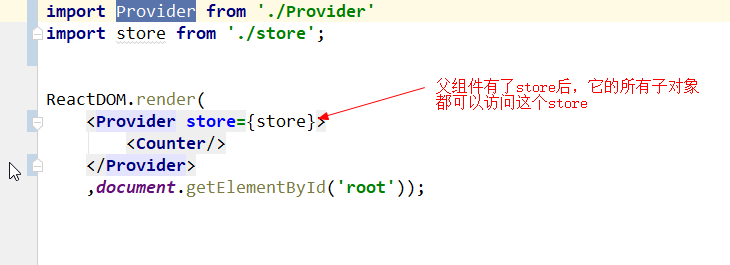

# React 进阶笔记

## 1. Reduct 应用场景图


## 2. 手写Redux.js

```js

//创建仓库
/**
 * store中有2个对象:
 *    1. state（全局只有一个state，但它可以保存为一个对象树，什么数据都可以保存）
 *       一个state对应一个view（外部传入的），故state的结构是要变化的。
 *
 *    2. reducer处理器（外部传入）
 *
 * @param reducer 处理器（具体业务的，必须传入）
 *        reducer：需要获取
 *
 *
 */
const createStore = (reducer)=>{
    //内部保存一个状态
    let state;

    //获取当前状态
    let getState = () => state;

    //订阅者
    let listeners = [];
    //订阅（传入一个监听函数对象 func）
    let subscribe = (listener) =>{
        //订阅后，将监听函数压入到内部的 监听数组中
        listeners.push(listener);

        //订阅后，要返回一个 取消订阅的函数回去
        return (listener) => {

            //这里是过滤不等于当前订阅的函数，即从订阅函数数组中移除当前订阅者。
            listeners = listeners.filter(l=> l!==listeners);
        }
    }

    //向仓库发送action --给-> reducer 进行处理，返回一个新的state
    //通过reducer(state,action)方法，就可以知道reducer必须接收2个参数(老的state和action对象）
    let dispatch = (action) => {

        //reducer接收action，并处理后，返回一个新的state
        state = reducer(state,action); //这里将新的state赋值给内部的state

        //当状态更新后，监听数组中（即订阅者，执行各自的订阅方法）
        listeners.forEach((listener)=>listener());
    }

    //返回值，可以返回一个箭头函数，其实也是一个对象
    return {
        getState,
        dispatch,
        subscribe
    }
}

export {createStore}

```

## 3. 手写合并reducers

```js
import {createStore} from "redux";
import counter from './reducers/counter-reducer';
import todo from './reducers/todo-reducer';

//将2个reducer合并为1个

//这里的reducers 表示是2个函数数组
let combineReducers = (reducers) =>  //注意，这里没有 {} ，紧接着又是一个箭头函数
    //这里的state组合为{counter:{number:0},todo:{list:list[]}}
    (state = {}, action) => {
        let newState = {};
        for (let key in reducers) {
            //newState[key] 表示给newState赋值一个新的属性，属性名为key
            //reducers[key] 表示数组key = key 的函数
            //state[key] 表示老的state，通过key 对应不同的属性
            newState[key] = reducers[key](state[key], action);
        }
        return newState;
    }


//将2个reducer合并为1个函数数组对象（对象key为函数名，值为函数
let reducer = combineReducers(
    {
        counter,
        todo
    }
);

//创建一个全局的Store，传入参数为：合并后的reducer
let store = createStore(reducer);
console.log('初始化',store.getState());
export {store};
```


## 4. 手写Connect函数

Connect 函数来源于 React-redux 中间件。目的是让UI组件更纯粹，只负责UI的呈现，这样的组件称为**纯组件**

数据的处理交给**容器组件**来处理。


原始的组件的写法（与store紧密结合的方式）

```js

export default class Counter extends React.Component{
    state={
        number: 0
    }

    //react的组件装载事件 ---> 启用监听
    componentWillMount(){
        //订阅返回一个卸载订阅的方法
        this.unSubscribe = store.subscribe(()=>{
            this.setState({
                number:store.getState().counter.number
            })
        });
    }

    //react的组件卸载事件 ---> 禁用监听
    componentWillUnMount(){
        this.unSubscribe();
    }


    render(){
        //这个箭头函数就是一个action Creator
        let increase = (amount) => ({type:INC,amount});
        //等价于
        //let increase = (amount) => { return {type:INC,amount}};


        return (
            <div>
                <p>{this.state.number}</p>
                <button onClick={()=>{store.dispatch(increase(2))}}>+</button>
                <button onClick={()=>{store.dispatch({type:DEC,amount:1})}}>-</button>
            </div>
        );
    }
}
```

上面例子中的 state 初始值，与store的订阅与取消订阅以及事件的绑定等，**每个组件都需要写一遍**，这时需要一个Connect函数来**自动生成**这块代码。


手写Connect方法体

```js
import React from 'react';
import {store} from '../store'
import {INC,DEC} from '../actions'

/**
 * 声明一个React组件
 *
 */
class Counter2 extends React.Component{
    render(){
        return (
            <div>
                {/*老的组件，内部没有state了，只有外面传入的属性*/}
                {/*老的组件，就可以得到外面传入的属性了*/}

                <p>{this.props.value}</p>
                {/*注意，onClick 也是 等于 一个 func，故不能加 ()*/}
                <button onClick={this.props.onInc}>+</button>
                <button onClick={this.props.onDec}>-</button>

                {/*<button onClick={()=>{store.dispatch({type:INC,amount:3})}}>+</button>*/}
                {/*<button onClick={()=>{store.dispatch({type:DEC,amount:1})}}>-</button>*/}
            </div>
        );
    }
}

/**
 *   模拟一个 let CounterApp = connect()(Counter) 的调用方式，返回一个新的组件
 *
 *   说明：connect() 后面还有一个 (Counter) 说明 Connect() 返回的是一个函数(并且带有一个参数，这个参数就是代表原来的组件），
 *
 *   connect =  () => 箭头函数 ，表示第一个匿名函数（无参数）返回的是一个箭头函数，而不是一个对象
 */


/**
 *
 * @param mapStateToProps 把store中的state映射为组件的属性的一个 func
 * @returns {function(*): *}
 */
let connect = (mapStateToProps,mapDispatchToProps) => (_component) => {

    class Proxy extends React.Component{
        constructor(){
            super();

            // this.state = {...mapStateToProps(store.getState())} 等同于下面的写法
            this.state = mapStateToProps(store.getState());
        }

        componentWillMount(){
            //store.subscribe(render());
            this.unSubscribe = store.subscribe(() => {
                this.setState({...mapStateToProps(store.getState())});
            })
        }

        componentWillUnMount(){
            this.unSubscribe();
        }


        //渲染传入的老组件
        render(){

            //这句很重要， ...this.state 解构为每个属性，再传递到组件中的 props
            return <_component {...this.state} {...mapDispatchToProps(store.dispatch)}/>
        }
    }

    return Proxy;
}

//将 state 映射为 属性
//这里的state，是store中的state，看上面的调用处
let mapStateToProps = (state) => {
    return { value:state.number}
}

//将 Dispatch 映射为 属性
let mapDispatchToProps = (dispatch) => (
    {
        //属性后面是一个箭头函数
        onInc: () => dispatch({type:INC}),
        onDec: () => dispatch({type:DEC,amount:1})
    }
)

/**
 *  帮助理解如何将store中的属性转换为组件中state的值
let _state = {number:15};

let mapStateToProps = (state) => ({
    value:state.number
})

let myState = mapStateToProps(_state);
let myState1 = {...mapStateToProps(_state)};
console.log(myState);   //输出 {value: 15}
console.log(myState1);  //输出 {value: 15}

 **/


let Counter = connect(mapStateToProps,mapDispatchToProps)(Counter2);

export default Counter;
```


## 5.将Connect独立为一个文件

```js
import React from 'react';
import {store} from './store'

/**
 *
 * @param mapStateToProps 把store中的state映射为组件的属性
 * @param mapDispatchToProps 把store中的dispatch映射为组件的一个属性，这个属性的值为一个 func
 * @returns {function(*): *}
 */
let connect = (mapStateToProps,mapDispatchToProps) => (_component) => {

    class Proxy extends React.Component{
        constructor(){
            super();

            // this.state = {...mapStateToProps(store.getState())} 等同于下面的写法
            this.state = mapStateToProps(store.getState());
        }

        componentWillMount(){
            //store.subscribe(render());
            this.unSubscribe = store.subscribe(() => {
                this.setState({...mapStateToProps(store.getState())});
            })
        }

        componentWillUnMount(){
            this.unSubscribe();
        }


        //渲染传入的老组件
        render(){

            //这句很重要， ...this.state 解构为每个属性，再传递到组件中的 props
            return <_component {...this.state} {...mapDispatchToProps(store.dispatch)}/>
        }
    }

    return Proxy;
}

export default  connect;
```

**但这里面的store与connect方式是强依赖，需要剔除。**


Store的代码一般是 放到index.js文件中（属于应用层的代码）

**不能把store到处都引用进来。**


这时就需要Context，只要在最顶层传入后，它的Children 都可以使用了。


## 6. Context 上下文 特性

利用Context上下文的特性，可以让所有子组件都拥有顶层组件传入的对象。

Provider 组件是专门引入**Context上下文**，并可以让**子组件**可以使用**顶层定义的属性**


```js
import React from 'react';
import {PropTypes} from 'prop-types';

class Provider extends React.Component{

    getChildContext(){
        return {store:this.props.store};
    }


    //渲染所有的子组件就可以了
    render(){
       return this.props.children;
    }
}

//注意，父组件是用  childContextTypes
Provider.childContextTypes  = {
    store:PropTypes.object
}

export default Provider;
```


子组件 使用时

```
使用store时，是用下面的
this.context.store


//约束 组件的 contextTypes
Proxy.contextTypes={
    store:PropTypes.object
}
```

完整的connect

```js
import React from 'react';
import {PropTypes} from 'prop-types';

/**
 * store 使用 this.context.store
 * @param mapStateToProps 把store中的state映射为组件的属性
 * @param mapDispatchToProps 把store中的dispatch映射为组件的一个属性，这个属性的值为一个 func
 * @returns {function(*): *}
 */
let connect = (mapStateToProps,mapDispatchToProps) => (_component) => {

    class Proxy extends React.Component{
        constructor(){
            super();

            // this.state = {...mapStateToProps(store.getState())} 等同于下面的写法
            this.state = {};
        }

        componentWillMount(){
            //store.subscribe(render());
            this.unSubscribe = this.context.store.subscribe(() => {
                this.setState({...mapStateToProps(this.context.store.getState())});
            })
        }

        componentWillUnMount(){
            this.unSubscribe();
        }


        //渲染传入的老组件
        render(){

            //这句很重要， ...this.state 解构为每个属性，再传递到组件中的 props
            return <_component {...this.state} {...mapDispatchToProps(this.context.store.dispatch)}/>
        }
    }

    //约束 组件的 contextTypes
    Proxy.contextTypes={
        store:PropTypes.object
    }

    return Proxy;
}

export default  connect;
```




UI组件，就变为纯组件了（只使用到了props了）

```js
import React from 'react';
import {INC,DEC} from '../actions'
import connect from '../connect'
/**
 * 声明一个React组件
 *
 */
class Counter2 extends React.Component{
    render(){
        return (
            <div>
                {/*老的组件，内部没有state了，只有外面传入的属性*/}
                {/*老的组件，就可以得到外面传入的属性了*/}
                <p>{this.props.value}</p>
                {/*注意，onClick 也是 等于 一个 func，故不能加 ()*/}
                <button onClick={this.props.onInc}>+</button>
                <button onClick={this.props.onDec}>-</button>
            </div>
        );
    }
}

/**
 *   模拟一个 let CounterApp = connect()(Counter) 的调用方式，返回一个新的组件
 *
 *   说明：connect() 后面还有一个 (Counter) 说明 Connect() 返回的是一个函数(并且带有一个参数，这个参数就是代表原来的组件），
 *
 *   connect =  () => 箭头函数 ，表示第一个匿名函数（无参数）返回的是一个箭头函数，而不是一个对象
 */


//将 state 映射为 属性
//这里的state，是store中的state，看上面的调用处
let mapStateToProps = (state) => {
    return { value:state.number}
}

//将 Dispatch 映射为 属性
let mapDispatchToProps = (dispatch) => (
    {
        //属性后面是一个箭头函数
        onInc: () => dispatch({type:INC}),
        onDec: () => dispatch({type:DEC,amount:1})
    }
)

/**
 *  帮助理解如何将store中的属性转换为组件中state的值
let _state = {number:15};

let mapStateToProps = (state) => ({
    value:state.number
})

let myState = mapStateToProps(_state);
let myState1 = {...mapStateToProps(_state)};
console.log(myState);   //输出 {value: 15}
console.log(myState1);  //输出 {value: 15}

 **/


let Counter = connect(mapStateToProps,mapDispatchToProps)(Counter2);

export default Counter;
```

## 7.完整的手写react-redux-connect-provider手写

项目组织结构


### 1) index.js

程序启动入口，store在这里创建，传入到Provider，用于上下文中可以访问到store（这个例子，只有connect中用到了）

```js
import React from 'react';
import ReactDOM from 'react-dom';
import Counter from './components/Counter';
import {createStore} from "redux";
import reducer from './reducers/counter-reducer'
import Provider from './Provider'
let store = createStore(reducer);
ReactDOM.render(
    <Provider store={store}>
        <Counter/>
    </Provider>
    ,document.getElementById('root'));
```

### 2)redux.js


```js
//创建仓库
/**
 * store中有2个对象:
 *    1. state（全局只有一个state，但它可以保存为一个对象树，什么数据都可以保存）
 *       一个state对应一个view（外部传入的），故state的结构是要变化的。
 *
 *    2. reducer处理器（外部传入）
 *
 * @param reducer 处理器（具体业务的，必须传入）
 *        reducer：需要获取
 *
 *
 */
const createStore = (reducer)=>{
    //内部保存一个状态
    let state;

    //获取当前状态
    let getState = () => state;

    //订阅者
    let listeners = [];
    //订阅（传入一个监听函数对象 func）
    let subscribe = (listener) =>{
        //订阅后，将监听函数压入到内部的 监听数组中
        listeners.push(listener);

        //订阅后，要返回一个 取消订阅的函数回去
        return (listener) => {

            //这里是过滤不等于当前订阅的函数，即从订阅函数数组中移除当前订阅者。
            listeners = listeners.filter(l=> l!==listeners);
        }
    }

    //向仓库发送action --给-> reducer 进行处理，返回一个新的state
    //通过reducer(state,action)方法，就可以知道reducer必须接收2个参数(老的state和action对象）
    let dispatch = (action) => {

        //reducer接收action，并处理后，返回一个新的state
        state = reducer(state,action); //这里将新的state赋值给内部的state

        //当状态更新后，监听数组中（即订阅者，执行各自的订阅方法）
        listeners.forEach(l=>l());
    }
    //默认先过滤一次监听器
    dispatch();
  
    //返回值，可以返回一个箭头函数，其实也是一个对象
    return {
        getState,
        dispatch,
        subscribe
    }
}

export {createStore}
```


### 3)connect.js

用于分解UI组件和组件与store的操作的中间件，核心代码

```js
import React from 'react';
import {PropTypes} from 'prop-types';

/**
 * store 使用 this.context.store
 * @param mapStateToProps 把store中的state映射为组件的属性
 * @param mapDispatchToProps 把store中的dispatch映射为组件的一个属性，这个属性的值为一个 func
 * @returns {function(*): *}
 */
let connect = (mapStateToProps,mapDispatchToProps) => (_component) => {

    class Proxy extends React.Component{
        constructor(){
            super();

            // this.state = {...mapStateToProps(store.getState())} 等同于下面的写法
            this.state = {};
        }

        componentWillMount(){
            //store.subscribe(render());
            this.unSubscribe = this.context.store.subscribe(() => {
                this.setState({...mapStateToProps(this.context.store.getState())});
            })
        }

        componentWillUnMount(){
            this.unSubscribe();
        }


        //渲染传入的老组件
        render(){

            //这句很重要， ...this.state 解构为每个属性，再传递到组件中的 props
            return <_component {...this.state} {...mapDispatchToProps(this.context.store.dispatch)}/>
        }
    }

    //约束 组件的 contextTypes
    Proxy.contextTypes={
        store:PropTypes.object
    }

    return Proxy;
}

export default  connect;
```

4)Provider.js

```js
import React from 'react';
import {PropTypes} from 'prop-types';

class Provider extends React.Component{

    getChildContext(){
        return {store:this.props.store};
    }


    //渲染所有的子组件就可以了
    render(){
       return this.props.children;
    }
}

//注意，父组件是用  childContextTypes
Provider.childContextTypes  = {
    store:PropTypes.object
}

export default Provider;
```

### 4)actions.js

```js
const INC = 'INC';
const DEC = 'DEC';
export {INC,DEC}
```

### 5)Counter.js(组件)

```js
import React from 'react';
import {INC,DEC} from '../actions'
import connect from '../connect'
/**
 * 声明一个React组件
 *
 */
class Counter2 extends React.Component{
    render(){
        return (
            <div>
                {/*老的组件，内部没有state了，只有外面传入的属性*/}
                {/*老的组件，就可以得到外面传入的属性了*/}

                <p>{this.props.value}</p>
                {/*注意，onClick 也是 等于 一个 func，故不能加 ()*/}
                <button onClick={this.props.onInc}>+</button>
                <button onClick={this.props.onDec}>-</button>

                {/*<button onClick={()=>{store.dispatch({type:INC,amount:3})}}>+</button>*/}
                {/*<button onClick={()=>{store.dispatch({type:DEC,amount:1})}}>-</button>*/}
            </div>
        );
    }
}

/**
 *   模拟一个 let CounterApp = connect()(Counter) 的调用方式，返回一个新的组件
 *
 *   说明：connect() 后面还有一个 (Counter) 说明 Connect() 返回的是一个函数(并且带有一个参数，这个参数就是代表原来的组件），
 *
 *   connect =  () => 箭头函数 ，表示第一个匿名函数（无参数）返回的是一个箭头函数，而不是一个对象
 */


//将 state 映射为 属性
//这里的state，是store中的state，看上面的调用处
let mapStateToProps = (state) => {
    return { value:state.number}
}

//将 Dispatch 映射为 属性
let mapDispatchToProps = (dispatch) => (
    {
        //属性后面是一个箭头函数
        onInc: () => dispatch({type:INC}),
        onDec: () => dispatch({type:DEC,amount:1})
    }
)

/**
 *  帮助理解如何将store中的属性转换为组件中state的值
let _state = {number:15};

let mapStateToProps = (state) => ({
    value:state.number
})

let myState = mapStateToProps(_state);
let myState1 = {...mapStateToProps(_state)};
console.log(myState);   //输出 {value: 15}
console.log(myState1);  //输出 {value: 15}

 **/


let Counter = connect(mapStateToProps,mapDispatchToProps)(Counter2);

export default Counter;
```

### 6)counter-reducer.js

每个组件的处理器

```js
import {INC,DEC} from '../actions'

//假如：action对象为{type:'INC'，amount:2)
const reducer = (state = {number: 0}, action) => {
    if (action === undefined) return state; //当初始化时，没有传入action时，取默认值

    switch (action.type) {
        case INC:
            // 这里的 || 表示如果action.amount 为undefined时，取默认值为1
            return {number: state.number + (action.amount || 1) };
        case DEC:
            return {number: state.number - action.amount};
        default:
            return state;
    }
};

export default reducer;
```

## 8 手写middleWare（redux中原生有实现)


**中间件的三个参数**，为后面的代码理解有好处

第一个参数为：store

第二个参数为：dispatch

第三个参数为：action


```js
/**
 *
 * logger 的定义， 第一个参数为老的store，第二个参数为store.dispatch
 * let logger = store => next => action =>{
 * }
 *
 *applyMiddleware的应用
 * let store = applyMiddleware(logger)(store.createStore)(reducer);
 * @param middleWare
 * @returns {function(*): function(*=): {dispatch: *}}
 */
//应用中间件 对store 增强，返回一个对 dispath 增强的 store
let applyMiddleware = (logger) => {
    return (createStore) => (reducer) => {
        let store = createStore(reducer);
        let dispatchFunc = logger(store); //返回是nextFunc，nextFunc = (next 或叫 dispatch) => action => {}
        let dispatch = dispatchFunc(store.dispatch);//将store老的dispatch方法传入，替换掉store中的dispath

        //返回一个新的store，并把store中原来有的getState，subscribe 返回，并返回一个新的dispatch，这个行的dispath，就是上面的 dispatchFunc（即日志中间件的最后实现的方法体）
        return {
            ...store,dispatch //表示把新的dispatch，覆盖老的store的dispatch方法
        }
    }
}

```

index.js

```js
import {createStore,applyMiddleware} from "redux";
import reducer from './reducers/counter-reducer'
import {INC} from './actions'

//这里定义的一个中间件logger
let logger = store => next => action =>{
    console.log('befoe',store.getState().number);
    next(action);
    console.log('after',store.getState().number);
}
//返回一个带有logger的中间件增强dispatch方法的store了
let store = applyMiddleware(logger)(createStore)(reducer);
// let store = createStore(reducer);

store.dispatch({type:INC,amount:1});
```

## 9.手写 thunk 实现异步

```js
let thunk = store => next => action =>{
    //判断action是否为一个函数，如果为函数，则将next 传入到action 中去执行，这个next 就是 下面调用的dispatch
    if (typeof action === 'function'){
        action(next);
    }else{
        next(action);
    }

}

//后面2个参数，是固定写法了，只有第一个参数，才是中间件方法本身。
let store = applyMiddleware(thunk)(createStore)(reducer);
store.subscribe(()=>{
    console.log(store.getState().number);
})

store.dispatch(function(dispatch){
    // setTimeout(function () {
    //     dispatch({type:INC,amount:3})
    // },3000)

    //上面的代码等同于
    setTimeout( () => dispatch({type:INC,amount:3}) ,3000)

});
```

## 10.手写promise异步

```js
let isPromise = obj => obj.then; //表示只要有then方法，表示是promise
let promiseMiddleWare = store => next => action =>{
    //判断action是Promise方法
    if (isPromise(action)){
        action.then((data)=>next(data));
    }else{
        next(action);
    }

}


//后面2个参数，是固定写法了，只有第一个参数，才是中间件方法本身。
let store = applyMiddleware(promiseMiddleWare)(createStore)(reducer);
store.subscribe(()=>{
    console.log(store.getState().number);
})

/*store.dispatch(function(dispatch){
    // setTimeout(function () {
    //     dispatch({type:INC,amount:3})
    // },3000)

    //上面的代码等同于
    setTimeout( () => dispatch({type:INC,amount:3}) ,3000)

});*/

store.dispatch(new Promise(function(reslove,reject){
    setTimeout(function () {
        reslove({type:INC,amount:3})
    },3000)
}))

```


## 11.应用多个中间件

```js
let applyMiddleware = (...logs) => {
    return (createStore) => (reducer) => {
        let store = createStore(reducer);
        logs.map(l=>l(store));

        let dispatch = compose(...logs,store.dispatch);

        return {
            ...store,dispatch //表示把新的dispatch，覆盖老的store的dispatch方法
        }
    }
}
```


## 12.react的默认属性

```js
import React,{Component} from 'react';
import {render} from 'react-dom';

class Clock extends Component{

    static defaultProps = {
        name: '默认名'
    }


    render(){
        return (
            <div>
                {this.props.name}
            </div>
        )
    }
}

render(<Clock name='yxq' />,document.getElementById('root'));
```

当 name 不传递的时候，读取默认的props的值，这个**defaultProps** 是默认的名称


## 13.react 中的 this

react中的this 是指组件实例，而不是react元素本身，如下

```js
import React,{Component} from 'react';
import {render} from 'react-dom';

class Clock extends Component{


    handleChange = () =>{
        debugger;

        let a = parseInt(this.a.value) || 0;
        let b = parseInt(this.b.value) || 0;
        this.c.value = a + b;

        console.log(this.refs.test.value); //直接获取ref的值

        console.log(this);
    }


    render(){

        //ref={ref=>this.a=ref} 表示在Clock类中声明了一个a属性，并赋值为当前的input
        return (
            <div onChange={this.handleChange}>
                <input type='test' ref={ref=>this.a=ref} /> +
                <input type='test' ref={ref=>this.b=ref}/> =
                <input type='test' ref={ref=>this.c=ref}/>
                //这个表示 给 组件类的refs 添加了一个属性为test
                <input type='test' ref="test"/>

            </div>
        )
    }


}

render(<Clock name='yxq' />,document.getElementById('root'));
```


还要学习珠峰的第三章。


