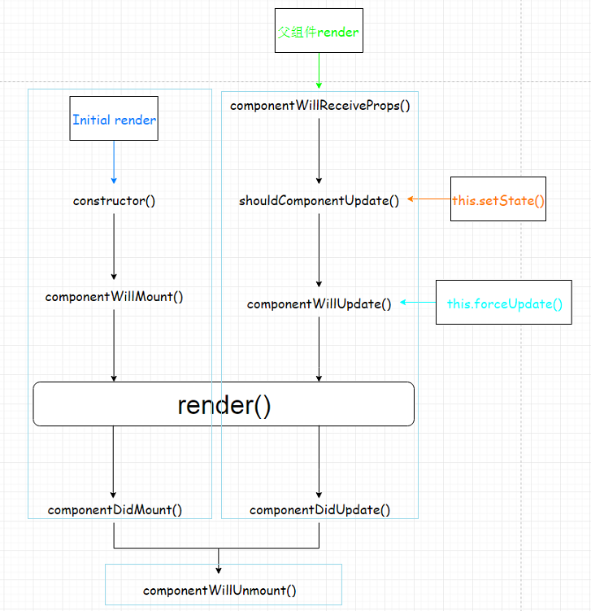

# 1.React JS 库

```xml
<script type="text/javascript" src="../js/react.development.js"></script>
<script type="text/javascript" src="../js/react-dom.development.js"></script>
<script type="text/javascript" src="../js/prop-types.js"></script>
<script type="text/javascript" src="../js/babel.min.js"></script>
<script type="text/babel">/*告诉babel.js解析里面的jsx的代码*/
// 1. 创建虚拟DOM元素对象
var vDom = <h1>Hello React!</h1>   // 不是字符串
// 2. 将虚拟DOM渲染到页面真实DOM容器中
ReactDOM.render(vDom, document.getElementById('test'))
</script>
```

3个核心库，1个解析jsx的库

# 2.面向组件编程

## 1.React组件的三大属性（state、props、refs）

```html
<!DOCTYPE html>
<html>
<head>
    <meta charset="UTF-8">
    <title>01_HelloWorld</title>
</head>
<body>
<div id="test"></div>

<script type="text/javascript" src="../js/react.development.js"></script>
<script type="text/javascript" src="../js/react-dom.development.js"></script>
<script type="text/javascript" src="../js/babel.min.js"></script>
<script type="text/babel">/*告诉babel.js解析里面的jsx的代码*/
// 1. 创建虚拟DOM元素对象
var vDom = <h1>Hello React!</h1>   // 不是字符串
// 2. 将虚拟DOM渲染到页面真实DOM容器中
ReactDOM.render(vDom, document.getElementById('test'))
</script>
</body>
</html>
```

###1）state的使用

```jsx
<!DOCTYPE html>
<html>
<head>
    <meta charset="UTF-8">
    <title>02_ToDolist</title>
</head>
<body>

<div id="test"></div>

<script type="text/javascript" src="../js/react.development.js"></script>
<script type="text/javascript" src="../js/react-dom.development.js"></script>
<script type="text/javascript" src="../js/prop-types.js"></script>
<script type="text/javascript" src="../js/babel.min.js"></script>
<script type="text/babel">/*告诉babel.js解析里面的jsx的代码*/

/**
 *    测试react的三大属性之 state ，用于保存内部数据
 *
 */


// 1. 创建虚拟DOM元素对象
class MyComponent extends React.Component{

    constructor(props){
        //固定写法，props是外部数据
        super(props)

        /*
           状态值，保存的是内部数据，初始化数据
        */

        this.state={
            isLikeMe: false
        }

        /**
         * 将组件本身this绑定到自定义方法中去
         * ps: bind方法，将产生一个新的方法，只是函数体一样
         */
        this.hander1 = this.hander1.bind(this);

    }

    //不是Component组件本身的方法，是无法获取到this对象（即组件对象）
    //需要在构造方法中，对组件本身的this，绑定到自定义方法中
    hander1(){

        /*
        *   React 直接对状态修改，是不支持的，需要使用setState方法来处理
        */

        // this.state.isLikeMe = !this.state.isLikeMe

        //得到状态
        const isLike = this.state.isLikeMe;

        //修改状态
        this.setState({
            isLikeMe:!isLike
        })


    }

    render(){
        const  isLikeMe = this.state.isLikeMe
        return <h2 onClick={this.hander1}>{isLikeMe?'我喜欢你':'你喜欢我'}</h2>
    }
}
   // var vDom = <h1>Hello React!</h1>   // 不是字符串
   // // 2. 将虚拟DOM渲染到页面真实DOM容器中
   // ReactDOM.render(vDom, document.getElementById('test'))
ReactDOM.render(<MyComponent />,document.getElementById('test'))

</script>
</body>
</html>
```

### 2）props的使用

```jsx
<!DOCTYPE html>
<html>
<head>
    <meta charset="UTF-8">
    <title>02_ToDolist</title>
</head>
<body>

<div id="test"></div>
<div id="test2"></div>

<script type="text/javascript" src="../js/react.development.js"></script>
<script type="text/javascript" src="../js/react-dom.development.js"></script>
<script type="text/javascript" src="../js/prop-types.js"></script>
<script type="text/javascript" src="../js/babel.min.js"></script>
<script type="text/babel">/*告诉babel.js解析里面的jsx的代码*/
/**
 *    测试react的三大属性之 props ，用于从外部读取数据
 *
 */
// 1. 创建虚拟DOM元素对象

/**
 *   方式一：采用function的方式，这种方式，一般是简单处理，如，只显示数据，没有什么交互动作。
 */
// function MyComponent(props){
//     return (
//         <ul>
//             <li>{props.name}</li>
//             <li>{props.age}</li>
//             <li>{props.sex}</li>
//         </ul>
//
//     )
// }

/**
 * 方式二：采用类的方式
 *
 * 注意，这里的props是组件的一个属性，使用时，要用this.props ,有别于function中，可以直接使用
 *
 */

class MyComponent extends React.Component {

    constructor(props){
        super(props);

    }

    render() {
        console.log(this) //打印输出内部的结构
        return (
            <ul>
                <li>{this.props.name}</li>
                <li>{this.props.age}</li>
                <li>{this.props.sex}</li>
            </ul>
        )

    }
}

//指定属性值的类型和是否必须输入
MyComponent.propTypes = {
    name:PropTypes.string.isRequired,
    age:PropTypes.number

}


const p1 = {
    name:"Tom",
    age:15,
    sex:"男"
}

const p2 = {
    name:"Lusi",
    age:19,
    sex:"女"
}


/**
 ... 的作用
 1.打包
 function fn(...param){}  fn(1,2,3) 将1,2,3 打包为数组
 2.解包
 const arr1 = [3,4,5] const arr2 = [1,2,...arr1,6,7] 最终解包为[1,2,3,4,5,6,7]

 */
ReactDOM.render(<MyComponent {...p1} />, document.getElementById('test'))

ReactDOM.render(<MyComponent {...p2} />, document.getElementById('test2'))

</script>
</body>
</html>
```

### 3）refs的使用

```jsx
<!DOCTYPE html>
<html>
<head>
    <meta charset="UTF-8">
    <title>02_ToDolist</title>
</head>
<body>

<div id="test"></div>

<script type="text/javascript" src="../js/react.development.js"></script>
<script type="text/javascript" src="../js/react-dom.development.js"></script>
<script type="text/javascript" src="../js/prop-types.js"></script>
<script type="text/javascript" src="../js/babel.min.js"></script>
<script type="text/babel">/*告诉babel.js解析里面的jsx的代码*/
/**
 *    测试react的三大属性之 refs ，用于事件绑定
 *
 */
// 1. 创建虚拟DOM元素对象
class MyComponent extends React.Component{
    constructor(props){
        super(props)
        this.btn1 = this.btn1.bind(this)
        this.btn2 = this.btn2.bind(this)
    }

    btn1(){

        /**
         * 方式一：
         * <input type="text" ref="codeinput"/>&nbsp;
         * refs是Component中内置的一个对象，对象的属性名就是我们在ref中定义的名字codeinput


           const codeinput = this.refs.codeinput
           alert(codeinput.value)
         */
        const codeinput = this.refs.codeinput
        alert(codeinput.value)

        /** 方式二：也是React高版本推荐的方式
         *<input type="text" ref={a=>this.codeinput1 = a} />
         *
         * ref={a=>this.codeinput1 = a} 这里是一个委托，回调， a就代表input标签本身，后面的方法体，是动态给this，加了一个对象codeinput1
         * 并把当前的标签input赋值给了它
         *
         */
        //
        alert(this.codeinput1.value)

    }


    /**
     * @event
     *
     * 这里获取的是事件触发元素本身，我们可以不用ref来实现了，直接用event这个默认参数来处理
     *
     * 通过 event.target来得到目标元素
     */
    btn2(event){
        alert(event.target.value)

    }

    render(){
        return(
            <div>
                <input type="text" ref="codeinput"/>&nbsp;
                <input type="text" ref={a=>this.codeinput1 = a} />&nbsp;
                <button onClick={this.btn1}>提示输入</button>&nbsp;
                <input type="text" placeholder="失去焦点提示" onBlur={this.btn2} ></input>

            </div>
        )
    }
}
   // var vDom = <h1>Hello React!</h1>   // 不是字符串
   // // 2. 将虚拟DOM渲染到页面真实DOM容器中
   // ReactDOM.render(vDom, document.getElementById('test'))
ReactDOM.render(<MyComponent />,document.getElementById('test'))

</script>
</body>
</html>
```

## 2.组件的编写流程

1. **拆分组件**
2. **实现静态界面，没有动态数据和交互**
3. **实现动态数据(将静态数据替换为动态数据)**
4. **实现交互**


```jsx
<!DOCTYPE html>
<html>
<head>
    <meta charset="UTF-8">
    <title>02_ToDolist</title>
</head>
<body>

<div id="test"></div>

<script type="text/javascript" src="../js/react.development.js"></script>
<script type="text/javascript" src="../js/react-dom.development.js"></script>
<script type="text/javascript" src="../js/prop-types.js"></script>
<script type="text/javascript" src="../js/babel.min.js"></script>
<script type="text/babel">/*告诉babel.js解析里面的jsx的代码*/
/**
 *    测试react的组件组合
 *    1. 子组件需要改变父组件中的state中的数据
 *      a.子组件是不能直接改变父组件中的状态的。
 *         状态在哪个组件，就需要在哪个组件中进行更新
 *      b.在子组件中如何调用父组件的方法？
 *        不能直接调用，他们不是一个继承关系，只能通过props方式把父组件中的方法传递到子组件，传递的是一个引用
 *-------------------------------------------------------------------------
 *    实现组件的操作流程：
 *      1. 拆分组件
 *      2. 实现静态界面，没有动态数据和交互
 *      3. 实现动态数据
 *      4. 实现交互
 *
 */
// 1. 创建虚拟DOM元素对象
class MyComponent extends React.Component {
    constructor(props) {
        super(props);

        this.state = {
            todos: ['吃饭','睡觉','敲代码']
        }

        this.addtodo = this.addtodo.bind(this) //绑定组件的this到自定义方法中，返回一个新的方法
    }

    //更新状态数据（不能直接修改，React不支持，必须采用setState）
    addtodo(todo){
        //1 获取状态数据,并处理
        const todos = this.state.todos
        // todos.unshift(todo);
        todos.push(todo);

        //2.更新状态数据
        this.setState({todos})
    }

    /**
     *  <MyListComponent todos={this.state.todos}/>
     *  这里的todos 表示List的prop属性的名称，传入的父组件的state中的数据
     *
     * @returns {*}
     */
    render() {
        const {todos} = this.state
        return (
            <div>
                <h2>ToDO List</h2>
                <MyAddComponent todoCount={todos.length} addtodo={this.addtodo}/>
                <MyListComponent todos={todos}/>
            </div>
        )
    }

}


class MyAddComponent extends React.Component {

    constructor(props){
        super(props)
        this.add = this.add.bind(this)
    }


    add(){
        const inputVal = this.input1.value.trim();
        if (inputVal){
            // this.props.addtodo 就是父组件通过props方式传递过来的,传递的是一个引用
            this.props.addtodo(inputVal)

            this.input1.value=''


        }

    }


    render() {
        return (
            <div>
                <input type="text" ref={x=>this.input1=x}/>&nbsp;&nbsp;
                <button onClick={this.add} >添加#{this.props.todoCount}</button>
            </div>

        )
    }

}

MyAddComponent.propTypes = {
    todoCount:PropTypes.number.isRequired,
    addtodo:PropTypes.func.isRequired
}

class MyListComponent extends React.Component {

    constructor(props){
        super(props)
    }

    render() {
        // const todos = this.props.todos
        const {todos} = this.props  //这种写法，是上一种的简写
        console.log(todos)

        return (
            <ul>
                {
                    todos.map((x,index)=>{return <li key={index}>{x}</li>})
                }
            </ul>
        )
    }

}

/**
 * 定义List组件 的参数类型和 必输项
 * @type {{todos: (shim|*)}}
 */
MyListComponent.propTypes = {
    todos:PropTypes.array.isRequired
}

ReactDOM.render(<MyComponent/>, document.getElementById('test'))

</script>
</body>
</html>
```

## 3.收集表单

```jsx
<!DOCTYPE html>
<html>
<head>
    <meta charset="UTF-8">
    <title>react-form</title>
</head>
<body>

<div id="test"></div>

<script type="text/javascript" src="../js/react.development.js"></script>
<script type="text/javascript" src="../js/react-dom.development.js"></script>
<script type="text/javascript" src="../js/prop-types.js"></script>
<script type="text/javascript" src="../js/babel.min.js"></script>
<script type="text/babel">/*告诉babel.js解析里面的jsx的代码*/

/**
 *    测试react的收集表单数据
 *
 *    受控组件：自动将数据转化为状态数据的，比如这里的psw
 *    非受控：就是需要手动去读取，如这里 username
 *    
      推荐使用受控的，这是React的思想，少操作Dom
 *
 */

// 1. 创建虚拟DOM元素对象
class LoginForm extends React.Component{

    constructor(props){
        super(props)

        this.handleSubmit = this.handleSubmit.bind(this);
        this.handleChange = this.handleChange.bind(this);

        this.state={
            psw:''
        }

    }

    handleSubmit(event){

        const name = this.nameInput.value
        const pwd = this.state.psw
        alert(`用户名为${name}, 密码为${pwd}`)

        event.preventDefault();//阻止事件的默认行为，这里就是默认提交动作

    }

    handleChange(event){
        const pswVal = event.target.value
        console.log(pswVal)
        this.setState({psw:pswVal}) //状态是一个对象，故而，写法就是对象的写法方式
        //如果属性名和属性值一样，如这里都是psw的话，可以写如下的方式：
        this.setState({psw});


    }


    render(){
        return(
            <form action="/login" onSubmit={this.handleSubmit}>
                用户名：<input type="text" ref={x=>this.nameInput=x}/>
                密码：<input type="password" value={this.state.psw} onChange={this.handleChange}  />
                <input type="submit" value="登录"/>

            </form>

        )
    }
}
// 2. 渲染组件标签
ReactDOM.render(<LoginForm />,document.getElementById('test'))

</script>
</body>
</html>
```

# 3.组件的生命周期



```jsx
<!DOCTYPE html>
<html>
<head>
    <meta charset="UTF-8">
    <title>react-lifecycle</title>
</head>
<body>
<div id="test"></div>

<script type="text/javascript" src="../js/react.development.js"></script>
<script type="text/javascript" src="../js/react-dom.development.js"></script>
<script type="text/javascript" src="../js/prop-types.js"></script>
<script type="text/javascript" src="../js/babel.min.js"></script>
<script type="text/babel">


    class LifeComponent extends React.Component {
        constructor(props) {
            super(props);
            //设置状态中透明度的初始值
            this.state = {
                opacity: 1  //透明度
            };
            this.distroyComponent = this.distroyComponent.bind(this);
        }


        distroyComponent() {
            console.log("do distroyComponent()");
            //使用ReactDom的移除组件方法，移除一个组件，移除组件时，就会触发一个生命周期中所有的方法。
            ReactDOM.unmountComponentAtNode(document.getElementById("test"));
        }


        //这里的回调方法中用了bind（this），否则找不到组件本身的this
        //内置方法：组件挂载完成时，即在render之后执行。
        componentDidMount() {
            console.log("do componentDidMount()");
            //这里将定时器的id返回给一个新的组件变量intervalId
            this.intervalId = setInterval(function () {
                console.log("定时器执行中...");
                let {opacity} = this.state;
                opacity -= 0.1;
                if (opacity <= 0) {
                    opacity = 1;
                }
                this.setState({opacity});

            }.bind(this), 200);
        }

        //内置方法：组件即将移除之前的方法
        componentWillUnmount(){
            console.log("do componentWillUnmount()");
            //清理定时器
            clearInterval(this.intervalId);
        }

        render() {
            console.log("do render()")
            const {opacity} = this.state;

            //注意，这里的{{}},第一个{}表示这是写js代码的地方，第二个{}表示对象的写法
            //{{opacity:opacity}} 这里的属性名和属性值的名称一样，可以省略掉冒号后面的即 {{opacity}}
            return (
                <div>
                    <h2 style={{opacity}}>React 太难了</h2>
                    <button onClick={this.distroyComponent}>移除组件</button>
                </div>
            );
        }

    }


    ReactDOM.render(<LifeComponent/>, document.getElementById('test'));
</script>
</body>
</html>
```

# 4.使用脚手架创建React项目

首先安装node.js

安装WebStorm2018.2，破解方法和IDEA是一样的。

```xml
1. 安装node.js
node -v
npm -v

# 注册模块镜像
npm set registry https://registry.npm.taobao.org
--官方的
npm set registry http://registry.npmjs.org 
# node-gyp 编译依赖的 node 源码镜像
npm set disturl https://npm.taobao.org/dist

2.安装cnpm
npm install -g cnpm

如果安装失败，运行下面的命令： 
解决办法：

首先卸载cnpm
npm uninstall -g cnpm

# 清空缓存
npm cache clean
                                   

3 npm install -g @angular/cli     
----------------------以上是创建angular的命令，下面才是React的命令-----------------
安装中发现，用了上面的命令后，反而创建项目要报错。可以不设置镜像，直接用下面的命令创建。

--安装react的脚手架
npm install -g create-react-app
--用脚手架创建项目
create-react-app hello-react
cd hello-react
npm start

```


创建好项目后，在webstorm中的Terminal 终端命令输入界面中输入下面的指令，下载类型限制包

```xml
npm install --save prop-types
下载prop-types到项目中
```

## 1）箭头函数

```jsx
class CommentAdd extends React.Component {

    constructor(props){
        super(props);
        this.addComment = this.addComment.bind(this);
    }

    addComment(){
    }
  
    //自定义方法时，默认是需要bind组件的this，才能获取到组件上的属性
    //用了箭头函数后，就可以不用bind了,写法如下：
    addComment = () =>{};
    //因为箭头函数，可以理解为委托，本身就把this给传递进去了的。
   
}
```

## 2）数组的增加，修改，删除

```jsx
   deleteComment = (index) =>{
        const comments = this.state.comments;
        // 使用splice函数对数组 CUD 操作
        comments.splice(index,1); //表示删除index元素
        comments.splice(index,0,{}); //表示增加一个元素（删除0个元素，并传入一个新的元素）
        comments.splice(index,1,{}); //表示修改一个元素

        this.setState(comments);
    };
```

## 3）收集表单数据

```jsx
class CommentAdd extends React.Component {

    static propTypes = {
        saveComment: PropTypes.func.isRequired
    }

    // 定义state的结构为form表单中元素的结构，用于收集表单数据
    state = {
        username: '',
        content: ''
    };

    //用了箭头函数后，就可以不用bind(this)了。它是一个委托，默认就带有this
    addComment = () => {

        /*  const username = this.usernameInput.value;
          const comment = this.commentInput.value;

          if (username.trim()==='' || comment.trim() === '') return;
          this.usernameInput.value = '';
          this.commentInput.value = '';
          let object = {username:username,content:comment};

          //获取上级组件的保存方法
          const saveComment = this.props.saveComment;
          saveComment(object);*/
        const comment = this.state;
        if (comment.username.trim() === '' || comment.content.trim() === '') return;
        this.setState({
            username:'',content:''
        });
        //获取上级组件的保存方法
        const saveComment = this.props.saveComment;
        saveComment(comment);
    };

    handleUsernameChange = (event) => {
        const username = event.target.value;
        this.setState({username});
    };

    handleContentChange = (event) => {
        const content = event.target.value;
        this.setState({content});
    };

    render() {
        const comment = this.state;

        return (
            <div className="col-md-4">
                <form className="form-horizontal">
                    <div className="form-group">
                        <label>用户名</label>
                        <input type="text" className="form-control" placeholder="用户名" value={comment.username}
                               onChange={this.handleUsernameChange}/>
                    </div>
                    <div className="form-group">
                        <label>评论内容</label>
                        <textarea className="form-control" rows="6" placeholder="评论内容" value={comment.content}
                                  onChange={this.handleContentChange}></textarea>
                    </div>
                    <div className="form-group">
                        <div className="col-sm-offset-2 col-sm-10">
                            <button type="button" className="btn btn-default pull-right" onClick={this.addComment}>提交
                            </button>
                        </div>
                    </div>
                </form>
            </div>
        )
    }
}


export default CommentAdd
```

## 4）标签中的style中的属性简写

```jsx
<h2 style={{display}}>
这一句是一个简写，等价于 <h2 style={{display：display}}> 后面一个display表示一个变量，前一个表示style的一个属性名，当属性名和属性值的名字相同时，可以省略掉 :display
```


# 5.React ajax

## 1) jQuery: 比较重, 如果需要另外引入不建议使用

## 2) axios: 轻量级, 建议使用

a. 封装XmlHttpRequest对象的ajax

b. promise风格

**c.可以用在浏览器端和node服务器端**

## 3)fetch: 原生函数, 但老版本浏览器不支持

a.不再使用XmlHttpRequest对象提交ajax请求

b. 为了兼容低版本的浏览器, 可以引入兼容库fetch.js

## 4)axios

```jsx
<!DOCTYPE html>
<html>
<head>
    <meta charset="UTF-8">
    <title>react-ajax-demo</title>
</head>
<body>
<div id="test"></div>

<script type="text/javascript" src="../js/react.development.js"></script>
<script type="text/javascript" src="../js/react-dom.development.js"></script>
<script type="text/javascript" src="../js/prop-types.js"></script>
<script type="text/javascript" src="../js/babel.min.js"></script>
<script type="text/javascript" src="https://cdn.bootcss.com/axios/0.18.0/axios.js"></script>
<script type="text/babel">

    class MostStarRepo extends React.Component {

        state = {
            repoName: '',
            repoUrl: ''
        };

        // 组件装载完毕后，执行
        componentDidMount() {
            // https://api.github.com/search/repositories?q=r&sort=stars
            // 使用axios发送ajax请求，可以在cdn上下载
            // https://www.bootcdn.cn/
            const url = `https://api.github.com/search/repositories?q=r&sort=stars`;
            // axios.post(url,{}) 
            axios.get(url).then(res => {
                const data = res.data;
                /*  可以写成下面的写法
                const url = data.items[0].html_url;
                const name =data.items[0].name;
                */

                const {url, name} = data.items[0];

                this.setState({
                    repoName: name,
                    repoUrl: url
                });
            });
        }

        render() {
            // 表示从state中获取{中的属性值}
            const {repoName, repoUrl} = this.state;
            if (!repoName) {
                return <h2>loading...</h2>;
            } else {
                return <h2>the Most Star Repo <a href={repoUrl}>{repoName}</a></h2>
            }
        }
    }

    ReactDOM.render(<MostStarRepo/>, document.getElementById('test'));
</script>
</body>
</html>
```

文档：

https://github.com/axios/axios

```jsx
axios.get('/user?ID=12345')
  .then(function (response) {
    console.log(response);
  })
  .catch(function (error) {
    console.log(error);
  });

axios.get('/user', {
    params: {
      ID: 12345
    }
  })
  .then(function (response) {
    console.log(response);
  })
  .catch(function (error) {
    console.log(error);
  });


axios.post('/user', {
    firstName: 'Fred',
    lastName: 'Flintstone'
})
.then(function (response) {
  console.log(response);
})
.catch(function (error) {
  console.log(error);
});

```

## 5)fetch

### 1. 文档

1)        <https://github.github.io/fetch/>

2)        <https://segmentfault.com/a/1190000003810652>


### 2.相关API

1)        GET请求

```jsx
fetch(url).then(function(response) {
  return response.json()
}).then(function(data) {
  console.log(data)
}).catch(function(e) {
  console.log(e)
});

```


2)        POST请求

```jsx
fetch(url, {
  method: "POST",
  body: JSON.stringify(data),
}).then(function(data) {
  console.log(data)
}).catch(function(e) {
  console.log(e)
})

```


# 6.组件间通讯

## 方式一: 通过props传递

1)         共同的数据放在父组件上, 特有的数据放在自己组件内部(state)

2)         通过props可以传递一般数据和函数数据, 只能一层一层传递

3)         一般数据-->父组件传递数据给子组件-->子组件读取数据

4)         函数数据-->子组件传递数据给父组件-->子组件调用函数

**最大的问题，不能跨级传递，也不能在兄弟组件之间，直接传递**

## 方式二: 使用消息订阅(subscribe)-发布(publish)机制

1)         工具库: PubSubJS

2)         下载: npm install pubsub-js --save

3)         使用: 

​           import PubSub from 'pubsub-js' //引入

​           PubSub.subscribe('delete', function(data){ }); //订阅

​           PubSub.publish('delete', data) //发布消息


