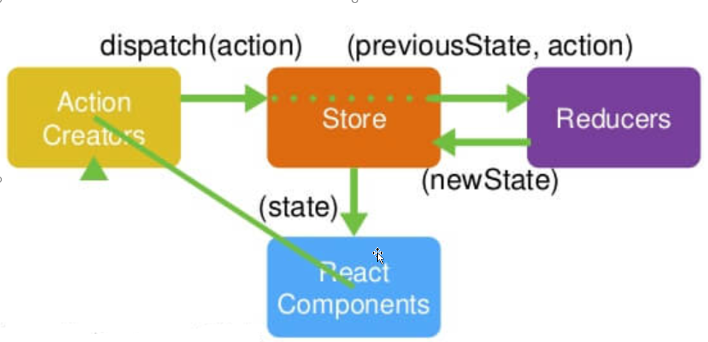

# 1.React JS 库

```xml
<script type="text/javascript" src="../js/react.development.js"></script>
<script type="text/javascript" src="../js/react-dom.development.js"></script>
<script type="text/javascript" src="../js/prop-types.js"></script>
<script type="text/javascript" src="../js/babel.min.js"></script>
<script type="text/babel">/*告诉babel.js解析里面的jsx的代码*/
// 1. 创建虚拟DOM元素对象
var vDom = <h1>Hello React!</h1>   // 不是字符串
// 2. 将虚拟DOM渲染到页面真实DOM容器中
ReactDOM.render(vDom, document.getElementById('test'))
</script>
```

3个核心库，1个解析jsx的库

# 2.面向组件编程

## 1.React组件的三大属性（state、props、refs）

```html
<!DOCTYPE html>
<html>
<head>
    <meta charset="UTF-8">
    <title>01_HelloWorld</title>
</head>
<body>
<div id="test"></div>

<script type="text/javascript" src="../js/react.development.js"></script>
<script type="text/javascript" src="../js/react-dom.development.js"></script>
<script type="text/javascript" src="../js/babel.min.js"></script>
<script type="text/babel">/*告诉babel.js解析里面的jsx的代码*/
// 1. 创建虚拟DOM元素对象
var vDom = <h1>Hello React!</h1>   // 不是字符串
// 2. 将虚拟DOM渲染到页面真实DOM容器中
ReactDOM.render(vDom, document.getElementById('test'))
</script>
</body>
</html>
```

###1）state的使用

```jsx
<!DOCTYPE html>
<html>
<head>
    <meta charset="UTF-8">
    <title>02_ToDolist</title>
</head>
<body>

<div id="test"></div>

<script type="text/javascript" src="../js/react.development.js"></script>
<script type="text/javascript" src="../js/react-dom.development.js"></script>
<script type="text/javascript" src="../js/prop-types.js"></script>
<script type="text/javascript" src="../js/babel.min.js"></script>
<script type="text/babel">/*告诉babel.js解析里面的jsx的代码*/

/**
 *    测试react的三大属性之 state ，用于保存内部数据
 *
 */


// 1. 创建虚拟DOM元素对象
class MyComponent extends React.Component{

    constructor(props){
        //固定写法，props是外部数据
        super(props)

        /*
           状态值，保存的是内部数据，初始化数据
        */

        this.state={
            isLikeMe: false
        }

        /**
         * 将组件本身this绑定到自定义方法中去
         * ps: bind方法，将产生一个新的方法，只是函数体一样
         */
        this.hander1 = this.hander1.bind(this);

    }

    //不是Component组件本身的方法，是无法获取到this对象（即组件对象）
    //需要在构造方法中，对组件本身的this，绑定到自定义方法中
    hander1(){

        /*
        *   React 直接对状态修改，是不支持的，需要使用setState方法来处理
        */

        // this.state.isLikeMe = !this.state.isLikeMe

        //得到状态
        const isLike = this.state.isLikeMe;

        //修改状态
        this.setState({
            isLikeMe:!isLike
        })


    }

    render(){
        const  isLikeMe = this.state.isLikeMe
        return <h2 onClick={this.hander1}>{isLikeMe?'我喜欢你':'你喜欢我'}</h2>
    }
}
   // var vDom = <h1>Hello React!</h1>   // 不是字符串
   // // 2. 将虚拟DOM渲染到页面真实DOM容器中
   // ReactDOM.render(vDom, document.getElementById('test'))
ReactDOM.render(<MyComponent />,document.getElementById('test'))

</script>
</body>
</html>
```

### 2）props的使用

```jsx
<!DOCTYPE html>
<html>
<head>
    <meta charset="UTF-8">
    <title>02_ToDolist</title>
</head>
<body>

<div id="test"></div>
<div id="test2"></div>

<script type="text/javascript" src="../js/react.development.js"></script>
<script type="text/javascript" src="../js/react-dom.development.js"></script>
<script type="text/javascript" src="../js/prop-types.js"></script>
<script type="text/javascript" src="../js/babel.min.js"></script>
<script type="text/babel">/*告诉babel.js解析里面的jsx的代码*/
/**
 *    测试react的三大属性之 props ，用于从外部读取数据
 *
 */
// 1. 创建虚拟DOM元素对象

/**
 *   方式一：采用function的方式，这种方式，一般是简单处理，如，只显示数据，没有什么交互动作。
 */
// function MyComponent(props){
//     return (
//         <ul>
//             <li>{props.name}</li>
//             <li>{props.age}</li>
//             <li>{props.sex}</li>
//         </ul>
//
//     )
// }

/**
 * 方式二：采用类的方式
 *
 * 注意，这里的props是组件的一个属性，使用时，要用this.props ,有别于function中，可以直接使用
 *
 */

class MyComponent extends React.Component {

    constructor(props){
        super(props);

    }

    render() {
        console.log(this) //打印输出内部的结构
        return (
            <ul>
                <li>{this.props.name}</li>
                <li>{this.props.age}</li>
                <li>{this.props.sex}</li>
            </ul>
        )

    }
}

//指定属性值的类型和是否必须输入
MyComponent.propTypes = {
    name:PropTypes.string.isRequired,
    age:PropTypes.number

}


const p1 = {
    name:"Tom",
    age:15,
    sex:"男"
}

const p2 = {
    name:"Lusi",
    age:19,
    sex:"女"
}


/**
 ... 的作用
 1.打包
 function fn(...param){}  fn(1,2,3) 将1,2,3 打包为数组
 2.解包
 const arr1 = [3,4,5] const arr2 = [1,2,...arr1,6,7] 最终解包为[1,2,3,4,5,6,7]

 */
ReactDOM.render(<MyComponent {...p1} />, document.getElementById('test'))

ReactDOM.render(<MyComponent {...p2} />, document.getElementById('test2'))

</script>
</body>
</html>
```

### 3）refs的使用

```jsx
<!DOCTYPE html>
<html>
<head>
    <meta charset="UTF-8">
    <title>02_ToDolist</title>
</head>
<body>

<div id="test"></div>

<script type="text/javascript" src="../js/react.development.js"></script>
<script type="text/javascript" src="../js/react-dom.development.js"></script>
<script type="text/javascript" src="../js/prop-types.js"></script>
<script type="text/javascript" src="../js/babel.min.js"></script>
<script type="text/babel">/*告诉babel.js解析里面的jsx的代码*/
/**
 *    测试react的三大属性之 refs ，用于事件绑定
 *
 */
// 1. 创建虚拟DOM元素对象
class MyComponent extends React.Component{
    constructor(props){
        super(props)
        this.btn1 = this.btn1.bind(this)
        this.btn2 = this.btn2.bind(this)
    }

    btn1(){

        /**
         * 方式一：
         * <input type="text" ref="codeinput"/>&nbsp;
         * refs是Component中内置的一个对象，对象的属性名就是我们在ref中定义的名字codeinput


           const codeinput = this.refs.codeinput
           alert(codeinput.value)
         */
        const codeinput = this.refs.codeinput
        alert(codeinput.value)

        /** 方式二：也是React高版本推荐的方式
         *<input type="text" ref={a=>this.codeinput1 = a} />
         *
         * ref={a=>this.codeinput1 = a} 这里是一个委托，回调， a就代表input标签本身，后面的方法体，是动态给this，加了一个对象codeinput1
         * 并把当前的标签input赋值给了它
         *
         */
        //
        alert(this.codeinput1.value)

    }


    /**
     * @event
     *
     * 这里获取的是事件触发元素本身，我们可以不用ref来实现了，直接用event这个默认参数来处理
     *
     * 通过 event.target来得到目标元素
     */
    btn2(event){
        alert(event.target.value)

    }

    render(){
        return(
            <div>
                <input type="text" ref="codeinput"/>&nbsp;
                <input type="text" ref={a=>this.codeinput1 = a} />&nbsp;
                <button onClick={this.btn1}>提示输入</button>&nbsp;
                <input type="text" placeholder="失去焦点提示" onBlur={this.btn2} ></input>

            </div>
        )
    }
}
   // var vDom = <h1>Hello React!</h1>   // 不是字符串
   // // 2. 将虚拟DOM渲染到页面真实DOM容器中
   // ReactDOM.render(vDom, document.getElementById('test'))
ReactDOM.render(<MyComponent />,document.getElementById('test'))

</script>
</body>
</html>
```

## 2.组件的编写流程

1. **拆分组件**
2. **实现静态界面，没有动态数据和交互**
3. **实现动态数据(将静态数据替换为动态数据)**
4. **实现交互**


```jsx
<!DOCTYPE html>
<html>
<head>
    <meta charset="UTF-8">
    <title>02_ToDolist</title>
</head>
<body>

<div id="test"></div>

<script type="text/javascript" src="../js/react.development.js"></script>
<script type="text/javascript" src="../js/react-dom.development.js"></script>
<script type="text/javascript" src="../js/prop-types.js"></script>
<script type="text/javascript" src="../js/babel.min.js"></script>
<script type="text/babel">/*告诉babel.js解析里面的jsx的代码*/
/**
 *    测试react的组件组合
 *    1. 子组件需要改变父组件中的state中的数据
 *      a.子组件是不能直接改变父组件中的状态的。
 *         状态在哪个组件，就需要在哪个组件中进行更新
 *      b.在子组件中如何调用父组件的方法？
 *        不能直接调用，他们不是一个继承关系，只能通过props方式把父组件中的方法传递到子组件，传递的是一个引用
 *-------------------------------------------------------------------------
 *    实现组件的操作流程：
 *      1. 拆分组件
 *      2. 实现静态界面，没有动态数据和交互
 *      3. 实现动态数据
 *      4. 实现交互
 *
 */
// 1. 创建虚拟DOM元素对象
class MyComponent extends React.Component {
    constructor(props) {
        super(props);

        this.state = {
            todos: ['吃饭','睡觉','敲代码']
        }

        this.addtodo = this.addtodo.bind(this) //绑定组件的this到自定义方法中，返回一个新的方法
    }

    //更新状态数据（不能直接修改，React不支持，必须采用setState）
    addtodo(todo){
        //1 获取状态数据,并处理
        const todos = this.state.todos
        // todos.unshift(todo);
        todos.push(todo);

        //2.更新状态数据
        this.setState({todos})
    }

    /**
     *  <MyListComponent todos={this.state.todos}/>
     *  这里的todos 表示List的prop属性的名称，传入的父组件的state中的数据
     *
     * @returns {*}
     */
    render() {
        const {todos} = this.state
        return (
            <div>
                <h2>ToDO List</h2>
                <MyAddComponent todoCount={todos.length} addtodo={this.addtodo}/>
                <MyListComponent todos={todos}/>
            </div>
        )
    }

}


class MyAddComponent extends React.Component {

    constructor(props){
        super(props)
        this.add = this.add.bind(this)
    }


    add(){
        const inputVal = this.input1.value.trim();
        if (inputVal){
            // this.props.addtodo 就是父组件通过props方式传递过来的,传递的是一个引用
            this.props.addtodo(inputVal)

            this.input1.value=''


        }

    }


    render() {
        return (
            <div>
                <input type="text" ref={x=>this.input1=x}/>&nbsp;&nbsp;
                <button onClick={this.add} >添加#{this.props.todoCount}</button>
            </div>

        )
    }

}

MyAddComponent.propTypes = {
    todoCount:PropTypes.number.isRequired,
    addtodo:PropTypes.func.isRequired
}

class MyListComponent extends React.Component {

    constructor(props){
        super(props)
    }

    render() {
        // const todos = this.props.todos
        const {todos} = this.props  //这种写法，是上一种的简写
        console.log(todos)

        return (
            <ul>
                {
                    todos.map((x,index)=>{return <li key={index}>{x}</li>})
                }
            </ul>
        )
    }

}

/**
 * 定义List组件 的参数类型和 必输项
 * @type {{todos: (shim|*)}}
 */
MyListComponent.propTypes = {
    todos:PropTypes.array.isRequired
}

ReactDOM.render(<MyComponent/>, document.getElementById('test'))

</script>
</body>
</html>
```

## 3.收集表单

```jsx
<!DOCTYPE html>
<html>
<head>
    <meta charset="UTF-8">
    <title>react-form</title>
</head>
<body>

<div id="test"></div>

<script type="text/javascript" src="../js/react.development.js"></script>
<script type="text/javascript" src="../js/react-dom.development.js"></script>
<script type="text/javascript" src="../js/prop-types.js"></script>
<script type="text/javascript" src="../js/babel.min.js"></script>
<script type="text/babel">/*告诉babel.js解析里面的jsx的代码*/

/**
 *    测试react的收集表单数据
 *
 *    受控组件：自动将数据转化为状态数据的，比如这里的psw
 *    非受控：就是需要手动去读取，如这里 username
 *    
      推荐使用受控的，这是React的思想，少操作Dom
 *
 */

// 1. 创建虚拟DOM元素对象
class LoginForm extends React.Component{

    constructor(props){
        super(props)

        this.handleSubmit = this.handleSubmit.bind(this);
        this.handleChange = this.handleChange.bind(this);

        this.state={
            psw:''
        }

    }

    handleSubmit(event){

        const name = this.nameInput.value
        const pwd = this.state.psw
        alert(`用户名为${name}, 密码为${pwd}`)

        event.preventDefault();//阻止事件的默认行为，这里就是默认提交动作

    }

    handleChange(event){
        const pswVal = event.target.value
        console.log(pswVal)
        this.setState({psw:pswVal}) //状态是一个对象，故而，写法就是对象的写法方式
        //如果属性名和属性值一样，如这里都是psw的话，可以写如下的方式：
        this.setState({psw});


    }


    render(){
        return(
            <form action="/login" onSubmit={this.handleSubmit}>
                用户名：<input type="text" ref={x=>this.nameInput=x}/>
                密码：<input type="password" value={this.state.psw} onChange={this.handleChange}  />
                <input type="submit" value="登录"/>

            </form>

        )
    }
}
// 2. 渲染组件标签
ReactDOM.render(<LoginForm />,document.getElementById('test'))

</script>
</body>
</html>
```

# 3.组件的生命周期


```jsx
<!DOCTYPE html>
<html>
<head>
    <meta charset="UTF-8">
    <title>react-lifecycle</title>
</head>
<body>
<div id="test"></div>

<script type="text/javascript" src="../js/react.development.js"></script>
<script type="text/javascript" src="../js/react-dom.development.js"></script>
<script type="text/javascript" src="../js/prop-types.js"></script>
<script type="text/javascript" src="../js/babel.min.js"></script>
<script type="text/babel">


    class LifeComponent extends React.Component {
        constructor(props) {
            super(props);
            //设置状态中透明度的初始值
            this.state = {
                opacity: 1  //透明度
            };
            this.distroyComponent = this.distroyComponent.bind(this);
        }


        distroyComponent() {
            console.log("do distroyComponent()");
            //使用ReactDom的移除组件方法，移除一个组件，移除组件时，就会触发一个生命周期中所有的方法。
            ReactDOM.unmountComponentAtNode(document.getElementById("test"));
        }


        //这里的回调方法中用了bind（this），否则找不到组件本身的this
        //内置方法：组件挂载完成时，即在render之后执行。
        componentDidMount() {
            console.log("do componentDidMount()");
            //这里将定时器的id返回给一个新的组件变量intervalId
            this.intervalId = setInterval(function () {
                console.log("定时器执行中...");
                let {opacity} = this.state;
                opacity -= 0.1;
                if (opacity <= 0) {
                    opacity = 1;
                }
                this.setState({opacity});

            }.bind(this), 200);
        }

        //内置方法：组件即将移除之前的方法
        componentWillUnmount(){
            console.log("do componentWillUnmount()");
            //清理定时器
            clearInterval(this.intervalId);
        }

        render() {
            console.log("do render()")
            const {opacity} = this.state;

            //注意，这里的{{}},第一个{}表示这是写js代码的地方，第二个{}表示对象的写法
            //{{opacity:opacity}} 这里的属性名和属性值的名称一样，可以省略掉冒号后面的即 {{opacity}}
            return (
                <div>
                    <h2 style={{opacity}}>React 太难了</h2>
                    <button onClick={this.distroyComponent}>移除组件</button>
                </div>
            );
        }

    }


    ReactDOM.render(<LifeComponent/>, document.getElementById('test'));
</script>
</body>
</html>
```

# 4.使用脚手架创建React项目

首先安装node.js

安装WebStorm2018.2，破解方法和IDEA是一样的。

```xml
1. 安装node.js
node -v
npm -v

# 注册模块镜像
npm set registry https://registry.npm.taobao.org
--官方的
npm set registry http://registry.npmjs.org 
# node-gyp 编译依赖的 node 源码镜像
npm set disturl https://npm.taobao.org/dist

2.安装cnpm
npm install -g cnpm

如果安装失败，运行下面的命令： 
解决办法：

首先卸载cnpm
npm uninstall -g cnpm

# 清空缓存
npm cache clean
                                   

3 npm install -g @angular/cli     
----------------------以上是创建angular的命令，下面才是React的命令-----------------
安装中发现，用了上面的命令后，反而创建项目要报错。可以不设置镜像，直接用下面的命令创建。

--安装react的脚手架
npm install -g create-react-app
--用脚手架创建项目
create-react-app hello-react
cd hello-react
npm start

```


创建好项目后，在webstorm中的Terminal 终端命令输入界面中输入下面的指令，下载类型限制包

```xml
npm install --save prop-types
下载prop-types到项目中
```

## 1）箭头函数

```jsx
class CommentAdd extends React.Component {

    constructor(props){
        super(props);
        this.addComment = this.addComment.bind(this);
    }

    addComment(){
    }
  
    //自定义方法时，默认是需要bind组件的this，才能获取到组件上的属性
    //用了箭头函数后，就可以不用bind了,写法如下：
    addComment = () =>{};
    //因为箭头函数，可以理解为委托，本身就把this给传递进去了的。
   
}
```

## 2）数组的增加，修改，删除

```jsx
   deleteComment = (index) =>{
        const comments = this.state.comments;
        // 使用splice函数对数组 CUD 操作
        comments.splice(index,1); //表示删除index元素
        comments.splice(index,0,{}); //表示增加一个元素（删除0个元素，并传入一个新的元素）
        comments.splice(index,1,{}); //表示修改一个元素

        this.setState(comments);
    };
```

## 3）收集表单数据

```jsx
class CommentAdd extends React.Component {

    static propTypes = {
        saveComment: PropTypes.func.isRequired
    }

    // 定义state的结构为form表单中元素的结构，用于收集表单数据
    state = {
        username: '',
        content: ''
    };

    //用了箭头函数后，就可以不用bind(this)了。它是一个委托，默认就带有this
    addComment = () => {

        /*  const username = this.usernameInput.value;
          const comment = this.commentInput.value;

          if (username.trim()==='' || comment.trim() === '') return;
          this.usernameInput.value = '';
          this.commentInput.value = '';
          let object = {username:username,content:comment};

          //获取上级组件的保存方法
          const saveComment = this.props.saveComment;
          saveComment(object);*/
        const comment = this.state;
        if (comment.username.trim() === '' || comment.content.trim() === '') return;
        this.setState({
            username:'',content:''
        });
        //获取上级组件的保存方法
        const saveComment = this.props.saveComment;
        saveComment(comment);
    };

    handleUsernameChange = (event) => {
        const username = event.target.value;
        this.setState({username});
    };

    handleContentChange = (event) => {
        const content = event.target.value;
        this.setState({content});
    };

    render() {
        const comment = this.state;

        return (
            <div className="col-md-4">
                <form className="form-horizontal">
                    <div className="form-group">
                        <label>用户名</label>
                        <input type="text" className="form-control" placeholder="用户名" value={comment.username}
                               onChange={this.handleUsernameChange}/>
                    </div>
                    <div className="form-group">
                        <label>评论内容</label>
                        <textarea className="form-control" rows="6" placeholder="评论内容" value={comment.content}
                                  onChange={this.handleContentChange}></textarea>
                    </div>
                    <div className="form-group">
                        <div className="col-sm-offset-2 col-sm-10">
                            <button type="button" className="btn btn-default pull-right" onClick={this.addComment}>提交
                            </button>
                        </div>
                    </div>
                </form>
            </div>
        )
    }
}


export default CommentAdd
```

## 4）标签中的style中的属性简写

```jsx
<h2 style={{display}}>
这一句是一个简写，等价于 <h2 style={{display：display}}> 后面一个display表示一个变量，前一个表示style的一个属性名，当属性名和属性值的名字相同时，可以省略掉 :display
```


# 5.React ajax

## 1) jQuery: 比较重, 如果需要另外引入不建议使用

## 2) axios: 轻量级, 建议使用

a. 封装XmlHttpRequest对象的ajax

b. promise风格

**c.可以用在浏览器端和node服务器端**

## 3)fetch: 原生函数, 但老版本浏览器不支持

a.不再使用XmlHttpRequest对象提交ajax请求

b. 为了兼容低版本的浏览器, 可以引入兼容库fetch.js

## 4)axios

```jsx
<!DOCTYPE html>
<html>
<head>
    <meta charset="UTF-8">
    <title>react-ajax-demo</title>
</head>
<body>
<div id="test"></div>

<script type="text/javascript" src="../js/react.development.js"></script>
<script type="text/javascript" src="../js/react-dom.development.js"></script>
<script type="text/javascript" src="../js/prop-types.js"></script>
<script type="text/javascript" src="../js/babel.min.js"></script>
<script type="text/javascript" src="https://cdn.bootcss.com/axios/0.18.0/axios.js"></script>
<script type="text/babel">

    class MostStarRepo extends React.Component {

        state = {
            repoName: '',
            repoUrl: ''
        };

        // 组件装载完毕后，执行
        componentDidMount() {
            // https://api.github.com/search/repositories?q=r&sort=stars
            // 使用axios发送ajax请求，可以在cdn上下载
            // https://www.bootcdn.cn/
            const url = `https://api.github.com/search/repositories?q=r&sort=stars`;
            // axios.post(url,{}) 
            axios.get(url).then(res => {
                const data = res.data;
                /*  可以写成下面的写法
                const url = data.items[0].html_url;
                const name =data.items[0].name;
                */

                const {url, name} = data.items[0];

                this.setState({
                    repoName: name,
                    repoUrl: url
                });
            });
        }

        render() {
            // 表示从state中获取{中的属性值}
            const {repoName, repoUrl} = this.state;
            if (!repoName) {
                return <h2>loading...</h2>;
            } else {
                return <h2>the Most Star Repo <a href={repoUrl}>{repoName}</a></h2>
            }
        }
    }

    ReactDOM.render(<MostStarRepo/>, document.getElementById('test'));
</script>
</body>
</html>
```

文档：

https://github.com/axios/axios

```jsx
axios.get('/user?ID=12345')
  .then(function (response) {
    console.log(response);
  })
  .catch(function (error) {
    console.log(error);
  });

axios.get('/user', {
    params: {
      ID: 12345
    }
  })
  .then(function (response) {
    console.log(response);
  })
  .catch(function (error) {
    console.log(error);
  });


axios.post('/user', {
    firstName: 'Fred',
    lastName: 'Flintstone'
})
.then(function (response) {
  console.log(response);
})
.catch(function (error) {
  console.log(error);
});

```

## 5)fetch

### 1. 文档

1)        <https://github.github.io/fetch/>

2)        <https://segmentfault.com/a/1190000003810652>


### 2.相关API

1)        GET请求

```jsx
fetch(url).then(function(response) {
  return response.json()
}).then(function(data) {
  console.log(data)
}).catch(function(e) {
  console.log(e)
});

```


2)        POST请求

```jsx
fetch(url, {
  method: "POST",
  body: JSON.stringify(data),
}).then(function(data) {
  console.log(data)
}).catch(function(e) {
  console.log(e)
})

```


# 6.组件间通讯

## 方式一: 通过props传递

1)         共同的数据放在父组件上, 特有的数据放在自己组件内部(state)

2)         通过props可以传递一般数据和函数数据, 只能一层一层传递

3)         一般数据-->父组件传递数据给子组件-->子组件读取数据

4)         函数数据-->子组件传递数据给父组件-->子组件调用函数

**最大的问题，不能跨级传递，也不能在兄弟组件之间，直接传递**

## 方式二: 使用消息订阅(subscribe)-发布(publish)机制

1)         工具库: PubSubJS

2)         下载: npm install pubsub-js --save

3)         使用: 

​           import PubSub from 'pubsub-js' //引入

​           PubSub.subscribe('delete', function(data){ }); //订阅

​           PubSub.publish('delete', data) //发布消息


## 1）map的用法

```jsx
 const users = result.items.map(item =>
                     (
                      {name:item.login,url:item.html_url,avatarUrl:item.avatar_url}
                     )
                                )
 /*
 {name:item.login,url:item.html_url,avatarUrl:item.avatar_url} :表示一个对象，但没有返回出去，加一个(xx对象) ，就返回了。
 
 
 也可以写另外一种方式：
 */
 const users = result.items.map(item =>
                {
                    return {name: item.login, url: item.html_url, avatarUrl: item.avatar_url}
                }
            )
 //就是直接return出一个对象
```


# 7.React-router

## 1）相关理解

### 1.理解router

1) react的一个插件库
2)专门用来实现一个SPA应用
3)基于react的项目基本都会用到此库

### 2.认识SPA

1)  单页Web应用（single page web application，SPA）

2)  整个应用只有一个完整的页面

3)  点击页面中的链接不会刷新页面, 本身也不会向服务器发请求

4)  当点击路由链接时, 只会做页面的局部更新

5)  数据都需要通过ajax请求获取, 并在前端异步展现

### 3.路由的理解

#### 1)什么是路由?

a. 一个路由就是一个映射关系(key:value)

b. key为路由路径, value可能是function（request,response）或者一个组件component

#### 2)路由分类

a. 后台路由: node服务器端路由, value是function, 用来处理客户端提交的请求并返回一个响应数据

b. 前台路由: 浏览器端路由, value是component, 当请求的是路由path时, 浏览器端前没有发送http请求, 但界面会更新显示对应的组件 

#### 3) 后台路由

a.注册路由: router.get(path, function(req, res))

b.当node接收到一个请求时, 根据请求路径找到匹配的路由, 调用路由中的函数来处理请求, 返回响应数据

#### 4) 前端路由

a. 注册路由: <Route path="/about" component={About}>

b. 当浏览器的hash变为#about时, 当前路由组件就会变为About组件

#### 5）前端路由的实现

1)  history库

a.  网址: <https://github.com/ReactTraining/history>

b.  管理浏览器会话历史(history)的工具库

c.   包装的是原生BOM中window.history和window.location.hash

2)  history API

a.  History.createBrowserHistory(): 得到封装window.history的管理对象

b.  History.createHashHistory(): 得到封装window.location.hash的管理对象

c.   history.push(): 添加一个新的历史记录

d.  history.replace(): 用一个新的历史记录替换当前的记录

e.  history.goBack(): 回退到上一个历史记录

f.   history.goForword(): 前进到下一个历史记录

g.  history.listen(function(location){}): 监视历史记录的变化

## 2）相关api

### 1.组件

1)  <BrowserRouter>

浏览器 路由器组件

2)  <HashRouter>

带#号的（锚点） 路由器组件

3)  <Route>

路由

4)  <Redirect>

重定向

5)  <Link>

路由链接

6)  <NavLink>

导航路由链接

7)  <Switch>

切换 它可以包含多个Route

### 2.对象及其他

1)  history对象（push，replace方法）

2)  match对象

3)  withRouter函数

## 3）基本使用

### 1.示例

```xml
1. 安装react-router
//react-router 有3个版本（web，native，anywhere），web版本是-dom
npm install --save react-router-dom

2. 引入bootStrap.css
```


index.js

```jsx
import React from 'react'
import ReactDOM from 'react-dom'
import {BrowserRouter} from 'react-router-dom'

import App from './components/app'

import './index.css'

ReactDOM.render(
    (
        <BrowserRouter>
            <App/>
        </BrowserRouter>
    ),
    document.getElementById('root'))
```

app.jsx

```jsx
import React, {Component} from 'react'

import {NavLink, Route, Switch, Redirect} from 'react-router-dom'
import About from '../views/about'
import Home from '../views/home'


export default class App extends Component {

    render() {
        return (
            <div>
                <div className="row">
                    <div className="col-xs-offset-2 col-xs-8">
                        <div className="page-header">
                            <h2>React Router Demo</h2>
                        </div>
                    </div>
                </div>

                <div className="row">
                    <div className="col-xs-2 col-xs-offset-2">
                        <div className="list-group">
                            {/*导航路由链接*/}
                            <NavLink className="list-group-item" to='/about'>About</NavLink>
                            <NavLink className="list-group-item" to='/home'>Home</NavLink>
                        </div>
                    </div>
                    <div className="col-xs-6">
                        <div className="panel">
                            <div className="panel-body">
                                {/*可切换的路由组件*/}
                                <Switch>
                                    <Route path='/about' component={About}/>
                                    <Route path='/home' component={Home}/>
                                    {/*表示默认跳转到第一个about组件*/}
                                    <Redirect to='/about'/>
                                </Switch>
                            </div>
                        </div>
                    </div>
                </div>
            </div>
        );
    }
}

```


在view文件夹下，建立2个组件（About和Home）

```jsx
import React, { Component } from 'react';

export default class About extends Component {
    render() {
        return (
            <div>
                About Route Component
            </div>
        );
    }
}

```

```jsx
import React, { Component } from 'react';

export default class Home extends Component {
    render() {
        return (

            <div>
                Home Route Component
            </div>
        );
    }
}

```

### 2.修改默认的选中样式

利用  NavLink的属性 activeClassName 来设置

```jsx
<NavLink className="list-group-item" activeClassName='activeClass' to='/about'>About</NavLink>

<NavLink className="list-group-item" activeClassName='activeClass' to='/home'>Home</NavLink>
```


```css
.activeClass{
  color: red!important; //  !important 表示这个属性，不允许被其他样式覆盖
}

```


缺点：是每个标签上都要去设置activeClassName，我们可以自定义组件，并实现类似于继承关系的作用。

### 3. 实现MyNavLink 包装组件,类似继承效果

```jsx
import React, { Component } from 'react';
import {NavLink} from 'react-router-dom'

export default class MyNavLink extends Component {
    render() {
        return (
            <NavLink  {...this.props}   activeClassName='activeClass' />
        )
    }
}

//{...this.props} 这个接包和压缩包，就可以将MyNavLink中的 所有属性都传递给NavLink 中
```


## 4）嵌套路由

### 1.第二层路由，和第一层的路由写法是一样的:

1. **写NavLink ,导航路由 <MyNavLike** 
2. **写路由，指向组件 <Switch> <Route>,注意，写路由时，要配合Switch**

```jsx
import React, { Component } from 'react';
import {Switch,Route,Redirect} from 'react-router-dom'
import MyNavLike from '../components/mynavlink'
import News from './news'
import Message from './message'


export default class Home extends Component {
    render() {
        return (
            <div>
                <h2>Home Route Component</h2>
                <div>
                    <ul className='nav nav-tabs'>
                        <li>
                            <MyNavLike to='/home/news'>News</MyNavLike>
                        </li>
                        <li>
                            <MyNavLike to='/home/message'>Message</MyNavLike>
                        </li>
                    </ul>
                    <div>
                        <Switch>
                            <Route path='/home/news' component= {News} />
                            <Route path='/home/message' component= {Message} />
                            <Redirect to='/home/news' />

                        </Switch>
                    </div>
                </div>
            </div>
        );
    }
}

```

### 2.超链接路由

第三层路由跳转，我们采用超链接的方式

改造message组件中的Item里的链接，来打开第三层路由.

```jsx
import React, {Component} from 'react'
import {Route} from 'react-router-dom'

import MessageDetail from './message-detail'

export default class Message extends Component {
    state = {
        messageList: []
    }

    componentDidMount() {
        // 模拟发送ajax请求
        setTimeout(() => {
            const messages = [
                {id: 1, title: 'msg001'},
                {id: 2, title: 'msg002'},
                {id: 3, title: 'msg003'},
                {id: 4, title: 'msg004'}
            ]
            //更新状态数据
            this.setState({messageList: messages})

        }, 1000)

    }


    render() {
        const {messageList} = this.state
        return (
            <div>

                <ul>
                    {
                        messageList.map((message, idx) => {
                            return (
                                <li key={idx}>
                                    {/*这里用的是es6的格式化语法*/}
                                    <a href={`/home/message/messageDetail/${message.id}`}>{message.title}</a>
                                </li>
                            )
                        })
                    }
                </ul>
                <Route path='/home/message/messageDetail/:id' component={MessageDetail} />
            </div>
        );
    }
}

```


messageDetial，我们采用function的方式来处理。

```jsx
import React from 'react'

// 模拟从后台取得的数据
const allMessages = [
    {id:1,title:'msg001',content:'你好啊'},
    {id:2,title:'msg002',content:'我很好'},
    {id:3,title:'msg003',content:'是吗？'},
    {id:4,title:'msg004',content:'当然'}
]

export default function MessageDetail(props){
    // debugger //打开调试
    const id = props.match.params.id;
    // 返回第一个匹配到的元素
    const message = allMessages.find((m)=>m.id === id * 1)
    console.log(message);
    return(
        <ul>
            <li>ID:{message.id}</li>
            <li>Title:{message.title}</li>
            <li>Content:{message.content}</li>
        </ul>
    )
}
```

### 3.启用路由后，如何给组件传递参数

注意，这里，我们没有使用组件标签了，以前传递是通过props直接传递的，现在不行了，只能通过路由导航和路由来设置。

上面例子中有一个：

```jsx
<a href={`/home/message/messageDetail/${message.id}`}>{message.title}</a>
<Route path='/home/message/messageDetail/:id' component={MessageDetail} />

//组件获取值
export default function MessageDetail(props){
    // debugger //打开调试
    const id = props.match.params.id;
}
```

Route中要使用占位符，这个占位符，就会出现在props.match.params中

### 4.路由链接和非路由链接的区别

路由请求：是不会发送请求的，不走服务器端

非路由请求：超链接的方式：要走服务器端，我们可以把它替换为Link标签或NavLink标签

### 5.按钮来执行路由

```jsx
//1. 通过在onClick中写一个匿名函数，在函数内部，调用外部的方法，并把id传入
// 注意，不能直接写onClick={this.showDetail(message.id)}，因为onClick中的第一个参数，是event，是得不到message.id的

<button onClick={() =>this.showDetail(message.id)}>push查看</button>

//2. 通过props.history 来push一个值，相当于压入一个请求，执行了一个路由。
 showDetail = (id) =>{
        this.props.history.push(`/home/message/messageDetail/${id}`);
 }
 //3. 还是要声明一个路由的跳转 到具体哪个组件
 <Route path='/home/message/messageDetail/:id' component={MessageDetail} />
```

History中有2个重要的方法（push 和 replace方法），replace方法时压入堆栈时，不增加路由，而是直接修改前一个路由。push是增加路由。


### 6.通过按钮执行回退，前进

```jsx
forward = ()=>{
    this.props.history.goForward()
}

back = () =>{
    this.props.history.goBack()
}

 <p>
    <button onClick={this.forward}>前进</button>
    <button onClick={this.back}>回退</button>
 </p>
```

### 7.页面整体跳转

上面讲的都是页面内，局部更新，SPA

要进行页面的整体跳转，2个方式：

   1 <a href>标签

2. window.location='http'的方式


# 8.ant design - react

1)PC官网: <https://ant.design/index-cn>
2)移动官网: <https://mobile.ant.design/index-cn>
3)Github: <https://github.com/ant-design/ant-design/>
4)Github: <https://github.com/ant-design/ant-design-mobile/>


## 1）搭建环境

搭建antd的环境，就是安装一个 antd 的组件库即可

npm install antd --save

## 2）配置按需加载

1.安装组件

npm install babel-plugin-import --dev
npm install react-app-rewired -dev

2.修改package.json
"scripts": {
"start": "react-app-rewired start",
"build": "react-app-rewired build",
"test": "react-app-rewired test --env=jsdom"
}
3.在项目的根目录下，建立一个config-overrides.js文件

```jsx
const {injectBabelPlugin} = require('react-app-rewired');
module.exports = function override(config, env) {
  config = injectBabelPlugin(['import', {libraryName: 'antd-mobile', style: 'css'}], config);
  return config;
};
```

4.编写代码时，只加载需要的组件

```jsx
import React, { Component } from 'react';
import {Button,message} from 'antd'

export default class App extends Component {

    handleClick = () =>{
        message.success("成功了",2)
    }

    render() {
        return (
            <div>
                <Button onClick={this.handleClick} type= 'primary'>点击我</Button>
            </div>
        );
    }
}
```

# 9.redux

## 1）概述

**官方文档：**

中文文档: <http://www.redux.org.cn/>

英文文档: https://redux.js.org/ 

**React是什么**

1)         redux是一个独立专门用于做状态管理的JS库(不是react插件库)

2)         它可以用在react, angular, vue等项目中, 但基本与react配合使用

3)         作用: 集中式管理react应用中多个组件共享的状态

**什么时候，需要redux(项目中都会用)**

1)总体原则: 能不用就不用, 如果不用比较吃力才考虑使用

2) 某个组件的状态，需要共享

3) 某个状态需要在任何地方都可以拿到

4) 一个组件需要改变全局状态

5) 一个组件需要改变另一个组件的状态

核心处理流程图：




## 2）API

**Store对象：**

redux库最核心的管理对象

它内部维护着: state 和 reducer(需要按照格式重写方法，第一个参数是store，代表老的store，第二个参数是action对象，action对象2个属性【1，type 代表action的标题或主题，2，data 表示action中的数据】)

**核心方法：**

store = createStore(reducer): 创建包含指定reducer的store对象
Store对象的核心方法：

store.getState()：获取store值

store.dispatch(action) 分配，发布一个消息（动作）

store.subscribe(listener) 订阅消息

## 3）基本使用 示例

1.安装redux

npm i redux --save

2.编写reducer

```jsx
/**
 *
 * @param store 老的store值
 * @param action 2个属性
 *              type： 动作的主题，类似于消息主题
 *              data:  动作的数据
 */
import {DECRMENT, INCRMENT} from "./reduce-types";

//这里设置了store的默认值
export function counter(store = 0,action) {

    switch (action.type) {
        case INCRMENT:
            return store + action.data
        case DECRMENT:
            return store - action.data
        default:
            return store

    }
}
```

action的主题，单独抽取一个配置文件

```jsx
/*
 * 这里是定义模块中所有的reducer的type
 * 值不能重复
 *
 */

/**
 *
 * @type {string}
 */
export const INCRMENT = 'incrment'
export const DECRMENT = 'decrment'
```

3.得到Store

```js
import React from 'react'
import ReactDOM from 'react-dom'

import App from './components/app'
//导入自己写的store
import store from './redux/store'


function render() {
    ReactDOM.render(
        (
            <App store={store}/>
        ),
        document.getElementById('root'))
}

// 初始化组件
render()

// 但有消息时，需要重新渲染
store.subscribe(()=>{
    render()
})
```

剥离创建store

```js
/**
 * 创建redux的  store对象
 */

import {createStore} from 'redux'
import {counter} from "./reducers";

const store = createStore(counter)
export default store
```


4.将组件中的action，统一管理

```jsx
import {INCREMENT,DECREMENT} from "./reduce-types";
/*
包含所有action的 creator
 */
export const incrementAction = (number)=>({type:INCREMENT,data:number})
export const decrementAction = (number)=>({type:DECREMENT,data:number})


```

5. 改造组件

```jsx
import React, { Component } from 'react';

//导入这个文件下暴露的所有模块
import * as actions from "../redux/actions";

export default class App extends Component {


    incrment = () =>{
        // 得到原来的number值
        // const {number} = this.props.store

        const val = this.selector.value * 1
        //更新值
        this.props.store.dispatch(actions.incrementAction(val))

        // this.setState({number:number + val})

    }


    decrment = () =>{
        // 得到原来的number值
        // const {number} = this.props.store
        const val = this.selector.value * 1
        //更新值
        this.props.store.dispatch(actions.decrementAction(val))
        // this.setState({number:number - val})

    }

    asyncincrment = () => {
        // 得到原来的number值

        setTimeout(() => {

            const val = this.selector.value * 1

            //更新值
            this.props.store.dispatch(actions.incrementAction(val))
            // this.setState({number:number + val})

        },1000);


    }


    render() {
        const number = this.props.store.getState()

        return (
            <div>
                <p>number:{number}</p>
                <div>
                    <select ref={x=>this.selector = x}>
                        <option value='1'>1</option>
                        <option value='2'>2</option>
                        <option value='3'>3</option>
                    </select>
                    &nbsp;
                    <button onClick={this.incrment}>+</button>
                    <button onClick={this.decrment}>-</button>
                    <button onClick={this.asyncincrment}>async add</button>
                </div>
            </div>
        );
    }
}
```


**总结使用步骤：**

1. 初始化store，利用createStore方法

      创建store之前，要先自定义reducer方法（就是更新store的具体实现，固定参数）

2. 将store的值 传给 组件的props

3. 订阅store的消息处理回调（就是重新渲染组件）

4. 在组件中，获取store的值显示

5. 抽取组件中的action到actions中统一管理（这里只是一个**action对象数据的封装**）

6. 在组件中，各种action执行时，调用store.dispatch(action)方法，发布消息


# 10.react-redux插件

react中使用到了redux后，组件代码中，有很多与redux代码进行耦合了，比如：

```js
this.props.store.dispatch(actions.incrementAction(val))
//比如下面的2个都是用到了redux
this.props.store
store.dispatch
```

为了解耦，和简化redux的应用，引入了react-redux插件库

## 组件划分

### 1)        UI组件

a.        只负责 UI 的呈现，不带有任何业务逻辑

b.        通过props接收数据(一般数据和函数)

c.         不使用任何 Redux 的 API

d.        一般保存在components文件夹下

### 2)        容器组件

a.        负责管理数据和业务逻辑，不负责UI的呈现

b.        使用 Redux 的 API

c.         一般保存在containers文件夹下

## 相关API

1)        Provider

让所有组件都可以得到state数据

<Provider store={store}>
​    <App />
  </Provider>

2)        connect()

用于包装 UI 组件生成容器组件

import { connect } from 'react-redux'
  connect(
​    mapStateToprops,
​    mapDispatchToProps
  )(Counter)

3)        mapStateToprops()

将外部的数据（即state对象）转换为UI组件的标签属性
  const mapStateToprops = function (state)
{
   return {
​     value: state
   }
  }****

4)        mapDispatchToProps()

将分发action的函数转换为UI组件的标签属性

简洁语法可以直接指定为actions对象或包含多个action方法的对象


## 示例

### UI组件

```jsx
import React, { Component } from 'react';
import PropTypes from 'prop-types'


export default class Counter extends Component {

    static propTypes = {
        count: PropTypes.number.isRequired,
        increment:PropTypes.func.isRequired,
        decrement:PropTypes.func.isRequired
    }

    incrment = () =>{
        // 得到原来的number值
        // const {number} = this.props.store

        const val = this.selector.value * 1
        //更新值
        // this.props.store.dispatch(actions.incrementAction(val))
        // this.setState({number:number + val})
        this.props.increment(val);

    }


    decrment = () =>{
        // 得到原来的number值
        // const {number} = this.props.store
        const val = this.selector.value * 1
        //更新值
        // this.props.store.dispatch(actions.decrementAction(val))
        // this.setState({number:number - val})
        this.props.decrement(val);

    }

    asyncincrment = () => {
        // 得到原来的number值

        setTimeout(() => {

            const val = this.selector.value * 1

            //更新值
            // this.props.store.dispatch(actions.incrementAction(val))
            // this.setState({number:number + val})
            this.props.increment(val);

        },1000);


    }


    render() {
        // const number = this.props.store.getState()
        const {count} = this.props


        return (
            <div>
                <p>number:{count}</p>
                <div>
                    <select ref={x=>this.selector = x}>
                        <option value='1'>1</option>
                        <option value='2'>2</option>
                        <option value='3'>3</option>
                    </select>
                    &nbsp;
                    <button onClick={this.incrment}>+</button>
                    <button onClick={this.decrment}>-</button>
                    <button onClick={this.asyncincrment}>async add</button>
                </div>
            </div>
        );
    }
}


```

### 容器包装

```jsx
import React from 'react'
import {connect} from 'react-redux'

import {incrementAction,decrementAction} from '../redux/actions'
import App from '../components/Counter'

export default connect(
    state => ({count:state}),
    {
        increment:incrementAction,decrement:decrementAction
    }
)(App)
```

### redux 4个标准文件

action.js

```js
import {INCREMENT,DECREMENT} from "./reduce-types";
/*
包含所有action的 creator
 */
export const incrementAction = (number)=>({type:INCREMENT,data:number})
export const decrementAction = (number)=>({type:DECREMENT,data:number})


```

reduce-types.js

```js
/*
 * 这里是定义模块中所有的reducer的type的常量字符串
 * 值不能重复
 *
 */

/**
 *
 * @type {string}
 */
export const INCREMENT = 'increment'
export const DECREMENT = 'decrement'
```

reducers.js

```js
/**
 *
 * @param store 老的store值
 * @param action 2个属性
 *              type： 动作的主题，类似于消息主题
 *              data:  动作的数据
 */
import {INCREMENT, DECREMENT} from "./reduce-types";

//计算器的 reducer（还原器）
export function counter(store = 0,action) {

    console.log(store)
    switch (action.type) {
        case INCREMENT:
            return store + action.data
        case DECREMENT:
            return store - action.data
        default:
            return store

    }
}
```

store.js

```js
/**
 * 创建redux的  store对象
 */

import {createStore} from 'redux'
import {counter} from "./reducers";

const store = createStore(counter)
export default store
```

### index.js

```js
import React from 'react'
import ReactDOM from 'react-dom'
import {Provider} from 'react-redux'


import App from './containers/app'
import store from './redux/store'


ReactDOM.render(
    (
        <Provider store={store}>
            <App/>
        </Provider>
    ),
    document.getElementById('root'))


```

# 11.redux-thunk(异步编程插件)

redux: 默认只有同步方式处理


## 使用步骤

1.下载redux插件(异步中间件)

npm install --save redux-thunk


2.store.js 文件修改(返回store的组件)

```js
/**
 * 创建redux的  store对象
 */

import {createStore,applyMiddleware} from 'redux'
import {counter} from "./reducers";
import thunk from 'redux-thunk'

// const store = createStore(counter)
const store = createStore(
    counter,
    applyMiddleware(thunk) // 应用上异步中间件
)

export default store
```

3.actions.js 文件修改 增加一个异步方法

// 异步action creator(返回一个函数)
export const incrementAsync = (number) => {

  **return **dispatch => {

​    setTimeout(() => {

​      dispatch(*increment*(number))

​    }, 1000)

  }

}

4.在ui组件中增加一个propTypes，就可以直接调用这个方法了


# 12.使用redux的调试工具

1. 下载redux-devtools_2_15_1.crx  chrome的插件
2. 在项目中安装依赖

npm install --save-dev redux-devtools-extension

3. store 的创建代码修改
```js
import { composeWithDevTools } from 'redux-devtools-extension'

const store = createStore(
  counter,
  composeWithDevTools(applyMiddleware(thunk)) //用composeWithDevTools包装一次
)


```


## 相关重要知识: 纯函数和高阶函数

### 1. 纯函数

1)        一类特别的函数: 只要是同样的输入，必定得到同样的输出

2)  必须遵守以下一些约束  

a.  不得改写参数

b.      不能调用系统 I/O 的API

c.       能调用Date.now()或者Math.random()等不纯的方法  

3)        reducer函数必须是一个纯函数

### 2. 高阶函数

4)        理解: 一类特别的函数

a.        情况1: 参数是函数

b.        情况2: 返回是函数

5)                 常见的高阶函数: 

a.        定时器设置函数

b.        数组的map()/filter()/reduce()/find()/bind()

c.         react-redux中的connect函数

6)                 作用: 

a.        能实现更加动态, 更加可扩展的功能


