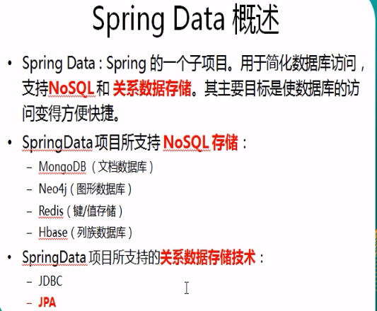
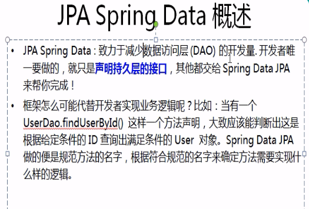
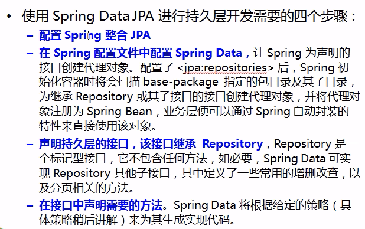
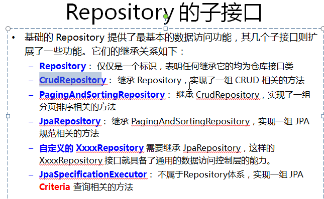
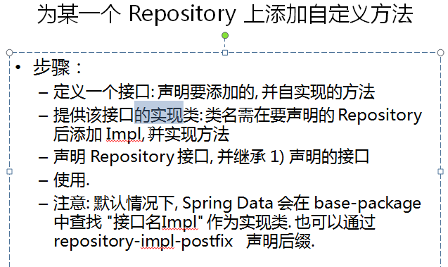
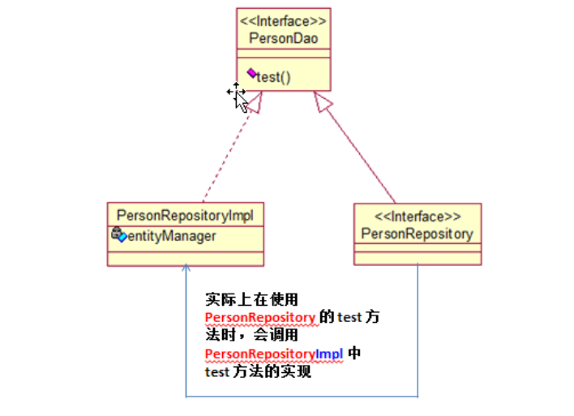

# Spring Data 笔记

## 1.概述






## 2.Spring Data 整合JPA步骤



### 1）建立一个maven Java项目

### 2）配置pom.xml

```xml
<?xml version="1.0" encoding="UTF-8"?>
<project xmlns="http://maven.apache.org/POM/4.0.0"
         xmlns:xsi="http://www.w3.org/2001/XMLSchema-instance"
         xsi:schemaLocation="http://maven.apache.org/POM/4.0.0 http://maven.apache.org/xsd/maven-4.0.0.xsd">
    <modelVersion>4.0.0</modelVersion>

    <groupId>com.hx</groupId>
    <artifactId>springdata</artifactId>
    <version>1.0-SNAPSHOT</version>

    <dependencies>
        <!-- https://mvnrepository.com/artifact/org.hibernate.javax.persistence/hibernate-jpa-2.1-api -->
        <dependency>
            <groupId>org.hibernate.javax.persistence</groupId>
            <artifactId>hibernate-jpa-2.1-api</artifactId>
            <version>1.0.2.Final</version>
        </dependency>

        <!-- https://mvnrepository.com/artifact/org.springframework.data/spring-data-jpa -->
        <dependency>
            <groupId>org.springframework.data</groupId>
            <artifactId>spring-data-jpa</artifactId>
            <version>2.0.10.RELEASE</version>
        </dependency>

        <!-- https://mvnrepository.com/artifact/org.hibernate/hibernate-core -->
        <dependency>
            <groupId>org.hibernate</groupId>
            <artifactId>hibernate-core</artifactId>
            <version>5.2.17.Final</version>
        </dependency>


        <!-- https://mvnrepository.com/artifact/org.hibernate/hibernate-entitymanager -->
        <dependency>
            <groupId>org.hibernate</groupId>
            <artifactId>hibernate-entitymanager</artifactId>
            <version>5.2.17.Final</version>
        </dependency>


        <!--数据源的驱动-->
        <dependency>
            <groupId>c3p0</groupId>
            <artifactId>c3p0</artifactId>
            <version>0.9.1</version>
        </dependency>


        <!-- https://mvnrepository.com/artifact/mysql/mysql-connector-java -->
        <dependency>
            <groupId>mysql</groupId>
            <artifactId>mysql-connector-java</artifactId>
            <version>5.1.47</version>
        </dependency>

        <dependency>
            <groupId>junit</groupId>
            <artifactId>junit</artifactId>
            <version>4.12</version>
            <scope>test</scope>
        </dependency>

        <dependency>
            <groupId>org.slf4j</groupId>
            <artifactId>slf4j-nop</artifactId>
            <version>1.7.25</version>
        </dependency>

    </dependencies>


</project>
```

### 3)配置applicationContext.xml

```xml
<?xml version="1.0" encoding="UTF-8"?>
<beans xmlns="http://www.springframework.org/schema/beans"
       xmlns:xsi="http://www.w3.org/2001/XMLSchema-instance"
       xmlns:context="http://www.springframework.org/schema/context"
       xmlns:tx="http://www.springframework.org/schema/tx"
       xmlns:jpa="http://www.springframework.org/schema/data/jpa"
       xsi:schemaLocation="http://www.springframework.org/schema/beans http://www.springframework.org/schema/beans/spring-beans.xsd
		http://www.springframework.org/schema/data/jpa http://www.springframework.org/schema/data/jpa/spring-jpa-1.3.xsd
		http://www.springframework.org/schema/tx http://www.springframework.org/schema/tx/spring-tx-4.0.xsd
		http://www.springframework.org/schema/context http://www.springframework.org/schema/context/spring-context-4.0.xsd">
    <!-- 导入数据库的配置信息,注意这个标签只能出现一次, 导入一个匹配文件
     		 若想导入多个配置文件可以将 db.properties写成 *.properties-->

    <context:property-placeholder location="db.properties" />

    <!-- 1. 配置数据源 数据库的连接池 c3p0 -->
    <bean id="dataSource" class="com.mchange.v2.c3p0.ComboPooledDataSource">
        <property name="user" value="${jdbc.user}"></property>
        <property name="password" value="${jdbc.password}"></property>
        <property name="driverClass" value="${jdbc.driverClass}"></property>
        <property name="jdbcUrl" value="${jdbc.jdbcUrl}"></property>

        <!-- 配置其他属性 -->

    </bean>

    <!-- 2. 配置EntityManagerFactory -->
    <bean id="entityManagerFactory" class="org.springframework.orm.jpa.LocalContainerEntityManagerFactoryBean">
        <property name="dataSource" ref="dataSource"/>
        <!--JPA实现产品的适配器-->
        <property name="jpaVendorAdapter">
            <!--使用hibernate的jpa实现-->
            <bean class="org.springframework.orm.jpa.vendor.HibernateJpaVendorAdapter"/>
        </property>
        <property name="packagesToScan" value="com.hx.springdata"/>
        <!--jpa的属性配置（实际就是配置实现产品的属性-->
        <property name="jpaProperties">
            <props>
                <!-- 生成的数据表的列的映射策略 -->
                <prop key="hibernate.ejb.naming_strategy">org.hibernate.cfg.ImprovedNamingStrategy</prop>
                <!-- hibernate 基本属性 -->
                <prop key="hibernate.dialect">org.hibernate.dialect.MySQL5InnoDBDialect</prop>
                <prop key="hibernate.show_sql">true</prop>
                <prop key="hibernate.format_sql">true</prop>
                <prop key="hibernate.hbm2ddl.auto">update</prop>
            </props>

        </property>
    </bean>


    <!-- 3. 配置事务管理器 -->
    <bean id="transactionManager"
          class="org.springframework.orm.jpa.JpaTransactionManager">
        <property name="entityManagerFactory" ref="entityManagerFactory"></property>
    </bean>

    <!-- 4. 配置支持注解的事务 -->
    <tx:annotation-driven transaction-manager="transactionManager"/>

    <!-- 5. 配置SpringData -->
    <!-- 加入  jpa 的命名空间 -->
    <!-- base-package: 扫描 Repository Bean 所在的 package -->
    <jpa:repositories base-package="com.hx.springdata"
                      entity-manager-factory-ref="entityManagerFactory"></jpa:repositories>


</beans>
```

配置db.properties

```properties
jdbc.driverClass=com.mysql.jdbc.Driver
jdbc.password=root
jdbc.user=root
jdbc.jdbcUrl=jdbc:mysql:///jpadb
```

### 4)写一个实体类

```java
package com.hx.springdata;

import javax.persistence.*;
import java.util.Date;

/**
 * @author yxqiang
 * @create 2018-10-07 14:15
 */

@Entity
@Table(name = "JPA_PERSONS")
public class Person {
    private Integer id;
    private String lastName;
    private Date birth;
    private String email;


    @Id
    @GeneratedValue
    public Integer getId() {
        return id;
    }

    public void setId(Integer id) {
        this.id = id;
    }

    public String getLastName() {
        return lastName;
    }

    public void setLastName(String lastName) {
        this.lastName = lastName;
    }

    public Date getBirth() {
        return birth;
    }

    public void setBirth(Date birth) {
        this.birth = birth;
    }

    public String getEmail() {
        return email;
    }

    public void setEmail(String email) {
        this.email = email;
    }

    @Override
    public String toString() {
        return "Person{" +
                "id=" + id +
                ", lastName='" + lastName + '\'' +
                ", birth=" + birth +
                ", email='" + email + '\'' +
                '}';
    }
}

```

### 5)编写一个Repository

```java
package com.hx.springdata;


import org.springframework.data.repository.Repository;
import org.springframework.data.repository.RepositoryDefinition;

/**
 * 1. Repository 是一个空接口（标记接口）
 * 2. 被Spring IOC 容器进行接管
 *    接管前提：1) 继承org.springframework.data.repository.Repository接口或者
 *                手工标记@RepositoryDefinition(domainClass = Person.class,idClass = Integer.class)
 *             2) <jpa:repositories base-package="com.hx.springdata" 配置扫描包
 *
 *
 *
 *
 */
//@RepositoryDefinition(domainClass = Person.class,idClass = Integer.class)
public interface PersonRepository extends Repository<Person,Integer> {

    /**
     * 根据lastName获取Person对象
     * @param lastName
     * @return
     */
    Person getByLastName(String lastName);
}

```


### 6)编写测试

```java
public class SpringDataTest {

    private ApplicationContext ctx = null;
    {
        ctx = new ClassPathXmlApplicationContext("applicationContext.xml");

    }


    @Test
    public void testDataSource() throws SQLException {
        DataSource dataSource = ctx.getBean(DataSource.class);
        System.out.println(dataSource.getConnection());
    }

    @Test
    public void testJpa(){

        PersonRepository personRepository = ctx.getBean(PersonRepository.class);
        Person person = personRepository.getByLastName("AA");
        System.out.println(person);

    }

}
```

## 2.Repository子接口



### 1）CrudRepository

```java
//1. 只要是继承了 crud 接口，就具有默认实现方法
public interface PersonCrudRepository extends CrudRepository<Person,Integer> {

}
//2. 在Service中，直接调用即可
@Service
public class PersonService {

    @Autowired
    private PersonCrudRepository personRepsotory;

    @Transactional
    public void savePersons(List<Person> persons){
        personRepsotory.saveAll(persons);
    }
}
```


### 2）PagingAndSortingRepository

```java
//1. Repository接口中继承Spring Data 提供的接口
public interface PersonQueryRepository extends PagingAndSortingRepository<Person,Integer> {}

//2. 直接使用
@Test
public void testPagingAndSortingRepository(){
    int pageindex = 3;
    int size = 5;
    Sort.Order order1 = new Sort.Order(Sort.Direction.ASC,"id");
    Sort.Order order2 = new Sort.Order(Sort.Direction.DESC,"lastName");
    Sort orders = new Sort(order1, order2);

    PageRequest qPageRequest = PageRequest.of(pageindex,size,orders);
    Page<Person> page = personQueryRepository.findAll(qPageRequest);
    System.out.println("总记录数: " + page.getTotalElements());
    System.out.println("当前第几页: " + (page.getNumber() + 1));
    System.out.println("总页数: " + page.getTotalPages());
    System.out.println("当前页面的 List: " + page.getContent());
    System.out.println("当前页面的记录数: " + page.getNumberOfElements());
}
```

### 3）自定义Repository

\


类图：



```java
//1
public interface PersonDao {
	
	void test();
	
}

//2
public class PersonRepsotoryImpl implements PersonDao {
	
	@PersistenceContext
	private EntityManager entityManager;
	
	@Override
	public void test() {
		Person person = entityManager.find(Person.class, 11);
		System.out.println("-->" + person);
	}

}

//3
public interface PersonRepsotory extends 
	JpaRepository<Person, Integer>,
	JpaSpecificationExecutor<Person>, PersonDao{
}

//4. 调用端 是调用的PersonRepository
@Test
public void testCustomRepositoryMethod(){
    personRepsotory.test();
}


```


## 3.Repository接口中方法定义规范


```java
package com.atguigu.springdata;

import java.util.Date;
import java.util.List;

import org.springframework.data.jpa.repository.JpaRepository;
import org.springframework.data.jpa.repository.JpaSpecificationExecutor;
import org.springframework.data.jpa.repository.Modifying;
import org.springframework.data.jpa.repository.Query;
import org.springframework.data.repository.query.Param;

/**
 * 1. Repository 是一个空接口. 即是一个标记接口
 * 2. 若我们定义的接口继承了 Repository, 则该接口会被 IOC 容器识别为一个 Repository Bean.
 * 纳入到 IOC 容器中. 进而可以在该接口中定义满足一定规范的方法. 
 * 
 * 3. 实际上, 也可以通过 @RepositoryDefinition 注解来替代继承 Repository 接口
 */
/**
 * 在 Repository 子接口中声明方法
 * 1. 不是随便声明的. 而需要符合一定的规范
 * 2. 查询方法以 find | read | get 开头
 * 3. 涉及条件查询时，条件的属性用条件关键字连接
 * 4. 要注意的是：条件属性以首字母大写。
 * 5. 支持属性的级联查询. 若当前类有符合条件的属性, 则优先使用, 而不使用级联属性. 
 * 若需要使用级联属性, 则属性之间使用 _ 进行连接. 
 */
//@RepositoryDefinition(domainClass=Person.class,idClass=Integer.class)
public interface PersonRepsotory extends 
	JpaRepository<Person, Integer>,
	JpaSpecificationExecutor<Person>, PersonDao{

	//根据 lastName 来获取对应的 Person
	Person getByLastName(String lastName);
	
	//WHERE lastName LIKE ?% AND id < ?
	List<Person> getByLastNameStartingWithAndIdLessThan(String lastName, Integer id);
	
	//WHERE lastName LIKE %? AND id < ?
	List<Person> getByLastNameEndingWithAndIdLessThan(String lastName, Integer id);
	
	//WHERE email IN (?, ?, ?) OR birth < ?
	List<Person> getByEmailInAndBirthLessThan(List<String> emails, Date birth);
	
	//WHERE a.id > ?
	List<Person> getByAddress_IdGreaterThan(Integer id);
	
	//查询 id 值最大的那个 Person
	//使用 @Query 注解可以自定义 JPQL 语句以实现更灵活的查询
	@Query("SELECT p FROM Person p WHERE p.id = (SELECT max(p2.id) FROM Person p2)")
	Person getMaxIdPerson();
	
	//为 @Query 注解传递参数的方式1: 使用占位符. 
	@Query("SELECT p FROM Person p WHERE p.lastName = ?1 AND p.email = ?2")
	List<Person> testQueryAnnotationParams1(String lastName, String email);
	
	//为 @Query 注解传递参数的方式1: 命名参数的方式. 
	@Query("SELECT p FROM Person p WHERE p.lastName = :lastName AND p.email = :email")
	List<Person> testQueryAnnotationParams2(@Param("email") String email, @Param("lastName") String lastName);
	
	//SpringData 允许在占位符上添加 %%. 
	@Query("SELECT p FROM Person p WHERE p.lastName LIKE %?1% OR p.email LIKE %?2%")
	List<Person> testQueryAnnotationLikeParam(String lastName, String email);
	
	//SpringData 允许在占位符上添加 %%. 
	@Query("SELECT p FROM Person p WHERE p.lastName LIKE %:lastName% OR p.email LIKE %:email%")
	List<Person> testQueryAnnotationLikeParam2(@Param("email") String email, @Param("lastName") String lastName);
	
	//设置 nativeQuery=true 即可以使用原生的 SQL 查询
	@Query(value="SELECT count(id) FROM jpa_persons", nativeQuery=true)
	long getTotalCount();
	
	//可以通过自定义的 JPQL 完成 UPDATE 和 DELETE 操作. 注意: JPQL 不支持使用 INSERT
	//在 @Query 注解中编写 JPQL 语句, 但必须使用 @Modifying 进行修饰. 以通知 SpringData, 这是一个 UPDATE 或 DELETE 操作
	//UPDATE 或 DELETE 操作需要使用事务, 此时需要定义 Service 层. 在 Service 层的方法上添加事务操作. 
	//默认情况下, SpringData 的每个方法上有事务, 但都是一个只读事务. 他们不能完成修改操作!
	@Modifying
	@Query("UPDATE Person p SET p.email = :email WHERE id = :id")
	void updatePersonEmail(@Param("id") Integer id, @Param("email") String email);
}
 
```


