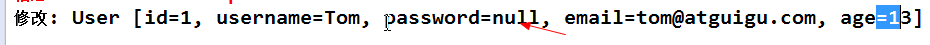
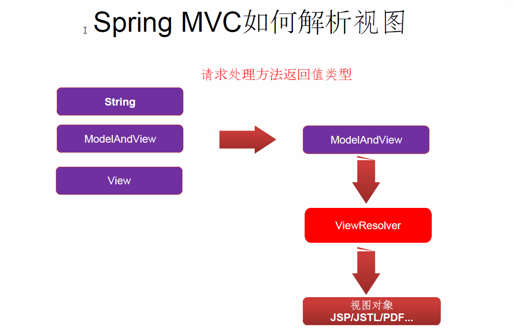
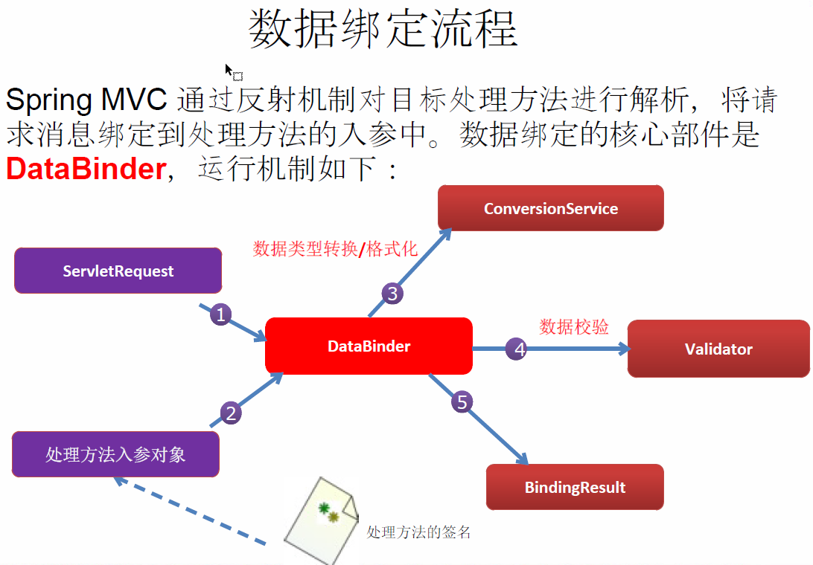

SpringMVC4 笔记

# 1.环境配置

## 1）pom.xml

```xml
<!--配置spring的版本号 -->
<properties>
  <spring.version>4.3.10.RELEASE</spring.version>
</properties>

<!--Spring 需要的包-->
<dependency>
  <groupId>org.springframework</groupId>
  <artifactId>spring-context</artifactId>
  <version>${spring.version}</version>
</dependency>

<dependency>
  <groupId>org.springframework</groupId>
  <artifactId>spring-beans</artifactId>
  <version>${spring.version}</version>
</dependency>

<dependency>
  <groupId>org.springframework</groupId>
  <artifactId>spring-web</artifactId>
  <version>${spring.version}</version>
</dependency>

<dependency>
  <groupId>org.springframework</groupId>
  <artifactId>spring-webmvc</artifactId>
  <version>${spring.version}</version>
</dependency>

<dependency>
  <groupId>org.springframework</groupId>
  <artifactId>spring-expression</artifactId>
  <version>${spring.version}</version>
</dependency>


<dependency>
    <groupId>org.springframework</groupId>
    <artifactId>spring-aop</artifactId>
    <version>${spring.version}</version>
</dependency>

<dependency>
  <groupId>org.springframework</groupId>
  <artifactId>spring-jdbc</artifactId>
  <version>${spring.version}</version>
</dependency>


<dependency>
    <groupId>commons-logging</groupId>
    <artifactId>commons-logging</artifactId>
    <version>1.2</version>
</dependency>

```

## 2）配置web.xml

```xml
<?xml version="1.0" encoding="UTF-8"?>
<web-app xmlns:xsi="http://www.w3.org/2001/XMLSchema-instance" xmlns="http://java.sun.com/xml/ns/javaee"
         xsi:schemaLocation="http://java.sun.com/xml/ns/javaee http://java.sun.com/xml/ns/javaee/web-app_2_5.xsd"
         id="WebApp_ID" version="2.5">


  <!--配置SpringMVC的DispatcherSrvlet-->
  <servlet>
    <servlet-name>springDispatcherServlet</servlet-name>
    <servlet-class>org.springframework.web.servlet.DispatcherServlet</servlet-class>
    <!--配置DispatcherServlet的初始化参数
        如果，不配置，则取默认值
        默认：路径为WEB-INF下，文件名为 <servlet-name>-servlet.xml,这里就应该为springDispatcherServlet-servlet.xml
    -->
    <init-param>
      <param-name>contextConfigLocation</param-name>
      <param-value>classpath:springmvc.xml</param-value>
    </init-param>
    
    
    <load-on-startup>1</load-on-startup>
  </servlet>
  <servlet-mapping>
    <servlet-name>springDispatcherServlet</servlet-name>
    <url-pattern>/</url-pattern>
  </servlet-mapping>


</web-app>

```

## 3）配置springmvc.xml

```xml
<?xml version="1.0" encoding="UTF-8"?>
<beans xmlns="http://www.springframework.org/schema/beans"
       xmlns:xsi="http://www.w3.org/2001/XMLSchema-instance" xmlns:bean="http://www.springframework.org/schema/context"
       xmlns:context="http://www.springframework.org/schema/context"
       xsi:schemaLocation="http://www.springframework.org/schema/beans http://www.springframework.org/schema/beans/spring-beans.xsd http://www.springframework.org/schema/context http://www.springframework.org/schema/context/spring-context.xsd">


    <!--配置扫描包-->
    <context:component-scan base-package="com.hx"></context:component-scan>

    <!--配置视图解析器：把controller方法返回值解析为实际的物理视图-->
    <bean class="org.springframework.web.servlet.view.InternalResourceViewResolver">
        <property name="prefix" value="/WEB-INF/views/"></property>
        <property name="suffix" value=".jsp"></property>

    </bean>

</beans>
```

4）定义一个Controller

```java
@Controller
public class EmployeeController {

    /**
     * 使用@RequestMapping 注解
     * 返回值：视图解析器中的 前缀 + 返回值 + 后缀 得到视图的物理路径
     *  这里的返回值 = /web-inf/views/hello.jsp
     */
    @RequestMapping("/hello")
    public String hello(){
        System.out.println("hello");
        return "hello";
    }
}
```

## 5）测试

```jsp
<html>
<body>
<h2>Hello World!</h2>
<a href="/hello">hello!!!</a>
</body>
</html>

```

# 2.@RequestMapping

## 1）修饰类

```java
@RequestMapping("/springmvc")
@Controller
public class TestController {

    private static final  String SUCCESS = "success";

    @RequestMapping("/testRequestMapping")
    public String testRequestMapping(){
        System.out.println("testRequestMapping controller doing....");

        return SUCCESS;
    }
}
```

这里对应的请求就是 /springmvc/testRequestMapping

## 2）PathVariable

```java
@RequestMapping("/testPathParam/{id}")
    public String testPathParam(@PathVariable("id") Integer id){
        System.out.println(id);
        return SUCCESS;
    }
```

## 3）Rest 请求方式

REST的四种请求方式：

GET:  查询

POST: 新增

PUT: 修改

DELETE:删除


在web.xml中增加一个HiddenHttpMethodFilter 

```xml
<?xml version="1.0" encoding="UTF-8"?>
<web-app xmlns:xsi="http://www.w3.org/2001/XMLSchema-instance" xmlns="http://java.sun.com/xml/ns/javaee"
         xsi:schemaLocation="http://java.sun.com/xml/ns/javaee http://java.sun.com/xml/ns/javaee/web-app_2_5.xsd"
         id="WebApp_ID" version="2.5">


    <!--配置将POST 请求转为 DELETE 或 PUT 请求-->
    <filter>
        <filter-name>hiddenHttpMethodFilter</filter-name>
        <filter-class>org.springframework.web.filter.HiddenHttpMethodFilter</filter-class>
    </filter>
    <filter-mapping>
        <filter-name>hiddenHttpMethodFilter</filter-name>
        <url-pattern>/*</url-pattern>
    </filter-mapping>


  <!--配置SpringMVC的DispatcherSrvlet-->
  <servlet>
    <servlet-name>springDispatcherServlet</servlet-name>
    <servlet-class>org.springframework.web.servlet.DispatcherServlet</servlet-class>
    <!--配置DispatcherServlet的初始化参数
        如果，不配置，则取默认值
        默认：路径为WEB-INF下，文件名为 <servlet-name>-servlet.xml,这里就应该为springDispatcherServlet-servlet.xml
    -->
    <init-param>
      <param-name>contextConfigLocation</param-name>
      <param-value>classpath:springmvc.xml</param-value>
    </init-param>
    <load-on-startup>1</load-on-startup>
  </servlet>
  <servlet-mapping>
    <servlet-name>springDispatcherServlet</servlet-name>
    <url-pattern>/</url-pattern>
  </servlet-mapping>


</web-app>
```

测试

如何发送PUT和DELETE 请求？

**需要发送post请求，并加一个隐藏域 name = _method value= DELETE/PUT**

```java
    <form action="/springmvc/testRest/1" method="post">
        <input type="submit" value="testRest POST">
    </form>
    <br></br>

    <form action="/springmvc/testRest/1" method="post">
        <input type="hidden" name="_method" value="DELETE">
        <input type="submit" value="testRest DELETE">
    </form>
    <br></br>

    <form action="/springmvc/testRest/1" method="post">
        <input type="hidden" name="_method" value="PUT">
        <input type="submit" value="testRest PUT">
    </form>
    <br></br>
```

**Controller 中**

注意，**@ResponseBody**  这个一定要写，否则在jdk1.8里，无法返回页面

```java
@RequestMapping("/rest")
@Controller
public class RestController {
    private static final  String SUCCESS = "success";

    @RequestMapping(value = "/testRest/{id}",method = RequestMethod.GET)
    public String testRestGET(@PathVariable Integer id){
        System.out.println("RequestMethod.GET:"+id);
        return SUCCESS;
    }

    @ResponseBody
    @RequestMapping(value = "/testRest/{id}",method = RequestMethod.PUT)
    public String testRestPUT(@PathVariable Integer id){
        System.out.println("RequestMethod.PUT:"+id);
        return SUCCESS;
    }

    @ResponseBody
    @RequestMapping(value = "/testRest/{id}",method = RequestMethod.DELETE)
    public String testRestDELETE(@PathVariable Integer id){
        System.out.println("RequestMethod.DELETE:"+id);
        return SUCCESS;
    }

    @RequestMapping(value = "/testRest",method = RequestMethod.POST)
    public String testRestPOST(){
        System.out.println("RequestMethod.POST");
        return SUCCESS;
    }
}
```


## 4）请求参数

### @RequestParam

```java
/**
 * @RequestParam 来映射请求参数. value 值即请求参数的参数名 required 该参数是否必须. 默认为 true
 *               defaultValue 请求参数的默认值
 */
@RequestMapping(value = "/testRequestParam")
public String testRequestParam(
		@RequestParam(value = "username") String un,
		@RequestParam(value = "age", required = false, defaultValue = "0") int age) {
	System.out.println("testRequestParam, username: " + un + ", age: "
			+ age);
	return SUCCESS;
}

<a href="springmvc/testRequestParam?username=atguigu&age=11">Test RequestParam</a>
<br><br>
```
### @RequestHeader

```java
	/**
	 * 了解: 映射请求头信息 用法同 @RequestParam
	 */
	@RequestMapping("/testRequestHeader")
	public String testRequestHeader(
			@RequestHeader(value = "Accept-Language") String al) {
		System.out.println("testRequestHeader, Accept-Language: " + al);
		return SUCCESS;
	}
	<a href="springmvc/testRequestHeader">Test RequestHeader</a>
	<br><br>
```

### @CookieValue

```java
	/**
	 * 了解:
	 * 
	 * @CookieValue: 映射一个 Cookie 值. 属性同 @RequestParam
	 */
	@RequestMapping("/testCookieValue")
	public String testCookieValue(@CookieValue("JSESSIONID") String sessionId) {
		System.out.println("testCookieValue: sessionId: " + sessionId);
		return SUCCESS;
	}

	<a href="springmvc/testCookieValue">Test CookieValue</a>
	<br><br>
```

### POJO对象绑定值

```java
	/**
	 * Spring MVC 会按请求参数名和 POJO 属性名进行自动匹配， 自动为该对象填充属性值。支持级联属性。
	 * 如：dept.deptId、dept.address.tel 等
	 */
	@RequestMapping("/testPojo")
	public String testPojo(User user) {
		System.out.println("testPojo: " + user);
		return SUCCESS;
	}

	<form action="springmvc/testPojo" method="post">
		username: <input type="text" name="username"/>
		<br>
		password: <input type="password" name="password"/>
		<br>
		email: <input type="text" name="email"/>
		<br>
		age: <input type="text" name="age"/>
		<br>
		city: <input type="text" name="address.city"/>
		<br>
		province: <input type="text" name="address.province"/>
		<br>
		<input type="submit" value="Submit"/>
	</form>
	<br><br>
```

### Servlet Api 参数

```java
	/**
	 * 可以使用 Serlvet 原生的 API 作为目标方法的参数 具体支持以下类型
	 * 
	 * HttpServletRequest 
	 * HttpServletResponse 
	 * HttpSession
	 * java.security.Principal 
	 * Locale InputStream 
	 * OutputStream 
	 * Reader 
	 * Writer
	 * @throws IOException 
	 */
	@RequestMapping("/testServletAPI")
	public void testServletAPI(HttpServletRequest request,
			HttpServletResponse response, Writer out) throws IOException {
		System.out.println("testServletAPI, " + request + ", " + response);
		out.write("hello springmvc");
//		return SUCCESS;
	}  	

    <a href="springmvc/testServletAPI">Test ServletAPI</a>
	<br><br>
```

# 3.处理模型数据

## 1）将模型数据放入到请求域（requestScope）中

### 1.ModelAndView

```java
	/**
	 * 目标方法的返回值可以是 ModelAndView 类型。 
	 * 其中可以包含视图和模型信息
	 * SpringMVC 会把 ModelAndView 的 model 中数据放入到 request 域对象中. 
	 * @return
	 */
	@RequestMapping("/testModelAndView")
	public ModelAndView testModelAndView(){
		String viewName = SUCCESS;
		ModelAndView modelAndView = new ModelAndView(viewName);
		
		//添加模型数据到 ModelAndView 中.
		modelAndView.addObject("time", new Date());
		
		return modelAndView;
	}

    jsp页面中，可以使用表达式取出值
	time: ${requestScope.time }
	<br><br>
```

### 2.请求参数中放入Map对象

```java
	/**
	 * 目标方法可以添加 Map 类型(实际上也可以是 Model 类型或 ModelMap 类型)的参数. 
	 * @param map 注意，这个参数不是从request传入的，而是Spring自己赋值，转换为ModelAndView对象
	 * @return
	 */
	@RequestMapping("/testMap")
	public String testMap(Map<String, Object> map){
		System.out.println(map.getClass().getName()); 
		map.put("names", Arrays.asList("Tom", "Jerry", "Mike"));
		return SUCCESS;
	}

    <a href="springmvc/testMap">Test Map</a>
	<br><br>

    jsp 页面直接获取值
    names: ${requestScope.names }
	<br><br>
```

## 2）将数据放入Session中

**@SessionAttributes 放到类上面**
通过value属性，保存到Session中

通过types属性，保存到Session中。

**获取时，都是通过key来获取（key就是方法中Map 入参的参数名）**

```java
@SessionAttributes(value={"user"}, types={String.class})
@RequestMapping("/springmvc")
@Controller
public class SpringMVCTest {


/**
	 * @SessionAttributes 除了可以通过属性名指定需要放到会话中的属性外(实际上使用的是 value 属性值),
	 * 还可以通过模型属性的对象类型指定哪些模型属性需要放到会话中(实际上使用的是 types 属性值)
	 * 
	 * 注意: 该注解只能放在类的上面. 而不能修饰放方法. 
	 */
	@RequestMapping("/testSessionAttributes")
	public String testSessionAttributes(Map<String, Object> map){
		User user = new User("Tom", "123456", "tom@atguigu.com", 15);
		map.put("user", user);
		map.put("school", "atguigu");
		return SUCCESS;
	}
    
    jsp页面：
    request user: ${requestScope.user }
	<br><br>
	
	session user: ${sessionScope.user }
	<br><br>
	
	request school: ${requestScope.school }
	<br><br>
	
	session school: ${sessionScope.school }
	<br><br>
```

## 3）只更新部分字段值（重要）


后台方法

```java
@RequestMapping("/testModelAttribute")
	public String testModelAttribute(User user){
		System.out.println("修改: " + user);
		return SUCCESS;
}
```

后台默认就会得到一个password为null的数据



这时，我们另外写一个方法，并在方法上加上@ModelAttribute 注解，模拟来从数据库中获取原来对象的值，并把没有值的属性值赋值给前端传入的对象user中。

```java
@RequestMapping("/testModel")
@Controller
public class ModelAndViewController {
    private static final  String SUCCESS = "success";


    @ModelAttribute
    public void getUser(@RequestParam(value="id",required=false) Integer id,
                        Map<String, Object> map){
        System.out.println("modelAttribute method");
        if(id != null){
            //模拟从数据库中获取对象
            User user = new User(1,"Tom","123456",18,"Tom@qq.com");
            System.out.println("从数据库中获取一个对象: " + user);

            map.put("user", user);
        }
    }

    //处理这个请求之前，会自动执行getUser方法，并更新user对象中没有属性值的值
    @RequestMapping("/testModelAttribute")
    //注意，这里key默认是取的User类的小写即user
    public String testModelAttribute(User user1){
        System.out.println("修改: " + user1);
        return SUCCESS;
    }

}
```

运行流程：


```java
	/**
	 * 运行流程:
	 * 1. 执行 @ModelAttribute 注解修饰的方法: 从数据库中取出对象, 把对象放入到了 Map 中. 键为: user
	 * 2. SpringMVC 从 Map 中取出 User 对象, 并把表单的请求参数赋给该 User 对象的对应属性.
	 * 3. SpringMVC 把上述对象传入目标方法的参数. 
	 * 
	 * 注意: 在 @ModelAttribute 修饰的方法中, 放入到 Map 时的键需要和目标方法入参类型的第一个字母小写的字符串一致!
	 * 
	 * SpringMVC 确定目标方法 POJO 类型入参的过程
	 * 1. 确定一个 key:
	 * 1). 若目标方法的 POJO 类型的参数木有使用 @ModelAttribute 作为修饰, 则 key 为 POJO 类名第一个字母的小写
	 * 2). 若使用了  @ModelAttribute 来修饰, 则 key 为 @ModelAttribute 注解的 value 属性值. 
	 * 2. 在 implicitModel 中查找 key 对应的对象, 若存在, 则作为入参传入
	 * 1). 若在 @ModelAttribute 标记的方法中在 Map 中保存过, 且 key 和 1 确定的 key 一致, 则会获取到. 
	 * 3. 若 implicitModel 中不存在 key 对应的对象, 则检查当前的 Handler 是否使用 @SessionAttributes 注解修饰, 
	 * 若使用了该注解, 且 @SessionAttributes 注解的 value 属性值中包含了 key, 则会从 HttpSession 中来获取 key 所
	 * 对应的 value 值, 若存在则直接传入到目标方法的入参中. 若不存在则将抛出异常. 
	 * 4. 若 Handler 没有标识 @SessionAttributes 注解或 @SessionAttributes 注解的 value 值中不包含 key, 则
	 * 会通过反射来创建 POJO 类型的参数, 传入为目标方法的参数
	 * 5. SpringMVC 会把 key 和 POJO 类型的对象保存到 implicitModel 中, 进而会保存到 request 中. 
	 * 
	 * 源代码分析的流程
	 * 1. 调用 @ModelAttribute 注解修饰的方法. 实际上把 @ModelAttribute 方法中 Map 中的数据放在了 implicitModel 中.
	 * 2. 解析请求处理器的目标参数, 实际上该目标参数来自于 WebDataBinder 对象的 target 属性
	 * 1). 创建 WebDataBinder 对象:
	 * ①. 确定 objectName 属性: 若传入的 attrName 属性值为 "", 则 objectName 为类名第一个字母小写. 
	 * *注意: attrName. 若目标方法的 POJO 属性使用了 @ModelAttribute 来修饰, 则 attrName 值即为 @ModelAttribute 
	 * 的 value 属性值 
	 * 
	 * ②. 确定 target 属性:
	 * 	> 在 implicitModel 中查找 attrName 对应的属性值. 若存在, ok
	 * 	> *若不存在: 则验证当前 Handler 是否使用了 @SessionAttributes 进行修饰, 若使用了, 则尝试从 Session 中
	 * 获取 attrName 所对应的属性值. 若 session 中没有对应的属性值, 则抛出了异常. 
	 * 	> 若 Handler 没有使用 @SessionAttributes 进行修饰, 或 @SessionAttributes 中没有使用 value 值指定的 key
	 * 和 attrName 相匹配, 则通过反射创建了 POJO 对象
	 * 
	 * 2). SpringMVC 把表单的请求参数赋给了 WebDataBinder 的 target 对应的属性. 
	 * 3). *SpringMVC 会把 WebDataBinder 的 attrName 和 target 给到 implicitModel. 
	 * 近而传到 request 域对象中. 
	 * 4). 把 WebDataBinder 的 target 作为参数传递给目标方法的入参. 
	 */	
```

**注意，只要类里面有ModelAttribute注解，都会先执行这里面的方法。**

# 4）视图解析流程



视图和视图解析器请求处理方法执行完成后，最终返回一个 ModelAndView 对象。

对于那些返回 String，View 或 ModeMap 等类型的处理方法，Spring MVC 也会在内部将它们装配成一个ModelAndView 对象，它包含了逻辑名和模型对象的视图.

Spring MVC 借助视图解析器（ViewResolver）得到最终的视图对象（View），最终的视图可以是 JSP ，也可能是Excel、JFreeChart 等各种表现形式的视图对于最终究竟采取何种视图对象对模型数据进行渲染， 处理器并不关心，处理器工作重点聚焦在生产模型数据的工作上，从而实现 MVC 的充分解耦.

## 1）视图


### 常用视图分类


## 2）视图解析器


### 1.常用解析器分类


### 2.InternalResourceViewResolver 解析器


### 3.直接转发请求配置

就是可以直接在地址栏输入 视图的对应名，无需经过中间处理器（handler）。

但必须要结合annotation-driven标签，否则，以前经过hander处理了后的success的视图解析就会出错了。

```xml
<!-- 可以直接相应转发的页面, 而无需再经过 Handler 的方法.  -->
<mvc:view-controller path="/success" view-name="success"/>

<!-- 在实际开发中通常都需配置 mvc:annotation-driven 标签 -->
<mvc:annotation-driven></mvc:annotation-driven>
```
### 4.国际化

1)需要新建一个资源文件，文件名为i18n.properties

资源文件命名中错误的规则：


2)在springmvc.xml中配置资源文件

```xml
	<!-- 配置国际化资源文件 -->
	<bean id="messageSource"
		class="org.springframework.context.support.ResourceBundleMessageSource">
		<property name="basename" value="i18n"></property>
	</bean>
```


# 5.转发和重定向

```java
@RequestMapping("/testRedirect")
	public String testRedirect(){
		System.out.println("testRedirect");
		return "redirect:/index.jsp";
	}
```


# 6.数据绑定流程



## 1）数据转换器


## 2）自定义转换器

如：将一个字符串转换为一个自定义对象。

```xml
	<mvc:annotation-driven conversion-service="conversionService"></mvc:annotation-driven>	
	
	<!-- 配置 ConversionService -->
	<bean id="conversionService"
		class="org.springframework.format.support.FormattingConversionServiceFactoryBean">
		<property name="converters">
			<set>
				<ref bean="employeeConverter"/> 这个是我们实现的转换器类
			</set>
		</property>	
	</bean>
```

```java

@Component
public class EmployeeConverter implements Converter<String, Employee> {

	@Override
	public Employee convert(String source) {
		if(source != null){
			String [] vals = source.split("-");
			//GG-gg@atguigu.com-0-105
			if(vals != null && vals.length == 4){
				String lastName = vals[0];
				String email = vals[1];
				Integer gender = Integer.parseInt(vals[2]);
				Department department = new Department();
				department.setId(Integer.parseInt(vals[3]));
				
				Employee employee = new Employee(null, lastName, email, gender, department);
				System.out.println(source + "--convert--" + employee);
				return employee;
			}
		}
		return null;
	}

}

```


## 3）静态资源

静态资源不能被Spring MVC给拦截了。需要加入下面这句话

```xml
<!--  
	default-servlet-handler 将在 SpringMVC 上下文中定义一个 DefaultServletHttpRequestHandler,
	它会对进入 DispatcherServlet 的请求进行筛查, 如果发现是没有经过映射的请求, 就将该请求交由 WEB 应用服务器默认的 
	Servlet 处理. 如果不是静态资源的请求，才由 DispatcherServlet 继续处理

	一般 WEB 应用服务器默认的 Servlet 的名称都是 default.
	若所使用的 WEB 服务器的默认 Servlet 名称不是 default，则需要通过 default-servlet-name 属性显式指定
	
-->
<mvc:default-servlet-handler/>
<mvc:annotation-driven/> <!-- 要配合使用这个注解驱动-->
```

## 4）mvc:annotation-driven


如果没有配置这个mvc:annotation-driven标签，将不支持表单数据向JavaBean的数据转换了。


## 5）数据格式化


## 6）数据校验


### 1). 如何校验 ? 注解 ?

			①. 使用 JSR 303 验证标准
			②. 加入 hibernate validator 验证框架的 jar 包
			③. 在 SpringMVC 配置文件中添加 <mvc:annotation-driven />
			④. 需要在 bean 的属性上添加对应的注解
			⑤. 在目标方法 bean 类型的前面添加 @Valid 注解   
### 2）示例

演示了，数据校验，和数据校验失败的错误信息的获取


注意：@Valid Employee employee 和 BindingResult result 之间，不能有其他的参数了，否则，Spring识别不了。


# 7.JSON处理

## 1）处理步骤

1.加入jackson Jar包

   ```xml
<dependency>
    <groupId>com.fasterxml.jackson.core</groupId>
    <artifactId>jackson-databind</artifactId>
    <version>2.9.7</version>
</dependency>
   ```

2.配置springmvc.xml

```xml
    <!--配置Json处理-->
    <bean class="org.springframework.web.servlet.mvc.annotation.AnnotationMethodHandlerAdapter">
        <property name="messageConverters">
            <list>
                <!--json视图拦截器，读取到@ResponseBody的时候去配置它-->
                <ref bean="mappingJacksonHttpMessageConverter"/>
            </list>
        </property>
    </bean>
    <!--json转化器，它可以将结果转化-->
    <bean id="mappingJacksonHttpMessageConverter" class="org.springframework.http.converter.json.MappingJackson2HttpMessageConverter">
        <property name="supportedMediaTypes">
            <list>
                <value>application/json;charset=UTF-8</value>
            </list>
        </property>
    </bean>

```

3.Controller中方法的使用@**ResponseBody**注解

**并且，不是返回String类型所对应的jsp的映射视图名，而是对象。**

```java
@Controller
public class JsonTestController {
    @ResponseBody
    @RequestMapping(value = "/getUserList")
    public List<User> getUserList(){
        List<User> userList = new ArrayList<>();
        User user1 = new User(1, "Tom1", "123", 11, "Tom1@qq.com");
        User user2 = new User(2, "Tom2", "123", 12, "Tom2@qq.com");
        User user3 = new User(3, "Tom3", "123", 13, "Tom3@qq.com");
        User user4 = new User(4, "Tom4", "123", 14, "Tom4@qq.com");
        User user5 = new User(5, "Tom5", "123", 15, "Tom5@qq.com");
        userList.add(user1);
        userList.add(user2);
        userList.add(user3);
        userList.add(user4);
        userList.add(user5);
        return userList;
    }
}
```

## 2）原理


## 3）使用ResponseEntity<T> 示例

演示下载文件的示例

```java
@RequestMapping("/testResponseEntity")
	public ResponseEntity<byte[]> testResponseEntity(HttpSession session) throws IOException{
		byte [] body = null;
		ServletContext servletContext = session.getServletContext();
		InputStream in = servletContext.getResourceAsStream("/files/abc.txt");
		body = new byte[in.available()];
		in.read(body);
		
		HttpHeaders headers = new HttpHeaders();
		headers.add("Content-Disposition", "attachment;filename=abc.txt");
		
		HttpStatus statusCode = HttpStatus.OK;
		
		ResponseEntity<byte[]> response = new ResponseEntity<byte[]>(body, headers, statusCode);
		return response;
	}
```

# 8.文件下载、上传

##文件下载


注意，在配置了Jackson后，会导致下载失败，这时，需要手动将字节流转换器放到Jackson的前面

```xml
<!--配置Json处理-->
    <bean class="org.springframework.web.servlet.mvc.annotation.AnnotationMethodHandlerAdapter">
        <property name="messageConverters">
            <list>
                <!--这个配置，必须放到Jackon序列化处理器前面，否则文件下载，内容不对-->
                <bean class="org.springframework.http.converter.ByteArrayHttpMessageConverter"/>
                <!--json视图拦截器，读取到@ResponseBody的时候去配置它-->
                <ref bean="mappingJacksonHttpMessageConverter"/>
            </list>
        </property>
    </bean>
    <!--json转化器，它可以将结果转化-->
    <bean id="mappingJacksonHttpMessageConverter" class="org.springframework.http.converter.json.MappingJackson2HttpMessageConverter">
        <property name="supportedMediaTypes">
            <list>
                <value>application/json;charset=UTF-8</value>
            </list>
        </property>
    </bean>
```

文件下载的示例

```java
@RequestMapping("/testResponseEntity")
    public ResponseEntity<byte[]> testResponseEntity(HttpSession session,HttpServletRequest request) throws IOException {
        byte [] body = null;
        ServletContext servletContext = session.getServletContext();

        String realPath = request.getServletContext().getRealPath(
                "WEB-INF/files/");
        File file = new File(realPath, "pom.txt");
        InputStream in = new FileInputStream(file);
//        InputStream in = servletContext.getResourceAsStream("/files/pom.txt");
//        InputStream in = this.getClass().getResourceAsStream("/pom.txt");
        body = new byte[in.available()];
        in.read(body);

        HttpHeaders headers = new HttpHeaders();
        String downloadFileName = new String(file.getName().getBytes("UTF-8"),"iso-8859-1");//设置编码
        headers.setContentDispositionFormData("attachment", downloadFileName);
        headers.setContentType(MediaType.APPLICATION_OCTET_STREAM);
        HttpStatus statusCode = HttpStatus.OK;
        ResponseEntity<byte[]> response = new ResponseEntity<byte[]>(body, headers, statusCode);
        return response;
    }
```

## 文件上传

springmvc.xml

```xml
	<!-- 配置 MultipartResolver -->
	<bean id="multipartResolver"
		class="org.springframework.web.multipart.commons.CommonsMultipartResolver">
		<property name="defaultEncoding" value="UTF-8"></property>
		<property name="maxUploadSize" value="1024000"></property>	
	</bean>	
```

```java
	@RequestMapping("/testFileUpload")
	public String testFileUpload(@RequestParam("desc") String desc, 
			@RequestParam("file") MultipartFile file) throws IOException{
		System.out.println("desc: " + desc);
		System.out.println("OriginalFilename: " + file.getOriginalFilename());
		System.out.println("InputStream: " + file.getInputStream());
		return "success";
	}
```


# 9.拦截器

48节了。


