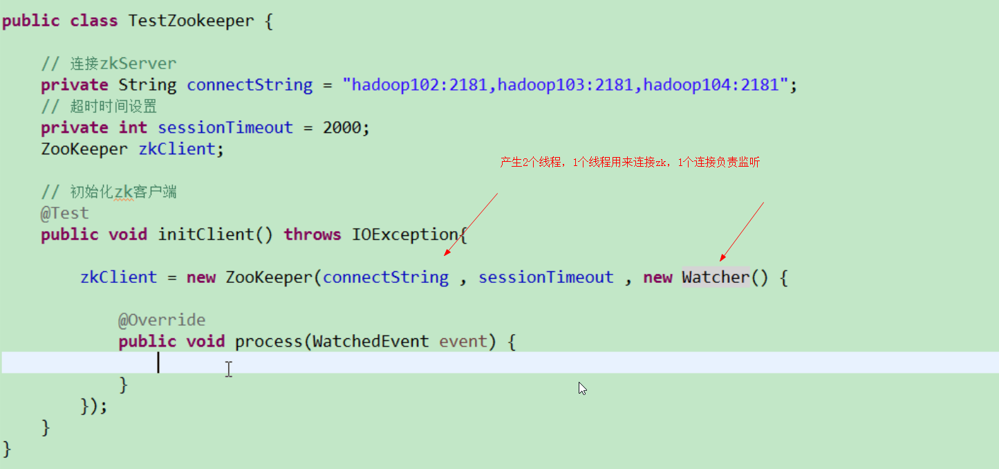

# Zookeeper 笔记
## 1概述

文件系统 + 通知机制的观察者模式设计的，每个节点都保存在文件中的，文件大小为1MB。

一个Leader，多个follower 组成集群。

集群中，**半数以上（大于）的存活时，集群才可用**，故部署按奇数（3,5,7）等来部署。

每个follower都保存同一个副本。

**数据操作是原子性的**。

数据结构：就是一个树，每个节点称为一个ZNode。每个**节点的名称**是**唯一**的。

## 2.下载

官网：zookeeper.apache.org

下面这个是镜像地址，国内要快些。

https://mirrors.tuna.tsinghua.edu.cn/apache/zookeeper/

## 3.本地模式安装

zookeeper在linux中安装步骤

1）上传安装文件zookeeper-3.4.10.tar.gz 到/opt下

2）解压

tar -zxvf zookeeper-3.4.10.tar.gz

3）修改配置文件

修改 zookeeper-3.4.10/conf 下的zoo.sample.cfg 改名为zoo.cfg

同时，修改zoo.cfg 中

dataDir = 自定义的目录

4）启动zookeeper

进入bin目录，

**./zkServer.sh start**  启动

输入**jps**指令，查看是否运行

会出现下面这个服务

QuorumPeerMain

或者输入**./zkServer.sh status**


5）启动客户端

./zkCli.sh 

\

quit : 退出客户端


6）停止服务

./zkServer.sh stop


## 4.目录节点

2种类型的节点（持久化 persistent的和临时 ephemeral的节点）还有（顺序节点和非顺序的节点），共4类节点。


## 5.集群配置


## 6.节点处理

create /banzhang woshibanzhang

/banzhang  :是节点名称

woshibanzhang ：是节点的数据

**创建时，必须带有数据**

创建临时节点：-e

create -e /tmp woshitmp

**退出连接**：quit

重新连接：./zkCli

ls / 查询节点时，就没有临时节点了。

**get  /banzhang**: 表示查询 banzhang 节点的数据

创建**带序号**的节点：-s

**修改**节点的值：set 


监听：节点的值变化，或者可以监听节点下的子节点的path 变化。

​           加入watch 参数即可。

注意：一次监听，只能响应一次watch。

**删除节点**：delete 节点路径

**递归删除节点**：rmr 节点路径


## 7.节点结构

通过status和get 可以获得节点的数据

其他节点的2个重要的属性：

dataLength（数据长度），numChildren(子节点数量)

## 8.监听器原理


## 9.写数据的流程


## 10.api应用





```java
import org.apache.zookeeper.*;
import org.apache.zookeeper.data.Stat;
import org.junit.Before;
import org.junit.Test;

import java.util.List;

/**
 * @author yxqiang
 * @create 2018-11-04 10:43
 */
public class MainTest {

    //服务器集群，用逗号隔开，逗号前不能有空格
    //private String connectionStr = "192.168.80.128:2181,192.168.80.129:2181";
    private String connectionStr = "192.168.80.128:2181";
    private Integer timeout = 5000;
    private ZooKeeper zooKeeperClient;

    @Before
    @Test
    public void initClient() throws Exception {
        zooKeeperClient = new ZooKeeper(connectionStr, timeout, new Watcher() {
            @Override
            public void process(WatchedEvent event) {
//                System.out.println("getType:"+event.getType().toString());
//                System.out.println("getPath"+event.getPath());

                System.out.println("-------start---------");
                List<String> children = null;
                try {
                    children = zooKeeperClient.getChildren("/", true);
                } catch (KeeperException e) {
                    e.printStackTrace();
                } catch (InterruptedException e) {
                    e.printStackTrace();
                }

                for (String child : children) {
                    System.out.println(child);
                }
                System.out.println("---------end-----------");

            }
        });
    }


    @Test
    public void createNode() throws Exception {
        //这里的第3个参数，表示节点的访问权限
        String path = zooKeeperClient.create("/yxq", "我是杨新强".getBytes(), ZooDefs.Ids.OPEN_ACL_UNSAFE, CreateMode.PERSISTENT_SEQUENTIAL);
        System.out.println(path);
    }


    @Test
    public void getChild() throws KeeperException, InterruptedException {
        //这里是获取节点，并注册了监听，但zk是监听只能执行一次，必须在zkClient的Watcher中再次注册，才能获取下次变化通知
        List<String> children = zooKeeperClient.getChildren("/", true);
//        for (String child : children) {
//            System.out.println(child);
//        }
        //这里睡眠等待更新
        Thread.sleep(Long.MAX_VALUE);
    }

    @Test
    public void chkNodeIsExists() throws KeeperException, InterruptedException {
        Stat stat = zooKeeperClient.exists("/yxqiang", false);
        if (stat == null){
            System.out.println("节点不存在");
        }else{
            System.out.println(stat);
        }
    }

    //获取节点数据
    public void getNodeData() throws KeeperException, InterruptedException {
        byte[] data = zooKeeperClient.getData("/", false, null);
        String dataStr = new String(data);

    }

}

```


