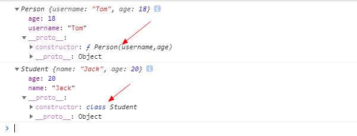
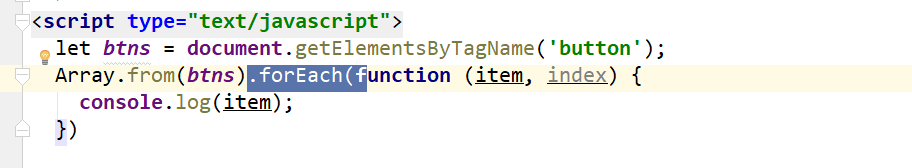
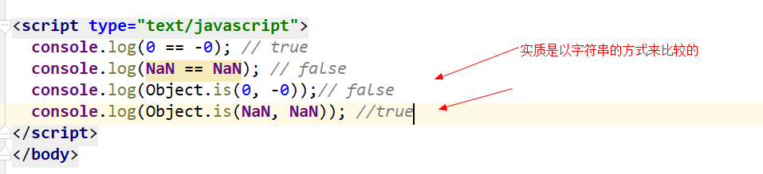

## **理解ES**
1. 全称: ECMAScript
2. js语言的规范
3. 我们用的js是它的实现
4. js的组成
  * ECMAScript(js基础)
  * 扩展-->浏览器端
    * BOM
    * DOM
  * 扩展-->服务器端
    * Node.js

## ES5
1. **严格模式**
  * 运行模式: 正常(混杂)模式与严格模式
  * 应用上严格式: 'strict mode';
  * 作用: 
    * 使得Javascript在更严格的条件下运行
    * 消除Javascript语法的一些不合理、不严谨之处，减少一些怪异行为
    * 消除代码运行的一些不安全之处，保证代码运行的安全
    * 需要记住的几个变化
      * 声明定义变量必须用var
      * 禁止自定义的函数中的this关键字指向全局对象
      * 创建eval作用域, 更安全

2. **JSON对象**
  * 作用: 用于在json对象/数组与js对象/数组相互转换
  * JSON.stringify(obj/arr)
      js对象(数组)转换为json对象(数组)
  * JSON.parse(json)
      json对象(数组)转换为js对象(数组)

3. Object扩展
  * Object.create(prototype[, descriptors]) : 创建一个新的对象
    * 以指定对象为原型创建新的对象
    * 指定新的属性, 并对属性进行描述
      * value : 指定值
      * writable : 标识当前属性值是否是可修改的, 默认为true
      * **get方法** : 用来得到当前属性值的回调函数
      * **set方法** : 用来监视当前属性值变化的回调函数
  * Object.defineProperties(object, descriptors) : 为指定对象定义扩展多个属性

4. Array扩展
  * Array.prototype.indexOf(value) : 得到值在数组中的第一个下标
  * Array.prototype.lastIndexOf(value) : 得到值在数组中的最后一个下标
  * **Array.prototype.forEach(function(item, index){}) : 遍历数组**
  * **Array.prototype.map(function(item, index){}) : 遍历数组返回一个新的数组**
  * **Array.prototype.filter(function(item, index){}) : 遍历过滤出一个子数组**

5. **Function扩展**
  * Function.prototype.bind(obj)
      * 将函数内的this绑定为obj, 并将函数返回
  * 面试题: 区别bind()与call()和apply()?
      * fn.bind(obj) : 指定函数中的this, 并返回函数
      * fn.call(obj, 参数) : 指定函数中的this,并调用函数
      * fn.apply(obj，[参数]): 指定函数中的this,并调用函数

6. Date扩展
  * Date.now() : 得到当前时间值

## ES6

### 1.let/const

- 块作用域
- 没有变量提升
- 不能重复定义
- 值不可变


### 2.变量的解构赋值

```html
<!--
1. 理解:
  * 从对象或数组中提取数据, 并赋值给变量(多个)
2. 对象的解构赋值
  let {n, a} = {n:'tom', a:12}
3. 数组的解构赋值
  let [a,b] = [1, 'atguigu'];
  let [,,c,d] = [1,2,3,4,5] //c = 3, d=4


4. 用途
  * 给多个形参赋值
-->
```

### 3.箭头函数

```html
<!--
* 作用: 定义匿名函数
* 基本语法:
  * 没有参数: () => console.log('xxxx')
  * 一个参数: i => i+2
  * 大于一个参数: (i,j) => i+j
  * 函数体不用大括号: 默认返回结果
  * 函数体如果有多个语句, 需要用{}包围，若有需要返回的内容，需要手动返回
* 使用场景: 多用来定义回调函数

* 箭头函数的特点：
    1、简洁
    2、箭头函数没有自己的this，箭头函数的this不是调用的时候决定的，而是在定义的时候处在的对象就是它的this
    3、扩展理解： 箭头函数的this看外层的是否有函数，
        如果有，外层函数的this就是内部箭头函数的this，
        如果没有，则this是window。
-->
```

### 4.对象的简写写法

```html
let name = 'Tom';
let age = 12;
let person = {
    name,
    age,
    setName (name) {
        this.name = name;
    }
};

属性名和值同名时，可以省略
属性为方法时，可以省略掉：function
setName(name):function(name){
   
}
```

### 5. 点点点运算符（...)

```html
<!--
* 用途
1. rest(可变)参数
    * 用来取代arguments 但比 arguments 灵活,只能是最后部分形参参数
    function fun(...values) {
        console.log(arguments);
        arguments.forEach(function (item, index) {
            console.log(item, index);
        });
        console.log(values);
        values.forEach(function (item, index) {
            console.log(item, index);
        })
    }
    fun(1,2,3);
2. 扩展运算符
  let arr1 = [1,3,5];
  let arr2 = [2,...arr1,6];
  arr2.push(...arr1);
-->
```

...变量名，这个变量名可以理解为：是一个**动态数组** 去**收集**参数，而es5 中的arguments 是一个伪数组，不具备数组的forEach（）等方法的调用。

...values 只能放到多个参数的最后。

### 6.形参默认值

```html
<!--
    * 形参的默认值----当不传入参数的时候默认使用形参里的默认值
    function Point(x = 1,y = 2) {
    this.x = x;
    this.y = y;
    }
-->
```

### 7.Promise对象

```html
<!--
1. 理解:
  * Promise对象: 代表了未来某个将要发生的事件(通常是一个异步操作)
  * 有了promise对象, 可以将异步操作以同步的流程表达出来, 避免了层层嵌套的回调函数(俗称'回调地狱')
  * ES6的Promise是一个构造函数, 用来生成promise实例
2. 使用promise基本步骤(2步):
  * 创建promise对象
    let promise = new Promise((resolve, reject) => {
        //初始化promise状态为 pending
      //执行异步操作
      异步操作结果，要么成功得到value，或失败得到errMsg

      if(异步操作成功) {
        resolve(value);//修改promise的状态为fullfilled
      } else {
        reject(errMsg);//修改promise的状态为rejected
      }
    })
  * 调用promise的then()
    promise.then(function(
      result => console.log(result),
      errorMsg => alert(errorMsg)
    ))
3. promise对象的3个状态
  * pending: 初始化状态
  * fullfilled: 成功状态
  * rejected: 失败状态
4. 应用:
  * 使用promise实现超时处理

  * 使用promise封装处理ajax请求
    let request = new XMLHttpRequest();
    request.onreadystatechange = function () {
    }
    request.responseType = 'json';
    request.open("GET", url);
    request.send();
-->
```

原理：就是通过resolve() 或reject() 来更改promise对象的状态为成功或失败，promise.then 就会执行相应成功或失败的方法。


### 8.Symbol 新增的基本数据类型

```html
<!--
    前言：ES5中对象的属性名都是字符串，容易造成重名，污染环境
    Symbol：
      概念：ES6中的添加了一种原始数据类型symbol(已有的原始数据类型：String, Number, boolean, null, undefined, 对象)
      特点：
        1、Symbol属性对应的值是唯一的，解决命名冲突问题
        2、Symbol值不能与其他数据进行计算，包括同字符串拼串
        3、for in, for of遍历时不会遍历symbol属性。
      使用：
        1、调用Symbol函数得到symbol值
          let symbol = Symbol();
          let obj = {};
          obj[symbol] = 'hello';
        2、传参标识
          let symbol = Symbol('one');
          let symbol2 = Symbol('two');
          console.log(symbol);// Symbol('one')
          console.log(symbol2);// Symbol('two')
        3、内置Symbol值
          * 除了定义自己使用的Symbol值以外，ES6还提供了11个内置的Symbol值，指向语言内部使用的方法。
          - Symbol.iterator
           * 对象的Symbol.iterator属性，指向该对象的默认遍历器方法(后边讲)

  -->
```

let symbol = Symbol();  //表示这个不是一个构造函数，如果是构造函数，需要new Symbol，它只是一个函数，返回一个Symbol 对象。

```js
let symbol = Symbol();
let symbol1 = Symbol();
console.log(symbol === symbol1) //false


console.log(symbol);
let person={username:"tom",age:19};
person.height = 168; //动态扩展对象的属性 height
person[symbol] = 'hello'; //person[xx] 表示对象的选择器，通过这种方式来指定一个唯一的值
person[2] = 'hehe';
console.log(person['username']);

console.log(person);
person[2] = 'hehehe';
console.log(person);

const PERSON_KEY = Symbol('person_key'); //可以
```

### 9.动态扩展对象的属性

2种方式

```js
let person={username:"tom",age:19};
扩展方式一
person.height = 168 
扩展方式二
person['height'] = 168 //person['xxx属性名'] 表示对象的属性选择器

```

### 10.对象属性的遍历

```js
let symbol = Symbol();
let person={username:"tom",age:19};
person[symbol] = 'hello';
for(let x in person){
    console.log(x);
}
//输出 symbol 属性是不会输出的。
username
age

```

### 11.iterator遍历器

```html
 <!--
    概念： iterator是一种接口机制，为各种不同的数据结构提供统一的访问机制
    作用：
      1、为各种数据结构，提供一个统一的、简便的访问接口；
      2、使得数据结构的成员能够按某种次序排列
      3、ES6创造了一种新的遍历命令for...of循环，Iterator接口主要供for...of消费。
    工作原理：
      - 创建一个指针对象(遍历器对象)，指向数据结构的起始位置。
      - 第一次调用next方法，指针自动指向数据结构的第一个成员
      - 接下来不断调用next方法，指针会一直往后移动，直到指向最后一个成员
      - 每调用next方法返回的是一个包含value和done的对象，{value: 当前成员的值,done: 布尔值}
        * value表示当前成员的值，done对应的布尔值表示当前的数据的结构是否遍历结束。
        * 当遍历结束的时候返回的value值是undefined，done值为false
    原生具备iterator接口的数据(可用for of遍历)
      1、Array
      2、arguments
      3、set容器
      4、map容器
      5、String
      。。。
  -->
```

ES6创造了一种新的遍历命令for...of循环，Iterator接口主要供for...of消费

ES6 已经为下面的数据类型实现了Iterator接口

数组、字符串、arguments、set容器、map容器

对象是没有实现的。

```js
 let arr = [1,2,3,4,'abc'];
    for (let i of arr){
        console.log(i);
    }

    let str = 'abcdefg';
    for(let i of str){
        console.log(i);
    }

    let person = {username:'tom',age:19};
    for(let i of person){
        console.log(i); //报错，因为对象没有实现iterator
    }

```


### 12.Generator函数（又叫*号函数  难点）

这个函数，不是直接调用 Generator() 这种方式，它是一种异步编程的方案，它是一个原型，用法是用*号来表示一个可以暂停执行的（yield 暂停），next（启动）。

```html
<!--
   Generator函数
    概念：
      1、ES6提供的解决异步编程的方案之一
      2、Generator函数是一个状态机，内部封装了不同状态的数据，
      3、用来生成遍历器对象
      4、可暂停函数(惰性求值), yield可暂停，next方法可启动。每次返回的是yield后的表达式结果
    特点：
      1、function 与函数名之间有一个星号
      2、内部用yield表达式来定义不同的状态
      例如：
        function* generatorExample(){
          let result = yield 'hello';  // 状态值为hello
          yield 'generator'; // 状态值为generator
        }
      3、generator函数返回的是指针对象(接11章节里iterator)，而不会执行函数内部逻辑
      4、调用next方法函数内部逻辑开始执行，遇到yield表达式停止，返回{value: yield后的表达式结果/undefined, done: false/true}
      5、再次调用next方法会从上一次停止时的yield处开始，直到最后
      6、yield语句返回结果通常为undefined， 当调用next方法时传参内容会作为启动时yield语句的返回值。
  -->
```

#### 写法

```js
//作为对象的属性，写法
let obj = {
  * myGeneratorMethod() {
    ···
  }
};

//作为方法的写法
function* helloWorldGenerator() {
  yield 'hello';
  yield 'world';
  return 'ending';
}

var hw = helloWorldGenerator();
```

#### 用法

调用next 获取值对象{value:xxx,done: bool}

```js

   function * f() {
       console.log('开始执行了');

       //yield后要么是表达式，要么是一个执行结果，比如服务器返回的数据
       yield 'haha';  //遇到yield时，暂定执行，必须调用next方法后，才会执行下面的语句

       console.log('暂停后，再次执行');

       return '执行结果';  //当函数体加上  return '执行结果';调用f1.next()时，返回 {value: '执行结果', done: true}，
                           //否则，返回 {value: undefined, done: true}

   }


   let f1 = f(); //返回的是一个指针对象
   console.log(f1);


   let arr = {username:'tom',age:19};
   console.log(arr);


   let result = f1.next();  //调用next后，返回一个对象
   console.log(result);     //输出  {value: "haha", done: false}
   let result1 = f1.next();  //
   console.log(result1);     //输出  {value: undefined, done: true} ，done = true 表示方法体执行完毕了
```


**通过next(xxx) 传入值，让函数体中的yield中可以得到一个值，来进行接下来的逻辑处理**


```js
 function * f() {
       console.log('开始执行了');

       let result = yield 'haha'; //yield 默认返回的值为 undefined，但我们可以通过next（xxx值）传入进来，这时result = xxx值

       console.log(result);

       console.log('暂停后，再次执行');

       return '执行结果';
   }

   let f1 = f();
   let result = f1.next('xxx');  //调用next后，返回一个对象
   console.log(result);          //输出  {value: "haha", done: false}
   let result1 = f1.next('bbb');  //传入bbb后，f()函数体中的 yield 'haha' 的返回值就是bbb了，
   console.log(result1);     //输出  {value: '执行结果', done: true} ，done = true 表示方法体执行完毕了
```


#### 给对象添加一个迭代器实现

对象是不具备迭代器功能，我们可以利用Generator函数（ * 函数）手动添加一个迭代器

Generator返回一个Iterator的指针对象。

```js
  let person = {username:'tom',age:18};
  //通过给对象添加Symbol.Tterator 属性，指向一个迭代器实现类
  person[Symbol.iterator] = function* () {
      yield 1;
      yield 2;
      yield 3;
  }

  //下面就可以用for 。。。of 来迭代取值了
  for(let x of person){
      console.log(x);
  }

  //输出了1,2,3

```


#### ajax请求

先查询列表，再查询列表中的一条明细数据

```js
function getNews(url){
   $.get(url,function (data) {
       console.log(data);
       let commentUrl = 'http://localhost:3000'+data.commentsUrl; //这里是明细内容的请求地址
       getIterator.next(commentUrl); //这里准备下一次请求的url
   })
}

//这里是采用的Generator函数的格式
function* getData(){
    //接收下一次next传入的url路径
    let url = yield getNews('http://localhost:3000/news?id=3'); 
    console.log("传入的url: "+url);
    yield getNews(url);
}

let getIterator = getData();
getIterator.next();

```

### 13 async（es2017 提出的）


async函数(源自ES2017)
概念： 真正意义上去解决异步回调的问题，同步流程表达异步操作
本质： Generator的语法糖
语法：
    async function foo(){
      await 异步操作;
      await 异步操作；
    }
特点：
  1、不需要像Generator去调用next方法，遇到await等待，当前的异步操作完成就往下执行
  2、返回的总是**Promise**对象，可以用**then**方法进行下一步操作
  3、async取代Generator函数的**星号***，await取代Generator的**yield**
  4、语意上更为明确，使用简单，经临床验证，暂时没有任何副作用


```js

    async function getNews(url){
        return new Promise((resolve, reject)=>{
            $.ajax({
                method:'GET',
                url,
                success:data=>resolve(data), //将请求成功后的data值，传给resolve
                error:error=>reject(error)
            })
        })
    }

    async function sendXML(){
        let result = await getNews("http://localhost:3000/news?id=3");//这里的result 就是上面传过来的data
        console.log(result);
        result = await getNews("http://localhost:3000"+result.commentsUrl);
        console.log(result);
    }

   sendXML();
```

如果第一次请求失败了，就会进入到error中去，我们无法在sendXml中处理了。改造下，把错误也采用resolve的方式来做。

```js
 async function getNews(url){
        return new Promise((resolve, reject)=>{
            $.ajax({
                method:'GET',
                url,
                success:data=>resolve(data), //将请求成功后的data值，传给resolve
                error:error=>resolve(false)  //请求错误时，将false传递出去
            })
        })
    }

    async function sendXML(){
        let result = await getNews("http://localhost:30001/news?id=3");//这里的result 就是上面传过来的data 或者是 错误的bool值
        if (!result){
            alert('没有新闻数据');
            return false;
        }

        console.log(result);
        result = await getNews("http://localhost:3000"+result.commentsUrl);
        console.log(result);
    }

   sendXML();
```

### 14.类（class）

```
1. 通过class定义类/实现类的继承
2. 在类中通过constructor定义构造方法
3. 通过new来创建类的实例
4. 通过extends来实现类的继承
5. 通过super调用父类的构造方法
6. 重写从父类中继承的一般方法
```

```js
//传统方式


function Person(username,age) {
    this.username = username;
    this.age = age;
}

let person = new Person('Tom',18);
console.log(person);


//类的方式
class Student{
    constructor(name,age){
        this.name = name;
        this.age = age;
    }
}

let student = new Student('Jack',20);
console.log(student);
		
```

下图是原型对应结构



```js
  //类的方式
  class Student{
      //类的构造方法
      constructor(name,age){
          this.name = name;
          this.age = age;
      }

      //一般方法。 一般方法都是放在原型对象上的
      showName(){
          console.log(this.name,this.age);
      }
  }

  //类的继承
  class SpeStudent extends Student{
      constructor(name,age,height){
          //这里要使用super调用父类的构造方法
          super(name,age);
          this.height = height;
      }

      showName(){
          console.log(this.name,this.age,this.height);
      }

  }

  let student = new Student('Jack',20);
  student.showName();
  let p1 = new SpeStudent('Tom',20,189);
  p1.showName();
```


### 15.字符串扩展

```
1. includes(str) : 判断是否包含指定的字符串
2. startsWith(str) : 判断是否以指定字符串开头
3. endsWith(str) : 判断是否以指定字符串结尾
4. repeat(count) : 重复指定次数
```

### 16.数值扩展

```
1. 二进制与八进制数值表示法: 二进制用0b, 八进制用0o
2. Number.isFinite(i) : 判断是否是有限大的数
3. Number.isNaN(i) : 判断是否是NaN
4. Number.isInteger(i) : 判断是否是整数
5. Number.parseInt(str) : 将字符串转换为对应的数值
6. Math.trunc(i) : 直接去除小数部分
```




### 17.数组扩展

```
1. Array.from(v) : 将伪数组对象或可遍历对象转换为真数组
2. Array.of(v1, v2, v3) : 将一系列值转换成数组
3. find(function(value, index, arr){return true}) : 找出第一个满足条件返回true的元素
4. findIndex(function(value, index, arr){return true}) : 找出第一个满足条件返回true的元素下标
```

### 18.对象扩展

```
1. Object.is(v1, v2)
  * 判断2个数据是否完全相等
2. Object.assign(target, source1, source2..)
  * 将源对象的属性复制到目标对象上
3. 直接操作 __proto__ 属性
  let obj2 = {};
  obj2.__proto__ = obj1;
```




### 19.深度克隆

**对象/数组 是复制的引用**，

如果数组内的对象为基本类型的话，就会复制一份新的数据，如果是对象的话，则是复制的引用。

**基本对象都是复制了一份新的数据**

```
1、数据类型：
  * 数据分为基本的数据类型(String, Number, boolean, Null, Undefined)和对象数据类型
  - 基本数据类型：
    特点： 存储的是该对象的实际数据
  - 对象数据类型：
    特点： 存储的是该对象在栈中引用，真实的数据存放在堆内存里
2、复制数据
  - 基本数据类型存放的就是实际的数据，可直接复制
    let number2 = 2;
    let number1 = number2;
  - 克隆数据：对象/数组
    1、区别： 浅拷贝/深度拷贝
       判断： 拷贝是否产生了新的数据还是拷贝的是数据的引用
       知识点：对象数据存放的是对象在栈内存的引用，直接复制的是对象的引用
       let obj = {username: 'kobe'}
       let obj1 = obj; // obj1 复制了obj在栈内存的引用
    2、常用的拷贝技术
      0). Object.assign() 浅拷贝
      1). arr.concat(): 数组浅拷贝
      2). arr.slice(): 数组浅拷贝
      3). JSON.parse(JSON.stringify(arr/obj)): 数组或对象深拷贝, 但不能处理函数数据
      4). 浅拷贝包含函数数据的对象/数组
      5). 深拷贝包含函数数据的对象/数组
```

#### 对象和数组的深度克隆实现

```js
//实现深度克隆，只有数组和对象才需要深度克隆。
function checkType(target) {

    //typeof 得到的数据类型是 String,Number,Boolean,Undefined,Object,Function，用这种方式不行
    //得到数据类型(可以得到Array或Object等）
    return Object.prototype.toString.call(target).slice(8, -1);
}
// let arr = [1,2,3]; //返回Array
// arr = null; //返回Null
// arr = {}; //返回Object
// console.log(checkType(arr));


//深度克隆
function deepnessClone(target){
    let result; //返回值
    let targetType = checkType(target);
    if (targetType === 'Array'){
        result = []; //初始化数组

    }else if (targetType == 'Object'){

        result = {}; //初始化对象
    }else{
        return target;
    }

    //for in 是获取的数组的下标，或者是对象的属性名；都可以通过xxx[下标或属性名] 得到值
    for(let i in target){
        let value = target[i];
        if (checkType(value)==="Array" || checkType(value) ==='Object'){ //这里判断每个元素是否还是数组或对象
            result[i] = deepnessClone(value); //递归调用
        }else{
            result[i] = value; //表示元素为基本元素或func
        }

    }
    return result;
}


let arr1=[1,2,{username:'Tom',child:[{name:'c1'},{name:'c2'}]}];
let arr2 = deepnessClone(arr1);
console.log(arr1,arr2);
arr2[2].child[1].name='c21';
console.log(arr1,arr2);
```


### 20.set和map

```
1. Set容器 : 无序不可重复的多个value的集合体
  * Set()
  * Set(array)
  * add(value)
  * delete(value)
  * has(value)
  * clear()
  * size
2. Map容器 : 无序的 key不重复的多个key-value的集合体
  * Map()
  * Map(array)
  * set(key, value)//添加
  * get(key)
  * delete(key)
  * has(key)
  * clear()
  * size
```

### 21.for...of（for...in）

```
for(let value of target){}循环遍历
  1. 遍历数组
  2. 遍历Set
  3. 遍历Map
  4. 遍历字符串
  5. 遍历伪数组
```

for...of: 是用的迭代器

for...in: 

记住，for in遍历的是数组的索引（即键名），而for of遍历的是数组元素值。


```js
var myObject={
    a:1,
    b:2,
    c:3
}

    //for in 可以遍历到myObject的原型方法method,如果不想遍历原型方法和属性的话，可以在循环内部判断一下,hasOwnPropery方法可以判断某属性是否是该对象的实例属性
    for (var key in myObject) {
        if (myObject.hasOwnProperty(key)) {
            console.log(key);
        }
    }


Object.keys(myObject).forEach(function(key,index){　
    　console.log(key,myObject[key])
})
```