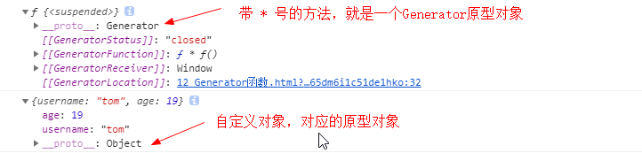

## **理解ES**
1. 全称: ECMAScript
2. js语言的规范
3. 我们用的js是它的实现
4. js的组成
  * ECMAScript(js基础)
  * 扩展-->浏览器端
    * BOM
    * DOM
  * 扩展-->服务器端
    * Node.js

## ES5
1. **严格模式**
  * 运行模式: 正常(混杂)模式与严格模式
  * 应用上严格式: 'strict mode';
  * 作用: 
    * 使得Javascript在更严格的条件下运行
    * 消除Javascript语法的一些不合理、不严谨之处，减少一些怪异行为
    * 消除代码运行的一些不安全之处，保证代码运行的安全
    * 需要记住的几个变化
      * 声明定义变量必须用var
      * 禁止自定义的函数中的this关键字指向全局对象
      * 创建eval作用域, 更安全

2. **JSON对象**
  * 作用: 用于在json对象/数组与js对象/数组相互转换
  * JSON.stringify(obj/arr)
      js对象(数组)转换为json对象(数组)
  * JSON.parse(json)
      json对象(数组)转换为js对象(数组)

3. Object扩展
  * Object.create(prototype[, descriptors]) : 创建一个新的对象
    * 以指定对象为原型创建新的对象
    * 指定新的属性, 并对属性进行描述
      * value : 指定值
      * writable : 标识当前属性值是否是可修改的, 默认为true
      * **get方法** : 用来得到当前属性值的回调函数
      * **set方法** : 用来监视当前属性值变化的回调函数
  * Object.defineProperties(object, descriptors) : 为指定对象定义扩展多个属性

4. Array扩展
  * Array.prototype.indexOf(value) : 得到值在数组中的第一个下标
  * Array.prototype.lastIndexOf(value) : 得到值在数组中的最后一个下标
  * **Array.prototype.forEach(function(item, index){}) : 遍历数组**
  * **Array.prototype.map(function(item, index){}) : 遍历数组返回一个新的数组**
  * **Array.prototype.filter(function(item, index){}) : 遍历过滤出一个子数组**

5. **Function扩展**
  * Function.prototype.bind(obj)
      * 将函数内的this绑定为obj, 并将函数返回
  * 面试题: 区别bind()与call()和apply()?
      * fn.bind(obj) : 指定函数中的this, 并返回函数
      * fn.call(obj, 参数) : 指定函数中的this,并调用函数
      * fn.apply(obj，[参数]): 指定函数中的this,并调用函数

6. Date扩展
  * Date.now() : 得到当前时间值

## ES6

### 1.let/const

- 块作用域
- 没有变量提升
- 不能重复定义
- 值不可变


### 2.变量的解构赋值

```html
<!--
1. 理解:
  * 从对象或数组中提取数据, 并赋值给变量(多个)
2. 对象的解构赋值
  let {n, a} = {n:'tom', a:12}
3. 数组的解构赋值
  let [a,b] = [1, 'atguigu'];
  let [,,c,d] = [1,2,3,4,5] //c = 3, d=4


4. 用途
  * 给多个形参赋值
-->
```

### 3.箭头函数

```html
<!--
* 作用: 定义匿名函数
* 基本语法:
  * 没有参数: () => console.log('xxxx')
  * 一个参数: i => i+2
  * 大于一个参数: (i,j) => i+j
  * 函数体不用大括号: 默认返回结果
  * 函数体如果有多个语句, 需要用{}包围，若有需要返回的内容，需要手动返回
* 使用场景: 多用来定义回调函数

* 箭头函数的特点：
    1、简洁
    2、箭头函数没有自己的this，箭头函数的this不是调用的时候决定的，而是在定义的时候处在的对象就是它的this
    3、扩展理解： 箭头函数的this看外层的是否有函数，
        如果有，外层函数的this就是内部箭头函数的this，
        如果没有，则this是window。
-->
```

### 4.对象的简写写法

```html
let name = 'Tom';
let age = 12;
let person = {
    name,
    age,
    setName (name) {
        this.name = name;
    }
};

属性名和值同名时，可以省略
属性为方法时，可以省略掉：function
setName(name):function(name){
   
}
```

### 5. 点点点运算符（...)

```html
<!--
* 用途
1. rest(可变)参数
    * 用来取代arguments 但比 arguments 灵活,只能是最后部分形参参数
    function fun(...values) {
        console.log(arguments);
        arguments.forEach(function (item, index) {
            console.log(item, index);
        });
        console.log(values);
        values.forEach(function (item, index) {
            console.log(item, index);
        })
    }
    fun(1,2,3);
2. 扩展运算符
  let arr1 = [1,3,5];
  let arr2 = [2,...arr1,6];
  arr2.push(...arr1);
-->
```

...变量名，这个变量名可以理解为：是一个**动态数组** 去**收集**参数，而es5 中的arguments 是一个伪数组，不具备数组的forEach（）等方法的调用。

...values 只能放到多个参数的最后。

### 6.形参默认值

```html
<!--
    * 形参的默认值----当不传入参数的时候默认使用形参里的默认值
    function Point(x = 1,y = 2) {
    this.x = x;
    this.y = y;
    }
-->
```

### 7.Promise对象

```html
<!--
1. 理解:
  * Promise对象: 代表了未来某个将要发生的事件(通常是一个异步操作)
  * 有了promise对象, 可以将异步操作以同步的流程表达出来, 避免了层层嵌套的回调函数(俗称'回调地狱')
  * ES6的Promise是一个构造函数, 用来生成promise实例
2. 使用promise基本步骤(2步):
  * 创建promise对象
    let promise = new Promise((resolve, reject) => {
        //初始化promise状态为 pending
      //执行异步操作
      if(异步操作成功) {
        resolve(value);//修改promise的状态为fullfilled
      } else {
        reject(errMsg);//修改promise的状态为rejected
      }
    })
  * 调用promise的then()
    promise.then(function(
      result => console.log(result),
      errorMsg => alert(errorMsg)
    ))
3. promise对象的3个状态
  * pending: 初始化状态
  * fullfilled: 成功状态
  * rejected: 失败状态
4. 应用:
  * 使用promise实现超时处理

  * 使用promise封装处理ajax请求
    let request = new XMLHttpRequest();
    request.onreadystatechange = function () {
    }
    request.responseType = 'json';
    request.open("GET", url);
    request.send();
-->
```

原理：就是通过resolve() 或reject() 来更改promise对象的状态为成功或失败，promise.then 就会执行相应成功或失败的方法。


### 8.Symbol 新增的基本数据类型

```html
<!--
    前言：ES5中对象的属性名都是字符串，容易造成重名，污染环境
    Symbol：
      概念：ES6中的添加了一种原始数据类型symbol(已有的原始数据类型：String, Number, boolean, null, undefined, 对象)
      特点：
        1、Symbol属性对应的值是唯一的，解决命名冲突问题
        2、Symbol值不能与其他数据进行计算，包括同字符串拼串
        3、for in, for of遍历时不会遍历symbol属性。
      使用：
        1、调用Symbol函数得到symbol值
          let symbol = Symbol();
          let obj = {};
          obj[symbol] = 'hello';
        2、传参标识
          let symbol = Symbol('one');
          let symbol2 = Symbol('two');
          console.log(symbol);// Symbol('one')
          console.log(symbol2);// Symbol('two')
        3、内置Symbol值
          * 除了定义自己使用的Symbol值以外，ES6还提供了11个内置的Symbol值，指向语言内部使用的方法。
          - Symbol.iterator
           * 对象的Symbol.iterator属性，指向该对象的默认遍历器方法(后边讲)

  -->
```

let symbol = Symbol();  //表示这个不是一个构造函数，如果是构造函数，需要new Symbol，它只是一个函数，返回一个Symbol 对象。

```js
let symbol = Symbol();
let symbol1 = Symbol();
console.log(symbol === symbol1) //false


console.log(symbol);
let person={username:"tom",age:19};
person.height = 168; //动态扩展对象的属性 height
person[symbol] = 'hello'; //person[xx] 表示对象的选择器，通过这种方式来指定一个唯一的值
person[2] = 'hehe';
console.log(person['username']);

console.log(person);
person[2] = 'hehehe';
console.log(person);

const PERSON_KEY = Symbol('person_key'); //可以
```

### 9.动态扩展对象的属性

2种方式

```js
let person={username:"tom",age:19};
扩展方式一
person.height = 168 
扩展方式二
person['height'] = 168 //person['xxx属性名'] 表示对象的属性选择器

```

### 10.对象属性的遍历

```js
let symbol = Symbol();
let person={username:"tom",age:19};
person[symbol] = 'hello';
for(let x in person){
    console.log(x);
}
//输出 symbol 属性是不会输出的。
username
age

```

### 11.iterator遍历器

```html
 <!--
    概念： iterator是一种接口机制，为各种不同的数据结构提供统一的访问机制
    作用：
      1、为各种数据结构，提供一个统一的、简便的访问接口；
      2、使得数据结构的成员能够按某种次序排列
      3、ES6创造了一种新的遍历命令for...of循环，Iterator接口主要供for...of消费。
    工作原理：
      - 创建一个指针对象(遍历器对象)，指向数据结构的起始位置。
      - 第一次调用next方法，指针自动指向数据结构的第一个成员
      - 接下来不断调用next方法，指针会一直往后移动，直到指向最后一个成员
      - 每调用next方法返回的是一个包含value和done的对象，{value: 当前成员的值,done: 布尔值}
        * value表示当前成员的值，done对应的布尔值表示当前的数据的结构是否遍历结束。
        * 当遍历结束的时候返回的value值是undefined，done值为false
    原生具备iterator接口的数据(可用for of遍历)
      1、Array
      2、arguments
      3、set容器
      4、map容器
      5、String
      。。。
  -->
```

ES6创造了一种新的遍历命令for...of循环，Iterator接口主要供for...of消费

ES6 已经为下面的数据类型实现了Iterator接口

数组、字符串、arguments、set容器、map容器

对象是没有实现的。

```js
 let arr = [1,2,3,4,'abc'];
    for (let i of arr){
        console.log(i);
    }

    let str = 'abcdefg';
    for(let i of str){
        console.log(i);
    }

    let person = {username:'tom',age:19};
    for(let i of person){
        console.log(i); //报错，因为对象没有实现iterator
    }

```


### 12.Generator函数

```html
<!--
   Generator函数
    概念：
      1、ES6提供的解决异步编程的方案之一
      2、Generator函数是一个状态机，内部封装了不同状态的数据，
      3、用来生成遍历器对象
      4、可暂停函数(惰性求值), yield可暂停，next方法可启动。每次返回的是yield后的表达式结果
    特点：
      1、function 与函数名之间有一个星号
      2、内部用yield表达式来定义不同的状态
      例如：
        function* generatorExample(){
          let result = yield 'hello';  // 状态值为hello
          yield 'generator'; // 状态值为generator
        }
      3、generator函数返回的是指针对象(接11章节里iterator)，而不会执行函数内部逻辑
      4、调用next方法函数内部逻辑开始执行，遇到yield表达式停止，返回{value: yield后的表达式结果/undefined, done: false/true}
      5、再次调用next方法会从上一次停止时的yield处开始，直到最后
      6、yield语句返回结果通常为undefined， 当调用next方法时传参内容会作为启动时yield语句的返回值。
  -->
```


```js
//作为对象的属性，写法
let obj = {
  * myGeneratorMethod() {
    ···
  }
};

//作为方法的写法
function* helloWorldGenerator() {
  yield 'hello';
  yield 'world';
  return 'ending';
}

var hw = helloWorldGenerator();
```


```js

   function * f() {
       console.log('开始执行了');

       //yield后要么是表达式，要么是一个执行结果，比如服务器返回的数据
       yield 'haha';  //遇到yield时，暂定执行，必须调用next方法后，才会执行下面的语句

       console.log('暂停后，再次执行');

       return '执行结果';  //当函数体加上  return '执行结果';调用f1.next()时，返回 {value: '执行结果', done: true}，
                           //否则，返回 {value: undefined, done: true}

   }


   let f1 = f(); //返回的是一个指针对象
   console.log(f1);


   let arr = {username:'tom',age:19};
   console.log(arr);


   let result = f1.next();  //调用next后，返回一个对象
   console.log(result);     //输出  {value: "haha", done: false}
   let result1 = f1.next();  //
   console.log(result1);     //输出  {value: undefined, done: true} ，done = true 表示方法体执行完毕了
```




