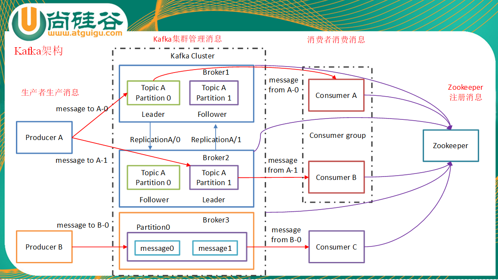
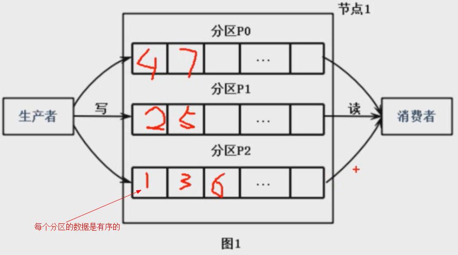

# Kafka 笔记

kafka是用scale语音编写的，开源给apache了。**依赖于zookeeper**，zookeeper，要产生大量的网络IO，故一般都是用专门的机器来部署它，同时要开启网络监控。

**zookeeper只记录生产消息和消费消息的状态。**

**下载地址**

kafka.apache.org

## 1.kafka架构

producer：生产者，生产馒头

consumer：消费者，吃馒头

broker：篮子，生产者先把馒头放到篮子里，等消费者来吃。当一个篮子放不下时，就需要多个篮子。

​               一个kafka就是一个broker。

​               

topic：主题，给馒头带一个标签，topicA 是给你吃的，topicB是给你弟弟吃的。就是标记那些消息，可以被哪些消费者，消费。

Partition：分区，是kafka数据操作的最小单元。

总结：

​    同一个Topic的数据是分区存放的，并且是分布在不同的Broker中的（作为Leader来讲），所以消息的**数据是分布式**的。

​    每个数据，有备份，备份者就是follower，**只有leader**才能与消费者和生产者进行通讯，因为有备份，所有**备份也是分布式**的。

​     消费者，**消费也是分布式的**

 zookeeper，用来记录消息的Broker的状态（例如，服务是否可用）以及客户端现在的消费情况（记录一个序号）

**消费者组：**

同一个消费者组，不允许重复消费消息。

但2个不同的消费者组，就可以消费2次了。消息就可以重复消费了。

