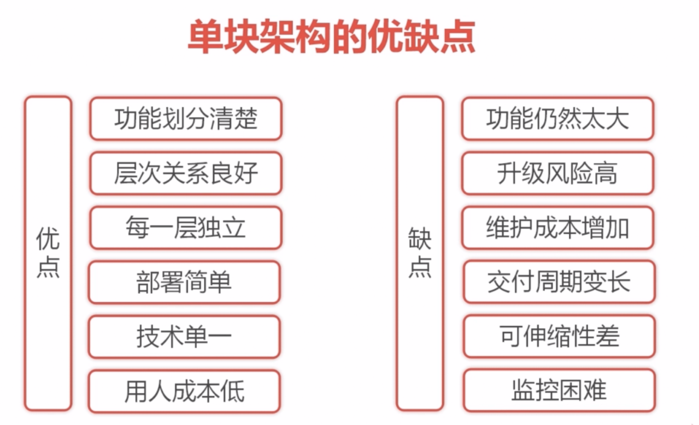

基于gradle的  spring boot 项目实战

# 1.HelloWorld项目

## 1.开发环境

下载gradle，至少4.8以上

http://services.gradle.org/distributions/

解压，设置path路径，变量名为`GRADLE_HOME`，变量值就是刚才所说的`D:\Dev\gradle-4.7`，如下

并把 %GRADLE_HOME%\bin 加入到path中

运行 gradle -v 能正常显示版本，就设置好了

## 2.利用spring initializr，选择web，选择gradle project

## 3）修改build.gradle文件,设置中央仓库为阿里云的

```gradle
//builscript 中脚本优先执行
buildscript {
	ext {
		springBootVersion = '2.0.6.RELEASE'
	}

	repositories {
		//mavenCentral()
		maven {url "http://maven.aliyun.com/nexus/content/groups/public/"}
	}
	dependencies {
		classpath("org.springframework.boot:spring-boot-gradle-plugin:${springBootVersion}")
	}
}

apply plugin: 'java'
apply plugin: 'eclipse'
apply plugin: 'org.springframework.boot'
apply plugin: 'io.spring.dependency-management'

group = 'com.hx.springboot'
version = '0.0.1-SNAPSHOT'
//jdk 的版本
sourceCompatibility = 1.8

repositories {
	//mavenCentral()
	maven {url "http://maven.aliyun.com/nexus/content/groups/public/"}
}


dependencies {
    //compile('org.springframework.boot:spring-boot-starter-web')
	implementation('org.springframework.boot:spring-boot-starter-web')
	runtimeOnly('org.springframework.boot:spring-boot-devtools')
	testImplementation('org.springframework.boot:spring-boot-starter-test')
}

```

## 4）打开项目目录，在cmd命令模式下，运行 gradle build 命令 ，编译项目，就会下载依赖包

## 5）写一个controller

```java

@RestController
public class HelloController {


    @RequestMapping("/hello")
    public String hello(){
        return "hello world!";
    }
}
```

## 6）写测试，采用模拟mvc测试。

```java
package com.hxcoltd.demo.controller;

import org.junit.Test;
import org.junit.runner.RunWith;
import org.springframework.beans.factory.annotation.Autowired;
import org.springframework.boot.test.autoconfigure.web.servlet.AutoConfigureMockMvc;
import org.springframework.boot.test.context.SpringBootTest;
import org.springframework.http.MediaType;
import org.springframework.test.context.junit4.SpringRunner;
import org.springframework.test.web.servlet.MockMvc;
import org.springframework.test.web.servlet.MvcResult;
import org.springframework.test.web.servlet.request.MockMvcRequestBuilders;

import static org.springframework.test.web.servlet.result.MockMvcResultMatchers.content;
import static org.springframework.test.web.servlet.result.MockMvcResultMatchers.status;
import static org.hamcrest.Matchers.equalTo;
/**
 * @author yxqiang
 * @create 2018-10-26 21:20
 */

@RunWith(SpringRunner.class)
@SpringBootTest
@AutoConfigureMockMvc
public class HelloControllerTest {
    @Autowired
    private MockMvc mockMvc;

    @Test
    public void testHello() throws Exception {

        mockMvc.perform(MockMvcRequestBuilders.get("/hello").accept(MediaType.APPLICATION_JSON))
                .andExpect(status().isOk())
        .andExpect(content().string(equalTo("hello world!")));


        MvcResult rs = mockMvc.perform(MockMvcRequestBuilders.get("/hello").accept(MediaType.APPLICATION_JSON)).andReturn();
        System.out.println(rs.getResponse().getContentAsString());
    }

}

```

## 7）三种运行方式

1）java -jar xxx.jar （gradle build 编译出jar包）

2）gradle bootRun

3）IDE 里面右键项目运行


## 8）扩展学习

基于Spring boot的博客系统实战

http://coding.imooc.com/class/125.html


# 2.天气项目（集成了Redis，HttpClient，Jackson）

利用spring rest 客户端 RestTemplate 来发送http请求，返回一个ResponseEntity<T>对象

需要，先注入进来,写一个配置类

## 1）config 配置

```java
@Configuration
public class RestConfiguration {
	
	@Autowired
	private RestTemplateBuilder builder;

	@Bean
	public RestTemplate restTemplate() {
		return builder.build();
	}
	
}

```


## 2）controller

```java
package com.hxcoltd.weather.controller;

import com.hxcoltd.weather.service.WeatherDataService;
import com.hxcoltd.weather.vo.WeatherResponse;
import org.springframework.beans.factory.annotation.Autowired;
import org.springframework.web.bind.annotation.GetMapping;
import org.springframework.web.bind.annotation.PathVariable;
import org.springframework.web.bind.annotation.RequestMapping;
import org.springframework.web.bind.annotation.RestController;

/**
 * @author yxqiang
 * @create 2018-10-27 9:31
 */
@RestController
@RequestMapping("/weather")
public class WeatherController {
    @Autowired
    private WeatherDataService weatherDataService;

    @GetMapping("/cityId/{cityId}")
    public WeatherResponse getWeatherByCityId(@PathVariable("cityId") String cityId) {
        return weatherDataService.getDataByCityId(cityId);
    }

    @GetMapping("/cityName/{cityName}")
    public WeatherResponse getWeatherByCityName(@PathVariable("cityName") String cityName) {
        return weatherDataService.getDataByCityName(cityName);
    }
}


```

## 3）设置请求参数的默认值

```java
	@RequestMapping(value = {"/cityId/{cityId}", "/cityId"}, method = RequestMethod.GET)
	public ModelAndView getReportByCityId(@PathVariable(required = false)  String cityId, Model model) throws Exception {
		if (cityId == null) cityId = "101270101";
		model.addAttribute("title", "老杨的天气预报");
		model.addAttribute("cityId", cityId);
		model.addAttribute("cityList", cityDataService.listCity());
		model.addAttribute("report", weatherReportService.getDataByCityId(cityId));
		return new ModelAndView("weather/report", "reportModel", model);
	}
```


## 4）service
先定义接口，在定义class，面向接口编程


```java
package com.hxcoltd.weather.service;


import com.hxcoltd.weather.vo.WeatherResponse;

/**
 * Weather Data Service.
 * 
 * @since 1.0.0 2017年11月22日
 * @author <a href="https://waylau.com">Way Lau</a> 
 */
public interface WeatherDataService {
	/**
	 * 根据城市ID查询天气数据
	 * 
	 * @param cityId
	 * @return
	 */
	WeatherResponse getDataByCityId(String cityId);

	/**
	 * 根据城市名称查询天气数据
	 * 
	 * @param cityName
	 * @return
	 */
	WeatherResponse getDataByCityName(String cityName);
	
}

```

```java
package com.hxcoltd.weather.service;

import java.io.IOException;
import java.util.concurrent.TimeUnit;

import com.hxcoltd.weather.vo.WeatherResponse;
import org.slf4j.Logger;
import org.slf4j.LoggerFactory;
import org.springframework.beans.factory.annotation.Autowired;
import org.springframework.data.redis.core.StringRedisTemplate;
import org.springframework.data.redis.core.ValueOperations;
import org.springframework.http.ResponseEntity;
import org.springframework.stereotype.Service;
import org.springframework.web.client.RestTemplate;

import com.fasterxml.jackson.databind.ObjectMapper;

/**
 * WeatherDataService 实现.
 * 
 * @since 1.0.0 2017年11月22日
 * @author <a href="https://waylau.com">Way Lau</a> 
 */
@Service
public class WeatherDataServiceImpl implements WeatherDataService {
    private static final Logger logger= LoggerFactory.getLogger(WeatherDataService.class);
	private static final String WEATHER_URI = "http://wthrcdn.etouch.cn/weather_mini?";
	private static final Long TIME_OUT = 10L;
	@Autowired
	private RestTemplate restTemplate;

	@Autowired
	private StringRedisTemplate stringRedisTemplate;
	
	@Override
	public WeatherResponse getDataByCityId(String cityId) {
		String uri = WEATHER_URI + "citykey=" + cityId;
		return this.doGetWeahter(uri);
	}

	@Override
	public WeatherResponse getDataByCityName(String cityName) {
		String uri = WEATHER_URI + "city=" + cityName;
		return this.doGetWeahter(uri);
	}

	/**
	 * 使用Redis，如果缓存有，使用缓存，没有远程访问，并加入到redis中
	 * @param uri
	 * @return
	 */
	private WeatherResponse doGetWeahter(String uri) {
		String key = uri;
		String strBody = null;
        WeatherResponse resp = null;
        ValueOperations<String, String> ops = stringRedisTemplate.opsForValue();

        if (stringRedisTemplate.hasKey(key)){
            logger.info("Redis has data");
            strBody = ops.get(key);

        }else{
            logger.info("Redis don't has data");
            // 缓存没有，再调用服务接口来获取

            //sprign rest 的一个客户端 restTemplate 用于将json序列化为一个ResponseEntity 的string对象
            ResponseEntity<String> respString = restTemplate.getForEntity(uri, String.class);


            if (respString.getStatusCodeValue() == 200) {
                strBody = respString.getBody();
            }

            // 数据写入缓存
            ops.set(key,strBody,TIME_OUT, TimeUnit.SECONDS);
        }

		try {

            //利用jackson来转换为对象
            ObjectMapper mapper = new ObjectMapper();

            //利用jackson来转换为对象
			resp = mapper.readValue(strBody, WeatherResponse.class);
		} catch (IOException e) {
		    logger.error("error！",e);
		}
		
		return resp;
	}

}

```

4) 编写vo类，用于实例化为第三方的数据

这里略过

# 3.集成Quartz定时服务

## 1)  depandecy

compile('org.springframework.boot:spring-boot-starter-quartz')

## 2）config 配置

```java
package com.waylau.spring.cloud.weather.config;

import org.quartz.JobBuilder;
import org.quartz.JobDetail;
import org.quartz.SimpleScheduleBuilder;
import org.quartz.Trigger;
import org.quartz.TriggerBuilder;
import org.springframework.context.annotation.Bean;
import org.springframework.context.annotation.Configuration;

import com.waylau.spring.cloud.weather.job.WeatherDataSyncJob;

/**
 * Quartz Configuration.
 * 
 * @since 1.0.0 2017年11月23日
 * @author <a href="https://waylau.com">Way Lau</a> 
 */
@Configuration
public class QuartzConfiguration {

	private static final int TIME = 1800; // 更新频率

	// JobDetail
	@Bean
	public JobDetail weatherDataSyncJobDetail() {
		return JobBuilder.newJob(WeatherDataSyncJob.class).withIdentity("weatherDataSyncJob")
		.storeDurably().build();
	}
	
	// Trigger
	@Bean
	public Trigger weatherDataSyncTrigger() {
		
		SimpleScheduleBuilder schedBuilder = SimpleScheduleBuilder.simpleSchedule()
				.withIntervalInSeconds(TIME).repeatForever();
		
		return TriggerBuilder.newTrigger().forJob(weatherDataSyncJobDetail())
				.withIdentity("weatherDataSyncTrigger").withSchedule(schedBuilder).build();
	}
}

```

## 3) 编写job类

```java
package com.waylau.spring.cloud.weather.job;

import java.util.List;

import org.quartz.JobExecutionContext;
import org.quartz.JobExecutionException;
import org.slf4j.Logger;
import org.slf4j.LoggerFactory;
import org.springframework.beans.factory.annotation.Autowired;
import org.springframework.scheduling.quartz.QuartzJobBean;

import com.waylau.spring.cloud.weather.service.CityDataService;
import com.waylau.spring.cloud.weather.service.WeatherDataService;
import com.waylau.spring.cloud.weather.vo.City;

/**
 * Weather Data Sync Job.
 * 
 * @since 1.0.0 2017年11月23日
 * @author <a href="https://waylau.com">Way Lau</a> 
 */
public class WeatherDataSyncJob extends QuartzJobBean {
	
	private final static Logger logger = LoggerFactory.getLogger(WeatherDataSyncJob.class);  
	
	@Autowired
	private CityDataService cityDataService;
	
	@Autowired
	private WeatherDataService weatherDataService;
	/* (non-Javadoc)
	 * @see org.springframework.scheduling.quartz.QuartzJobBean#executeInternal(org.quartz.JobExecutionContext)
	 */
	@Override
	protected void executeInternal(JobExecutionContext context) throws JobExecutionException {
		logger.info("Weather Data Sync Job. Start！");
		// 获取城市ID列表
		List<City> cityList = null;
		
		try {
			cityList = cityDataService.listCity();
		} catch (Exception e) {
			logger.error("Exception!", e);
		}
		
		// 遍历城市ID获取天气
		for (City city : cityList) {
			String cityId = city.getCityId();
			logger.info("Weather Data Sync Job, cityId:" + cityId);
			
			weatherDataService.syncDateByCityId(cityId);
		}
		
		logger.info("Weather Data Sync Job. End！");
	}

}

```

# 4.存储城市列表（XML）

采用（javax.xml.bind.annotation）注解来解析xml数据

## 1）city bean

```java
package com.hxcoltd.weather.vo;
import javax.xml.bind.annotation.XmlAccessType;
import javax.xml.bind.annotation.XmlAccessorType;
import javax.xml.bind.annotation.XmlAttribute;
import javax.xml.bind.annotation.XmlRootElement;

/**
 * City.
 * 
 * @since 1.0.0 2017年11月23日
 * @author <a href="https://waylau.com">Way Lau</a> 
 */
@XmlRootElement(name = "d")
@XmlAccessorType(XmlAccessType.FIELD)
public class City {
	@XmlAttribute(name = "d1")
	private String cityId;
	
	@XmlAttribute(name = "d2")
	private String cityName;
	
	@XmlAttribute(name = "d3")
	private String cityCode;
	
	@XmlAttribute(name = "d4")
	private String province;

	public String getCityId() {
		return cityId;
	}

	public void setCityId(String cityId) {
		this.cityId = cityId;
	}

	public String getCityName() {
		return cityName;
	}

	public void setCityName(String cityName) {
		this.cityName = cityName;
	}

	public String getCityCode() {
		return cityCode;
	}

	public void setCityCode(String cityCode) {
		this.cityCode = cityCode;
	}

	public String getProvince() {
		return province;
	}

	public void setProvince(String province) {
		this.province = province;
	}
}

```

## 2）cityList类

```java
package com.hxcoltd.weather.vo;

import java.util.List;

import javax.xml.bind.annotation.XmlAccessType;
import javax.xml.bind.annotation.XmlAccessorType;
import javax.xml.bind.annotation.XmlElement;
import javax.xml.bind.annotation.XmlRootElement;

/**
 * City List.
 * 
 * @since 1.0.0 2017年11月23日
 * @author <a href="https://waylau.com">Way Lau</a> 
 */
@XmlRootElement(name = "c")
@XmlAccessorType(XmlAccessType.FIELD)
public class CityList {
	@XmlElement(name = "d")
	private List<City> cityList;

	public List<City> getCityList() {
		return cityList;
	}

	public void setCityList(List<City> cityList) {
		this.cityList = cityList;
	}
}

```

xml文件内容

```xml
<?xml version="1.0" encoding="UTF-8"?>
<c c1="0">
<d d1="101280101" d2="广州" d3="guangzhou" d4="广东"/>
<d d1="101280102" d2="番禺" d3="panyu" d4="广东"/>
<d d1="101280103" d2="从化" d3="conghua" d4="广东"/>
<d d1="101280104" d2="增城" d3="zengcheng" d4="广东"/>
<d d1="101280105" d2="花都" d3="huadu" d4="广东"/>
<d d1="101280201" d2="韶关" d3="shaoguan" d4="广东"/>
<d d1="101280202" d2="乳源" d3="ruyuan" d4="广东"/>
<d d1="101280203" d2="始兴" d3="shixing" d4="广东"/>
<d d1="101280204" d2="翁源" d3="wengyuan" d4="广东"/>
<d d1="101280205" d2="乐昌" d3="lechang" d4="广东"/>
<d d1="101280206" d2="仁化" d3="renhua" d4="广东"/>
<d d1="101280207" d2="南雄" d3="nanxiong" d4="广东"/>
<d d1="101280208" d2="新丰" d3="xinfeng" d4="广东"/>
<d d1="101280209" d2="曲江" d3="qujiang" d4="广东"/>
<d d1="101280210" d2="浈江" d3="chengjiang" d4="广东"/>
<d d1="101280211" d2="武江" d3="wujiang" d4="广东"/>
<d d1="101280301" d2="惠州" d3="huizhou" d4="广东"/>
<d d1="101280302" d2="博罗" d3="boluo" d4="广东"/>
<d d1="101280303" d2="惠阳" d3="huiyang" d4="广东"/>
<d d1="101280304" d2="惠东" d3="huidong" d4="广东"/>
<d d1="101280305" d2="龙门" d3="longmen" d4="广东"/>
<d d1="101280401" d2="梅州" d3="meizhou" d4="广东"/>
<d d1="101280402" d2="兴宁" d3="xingning" d4="广东"/>
<d d1="101280403" d2="蕉岭" d3="jiaoling" d4="广东"/>
<d d1="101280404" d2="大埔" d3="dabu" d4="广东"/>
<d d1="101280406" d2="丰顺" d3="fengshun" d4="广东"/>
<d d1="101280407" d2="平远" d3="pingyuan" d4="广东"/>
<d d1="101280408" d2="五华" d3="wuhua" d4="广东"/>
<d d1="101280409" d2="梅县" d3="meixian" d4="广东"/>
<d d1="101280501" d2="汕头" d3="shantou" d4="广东"/>
<d d1="101280502" d2="潮阳" d3="chaoyang" d4="广东"/>
<d d1="101280503" d2="澄海" d3="chenghai" d4="广东"/>
<d d1="101280504" d2="南澳" d3="nanao" d4="广东"/>
<d d1="101280601" d2="深圳" d3="shenzhen" d4="广东"/>
<d d1="101280701" d2="珠海" d3="zhuhai" d4="广东"/>
<d d1="101280702" d2="斗门" d3="doumen" d4="广东"/>
<d d1="101280703" d2="金湾" d3="jinwan" d4="广东"/>
<d d1="101280800" d2="佛山" d3="foshan" d4="广东"/>
<d d1="101280801" d2="顺德" d3="shunde" d4="广东"/>
<d d1="101280802" d2="三水" d3="sanshui" d4="广东"/>
<d d1="101280803" d2="南海" d3="nanhai" d4="广东"/>
<d d1="101280804" d2="高明" d3="gaoming" d4="广东"/>
<d d1="101280901" d2="肇庆" d3="zhaoqing" d4="广东"/>
<d d1="101280902" d2="广宁" d3="guangning" d4="广东"/>
<d d1="101280903" d2="四会" d3="sihui" d4="广东"/>
<d d1="101280905" d2="德庆" d3="deqing" d4="广东"/>
<d d1="101280906" d2="怀集" d3="huaiji" d4="广东"/>
<d d1="101280907" d2="封开" d3="fengkai" d4="广东"/>
<d d1="101280908" d2="高要" d3="gaoyao" d4="广东"/>
<d d1="101281001" d2="湛江" d3="zhanjiang" d4="广东"/>
<d d1="101281002" d2="吴川" d3="wuchuan" d4="广东"/>
<d d1="101281003" d2="雷州" d3="leizhou" d4="广东"/>
<d d1="101281004" d2="徐闻" d3="xuwen" d4="广东"/>
<d d1="101281005" d2="廉江" d3="lianjiang" d4="广东"/>
<d d1="101281006" d2="赤坎" d3="chikan" d4="广东"/>
<d d1="101281007" d2="遂溪" d3="suixi" d4="广东"/>
<d d1="101281008" d2="坡头" d3="potou" d4="广东"/>
<d d1="101281009" d2="霞山" d3="xiashan" d4="广东"/>
<d d1="101281010" d2="麻章" d3="mazhang" d4="广东"/>
<d d1="101281101" d2="江门" d3="jiangmen" d4="广东"/>
<d d1="101281103" d2="开平" d3="kaiping" d4="广东"/>
<d d1="101281104" d2="新会" d3="xinhui" d4="广东"/>
<d d1="101281105" d2="恩平" d3="enping" d4="广东"/>
<d d1="101281106" d2="台山" d3="taishan" d4="广东"/>
<d d1="101281107" d2="蓬江" d3="pengjiang" d4="广东"/>
<d d1="101281108" d2="鹤山" d3="heshan" d4="广东"/>
<d d1="101281109" d2="江海" d3="jianghai" d4="广东"/>
<d d1="101281201" d2="河源" d3="heyuan" d4="广东"/>
<d d1="101281202" d2="紫金" d3="zijin" d4="广东"/>
<d d1="101281203" d2="连平" d3="lianping" d4="广东"/>
<d d1="101281204" d2="和平" d3="heping" d4="广东"/>
<d d1="101281205" d2="龙川" d3="longchuan" d4="广东"/>
<d d1="101281206" d2="东源" d3="dongyuan" d4="广东"/>
<d d1="101281301" d2="清远" d3="qingyuan" d4="广东"/>
<d d1="101281302" d2="连南" d3="liannan" d4="广东"/>
<d d1="101281303" d2="连州" d3="lianzhou" d4="广东"/>
<d d1="101281304" d2="连山" d3="lianshan" d4="广东"/>
<d d1="101281305" d2="阳山" d3="yangshan" d4="广东"/>
<d d1="101281306" d2="佛冈" d3="fogang" d4="广东"/>
<d d1="101281307" d2="英德" d3="yingde" d4="广东"/>
<d d1="101281308" d2="清新" d3="qingxin" d4="广东"/>
<d d1="101281401" d2="云浮" d3="yunfu" d4="广东"/>
<d d1="101281402" d2="罗定" d3="luoding" d4="广东"/>
<d d1="101281403" d2="新兴" d3="xinxing" d4="广东"/>
<d d1="101281404" d2="郁南" d3="yunan" d4="广东"/>
<d d1="101281406" d2="云安" d3="yunan" d4="广东"/>
<d d1="101281501" d2="潮州" d3="chaozhou" d4="广东"/>
<d d1="101281502" d2="饶平" d3="raoping" d4="广东"/>
<d d1="101281503" d2="潮安" d3="chaoan" d4="广东"/>
<d d1="101281601" d2="东莞" d3="dongguan" d4="广东"/>
<d d1="101281701" d2="中山" d3="zhongshan" d4="广东"/>
<d d1="101281801" d2="阳江" d3="yangjiang" d4="广东"/>
<d d1="101281802" d2="阳春" d3="yangchun" d4="广东"/>
<d d1="101281803" d2="阳东" d3="yangdong" d4="广东"/>
<d d1="101281804" d2="阳西" d3="yangxi" d4="广东"/>
<d d1="101281901" d2="揭阳" d3="jieyang" d4="广东"/>
<d d1="101281902" d2="揭西" d3="jiexi" d4="广东"/>
<d d1="101281903" d2="普宁" d3="puning" d4="广东"/>
<d d1="101281904" d2="惠来" d3="huilai" d4="广东"/>
<d d1="101281905" d2="揭东" d3="jiedong" d4="广东"/>
<d d1="101282001" d2="茂名" d3="maoming" d4="广东"/>
<d d1="101282002" d2="高州" d3="gaozhou" d4="广东"/>
<d d1="101282003" d2="化州" d3="huazhou" d4="广东"/>
<d d1="101282004" d2="电白" d3="dianbai" d4="广东"/>
<d d1="101282005" d2="信宜" d3="xinyi" d4="广东"/>
<d d1="101282006" d2="茂港" d3="maogang" d4="广东"/>
<d d1="101282101" d2="汕尾" d3="shanwei" d4="广东"/>
<d d1="101282102" d2="海丰" d3="haifeng" d4="广东"/>
<d d1="101282103" d2="陆丰" d3="lufeng" d4="广东"/>
<d d1="101282104" d2="陆河" d3="luhe" d4="广东"/>
</c>
```

## 3）util 工具类

```java
package com.hxcoltd.weather.util;

import java.io.Reader;
import java.io.StringReader;

import javax.xml.bind.JAXBContext;
import javax.xml.bind.Unmarshaller;

/**
 * Xml Builder.
 * 
 * @since 1.0.0 2017年11月23日
 * @author <a href="https://waylau.com">Way Lau</a> 
 */
public class XmlBuilder {

	/**
	 * 将XML转为指定的POJO
	 * @param clazz
	 * @param xmlStr
	 * @return
	 * @throws Exception
	 */
	public static Object xmlStrToObject(Class<?> clazz, String xmlStr) throws Exception {
		Object xmlObject = null;
		Reader reader = null;
		JAXBContext context = JAXBContext.newInstance(clazz);
		
		// XML 转为对象的接口
		Unmarshaller unmarshaller = context.createUnmarshaller();
		
		reader = new StringReader(xmlStr);
		xmlObject = unmarshaller.unmarshal(reader);
		
		if (null != reader) {
			reader.close();
		}
		
		return xmlObject;
	}
}

```

## 4) 数据处理

```java
package com.hxcoltd.weather.service;

import java.io.BufferedReader;
import java.io.InputStreamReader;
import java.util.List;

import com.hxcoltd.weather.util.XmlBuilder;
import com.hxcoltd.weather.vo.City;
import com.hxcoltd.weather.vo.CityList;
import org.springframework.core.io.ClassPathResource;
import org.springframework.core.io.Resource;
import org.springframework.stereotype.Service;


/**
 * City Data Service.
 * 
 * @since 1.0.0 2017年11月23日
 * @author <a href="https://waylau.com">Way Lau</a> 
 */
@Service
public class CityDataServiceImpl implements CityDataService {

	@Override
	public List<City> listCity() throws Exception {
		// 读取XML文件
		Resource resource = new ClassPathResource("citylist.xml");
		BufferedReader br = new BufferedReader(new InputStreamReader(resource.getInputStream(), "utf-8"));
		StringBuffer buffer = new StringBuffer();
		String line = "";
		
		while ((line = br.readLine()) !=null) {
			buffer.append(line);
		}
		
		br.close();
		
		// XML转为Java对象
		CityList cityList = (CityList) XmlBuilder.xmlStrToObject(CityList.class, buffer.toString());
		return cityList.getCityList();
	}

}

```


5) 用redis 桌面管理工具查看数据

redis-desktop-manager-0.8.8.384.exe

# 5.使用Thymeleaf模板引擎

Thymeleaf 模板引擎，是spring 提供的后端模板。

## 1）添加依赖

```gradle
// 添加 Spring Boot Thymeleaf Starter 的依赖
compile('org.springframework.boot:spring-boot-starter-thymeleaf')
```

## 2）controller

```java
package com.hxcoltd.weather.controller;

import com.hxcoltd.weather.service.CityDataService;
import com.hxcoltd.weather.service.WeatherReportService;
import org.springframework.beans.factory.annotation.Autowired;
import org.springframework.ui.Model;
import org.springframework.web.bind.annotation.GetMapping;
import org.springframework.web.bind.annotation.PathVariable;
import org.springframework.web.bind.annotation.RequestMapping;
import org.springframework.web.bind.annotation.RestController;
import org.springframework.web.servlet.ModelAndView;

/**
 * Weather Report Controller.
 * 
 * @since 1.0.0 2017年11月24日
 * @author <a href="https://waylau.com">Way Lau</a> 
 */
@RestController
@RequestMapping("/report")
public class WeatherReportController {
	@Autowired
	private CityDataService cityDataService;
	
	@Autowired
	private WeatherReportService weatherReportService;
	
	@GetMapping("/cityId/{cityId}")
	public ModelAndView getReportByCityId(@PathVariable("cityId") String cityId, Model model) throws Exception {
		model.addAttribute("title", "老杨的天气预报");
		model.addAttribute("cityId", cityId);
		model.addAttribute("cityList", cityDataService.listCity());
		model.addAttribute("report", weatherReportService.getDataByCityId(cityId));
		return new ModelAndView("weather/report", "reportModel", model);
	}

}

```

## 3）配置热部署文件

在Resources文件夹下的application.properties文件中增加一个配置，关闭themyleaf的缓存

```properties
# 热部署的静态文件
spring.thymeleaf.cache=false
```

## 4）编写界面，运用Thymeleaf

引入bootstrap

http://getbootstrap.com/docs/4.1/getting-started/introduction/ 是官方示例

下面是它的html模板

```html
<!doctype html>
<html lang="en">
  <head>
    <!-- Required meta tags -->
    <meta charset="utf-8">
    <meta name="viewport" content="width=device-width, initial-scale=1, shrink-to-fit=no">

    <!-- Bootstrap CSS -->
    <link rel="stylesheet" href="https://stackpath.bootstrapcdn.com/bootstrap/4.1.3/css/bootstrap.min.css" integrity="sha384-MCw98/SFnGE8fJT3GXwEOngsV7Zt27NXFoaoApmYm81iuXoPkFOJwJ8ERdknLPMO" crossorigin="anonymous">

    <title>Hello, world!</title>
  </head>
  <body>
    <h1>Hello, world!</h1>

    <!-- Optional JavaScript -->
    <!-- jQuery first, then Popper.js, then Bootstrap JS -->
    <script src="https://code.jquery.com/jquery-3.3.1.slim.min.js" integrity="sha384-q8i/X+965DzO0rT7abK41JStQIAqVgRVzpbzo5smXKp4YfRvH+8abtTE1Pi6jizo" crossorigin="anonymous"></script>
    <script src="https://cdnjs.cloudflare.com/ajax/libs/popper.js/1.14.3/umd/popper.min.js" integrity="sha384-ZMP7rVo3mIykV+2+9J3UJ46jBk0WLaUAdn689aCwoqbBJiSnjAK/l8WvCWPIPm49" crossorigin="anonymous"></script>
    <script src="https://stackpath.bootstrapcdn.com/bootstrap/4.1.3/js/bootstrap.min.js" integrity="sha384-ChfqqxuZUCnJSK3+MXmPNIyE6ZbWh2IMqE241rYiqJxyMiZ6OW/JmZQ5stwEULTy" crossorigin="anonymous"></script>
  </body>
</html>
```


编写report.html

注意，这里用到了Thymeleaf中的标签 th，用到了${} 来取model中的值

```html
<!DOCTYPE html>
<html>
<head>
<meta charset="UTF-8">
<meta name="viewport"
	content="width=device-width, initial-scale=1, shrink-to-fit=no">
<!-- Bootstrap CSS -->
<link rel="stylesheet"
	href="https://maxcdn.bootstrapcdn.com/bootstrap/4.0.0-beta.2/css/bootstrap.min.css"
	integrity="sha384-PsH8R72JQ3SOdhVi3uxftmaW6Vc51MKb0q5P2rRUpPvrszuE4W1povHYgTpBfshb"
	crossorigin="anonymous">

<title>老杨的天气预报</title>
</head>
<body>
	<div class="container">
		<div class="row">
			<h3 th:text="${reportModel.title}">yxqiang</h3>
			<select class="custom-select" id="selectCityId">
				<option th:each="city : ${reportModel.cityList}"
					th:value="${city.cityId}" th:text="${city.cityName}"
					th:selected="${city.cityId eq reportModel.cityId}"></option>
			</select>
		</div>
		<div class="row">
			<h1 class="text-success" th:text="${reportModel.report.city}">成都</h1>
		</div>
		<div class="row">
			<p>
				空气质量指数：<span th:text="${reportModel.report.aqi}"></span>
			</p>
		</div>
		<div class="row">
			<p>
				当前温度：<span th:text="${reportModel.report.wendu}"></span>
			</p>
		</div>
		<div class="row">
			<p>
				温馨提示：<span th:text="${reportModel.report.ganmao}"></span>
			</p>
		</div>
		<div class="row">
			<div class="card border-info" th:each="forecast : ${reportModel.report.forecast}">
				<div class="card-body text-info">
					<p class ="card-text" th:text="${forecast.date}">日期</p>
					<p class ="card-text" th:text="${forecast.type}">天气类型</p>
					<p class ="card-text" th:text="${forecast.high}">最高温度</p>
					<p class ="card-text" th:text="${forecast.low}">最低温度</p>
					<p class ="card-text" th:text="${forecast.fengxiang}">风向</p>
				</div>
			</div>
		</div>
	</div>


	<!-- jQuery first, then Popper.js, then Bootstrap JS -->
	<script src="https://code.jquery.com/jquery-3.2.1.slim.min.js"
		integrity="sha384-KJ3o2DKtIkvYIK3UENzmM7KCkRr/rE9/Qpg6aAZGJwFDMVNA/GpGFF93hXpG5KkN"
		crossorigin="anonymous"></script>
	<script
		src="https://cdnjs.cloudflare.com/ajax/libs/popper.js/1.12.3/umd/popper.min.js"
		integrity="sha384-vFJXuSJphROIrBnz7yo7oB41mKfc8JzQZiCq4NCceLEaO4IHwicKwpJf9c9IpFgh"
		crossorigin="anonymous"></script>
	<script
		src="https://maxcdn.bootstrapcdn.com/bootstrap/4.0.0-beta.2/js/bootstrap.min.js"
		integrity="sha384-alpBpkh1PFOepccYVYDB4do5UnbKysX5WZXm3XxPqe5iKTfUKjNkCk9SaVuEZflJ"
		crossorigin="anonymous"></script>
	<!-- Optional JavaScript -->
	<script type="text/javascript" th:src="@{/js/weather/report.js}"></script>
</body>
</html>
```


# 6.springCloud 

1）单体架构的优劣势



## 2）微服务的设计原则

拆分足够微

轻量级通讯

领域驱动设计原则

单一职责原则

高内聚、低耦合

DevOps（技术栈相关人都有）

不限于技术栈

## 3）如何来设计微服务系统

服务拆分

服务注册（服务中心，可以管理各个小服务）

服务发现

服务消费

统一入口

配置管理（配置管理平台）

熔断机制

自动扩展（根据当前应用负荷，自动扩容）


